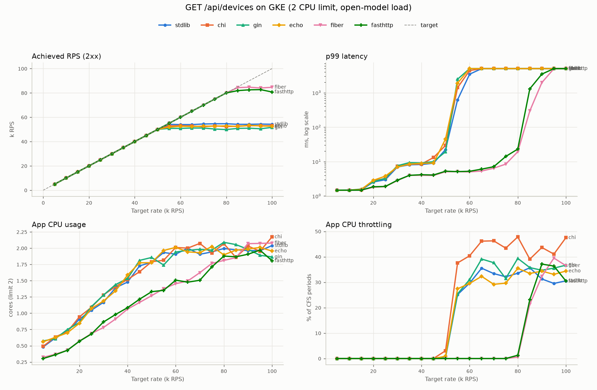
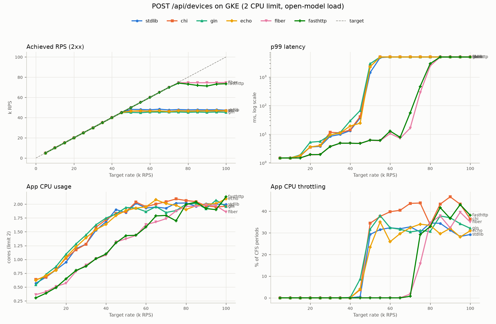

# GKE benchmark summary: gke-20260925-003821

SLO: p99 <= 50 ms, achieved >= 95% of target rate, errors <= 1%. Tester metrics cover each 30 s stage minus its first 5 s. App CPU comes from cAdvisor over a 150 s window centred on each stage, because cAdvisor timestamps lag by ~10-15 s (accuracy about +/-0.1 core; it smooths the knee). Throttling uses the stage itself. See validation.md.

## GET /api/devices

| Framework | Pair | Max rate within SLO (RPS) | Peak achieved RPS |
|---|---|---|---|
| fiber | 1 | 80,000 | 84,707 |
| fasthttp | 3 | 80,000 | 82,701 |
| stdlib | 2 | 50,000 | 54,674 |
| echo | 1 | 50,000 | 53,338 |
| chi | 3 | 50,000 | 53,075 |
| gin | 2 | 50,000 | 51,659 |

| Target RPS | Framework | Achieved RPS | Errors/s | p50 ms | p90 ms | p99 ms | p99.9 ms | CPU cores | Throttled | SLO |
|---|---|---|---|---|---|---|---|---|---|---|
| 5,000 | fiber | 5,000 | 0 | 0.68 | 1.25 | 1.48 | 1.50 | 0.32 | 0.0% | pass |
| 5,000 | echo | 5,000 | 0 | 0.72 | 1.29 | 1.48 | 1.50 | 0.56 | 0.0% | pass |
| 5,000 | stdlib | 5,000 | 0 | 0.72 | 1.28 | 1.48 | 1.50 | 0.48 | 0.0% | pass |
| 5,000 | gin | 5,000 | 0 | 0.72 | 1.29 | 1.48 | 1.50 | 0.57 | 0.0% | pass |
| 5,000 | chi | 5,000 | 0 | 0.72 | 1.27 | 1.48 | 1.50 | 0.49 | 0.0% | pass |
| 5,000 | fasthttp | 5,000 | 0 | 0.69 | 1.26 | 1.48 | 1.50 | 0.30 | 0.0% | pass |
| 10,000 | fiber | 9,999 | 0 | 0.71 | 1.28 | 1.48 | 1.50 | 0.37 | 0.0% | pass |
| 10,000 | echo | 10,000 | 0 | 0.71 | 1.30 | 1.48 | 1.73 | 0.63 | 0.0% | pass |
| 10,000 | stdlib | 10,000 | 0 | 0.72 | 1.29 | 1.48 | 1.87 | 0.62 | 0.0% | pass |
| 10,000 | gin | 10,000 | 0 | 0.72 | 1.30 | 1.48 | 1.89 | 0.61 | 0.0% | pass |
| 10,000 | chi | 10,000 | 0 | 0.72 | 1.29 | 1.48 | 1.82 | 0.64 | 0.0% | pass |
| 10,000 | fasthttp | 10,000 | 0 | 0.70 | 1.29 | 1.48 | 1.50 | 0.36 | 0.0% | pass |
| 15,000 | fiber | 15,000 | 0 | 0.67 | 1.29 | 1.48 | 1.65 | 0.43 | 0.0% | pass |
| 15,000 | echo | 15,000 | 0 | 0.69 | 1.32 | 1.55 | 2.25 | 0.70 | 0.0% | pass |
| 15,000 | stdlib | 15,000 | 0 | 0.68 | 1.32 | 1.50 | 2.11 | 0.72 | 0.0% | pass |
| 15,000 | gin | 15,000 | 0 | 0.69 | 1.32 | 1.59 | 2.36 | 0.75 | 0.0% | pass |
| 15,000 | chi | 15,000 | 0 | 0.68 | 1.32 | 1.52 | 2.44 | 0.72 | 0.0% | pass |
| 15,000 | fasthttp | 15,000 | 0 | 0.68 | 1.30 | 1.48 | 1.81 | 0.43 | 0.0% | pass |
| 20,000 | fiber | 20,001 | 0 | 0.67 | 1.34 | 1.79 | 2.00 | 0.57 | 0.0% | pass |
| 20,000 | echo | 19,999 | 0 | 0.73 | 1.47 | 2.85 | 5.89 | 0.84 | 0.0% | pass |
| 20,000 | stdlib | 20,002 | 0 | 0.72 | 1.45 | 2.55 | 4.35 | 0.91 | 0.0% | pass |
| 20,000 | gin | 20,003 | 0 | 0.73 | 1.47 | 2.61 | 3.99 | 0.86 | 0.0% | pass |
| 20,000 | chi | 19,998 | 0 | 0.73 | 1.48 | 2.74 | 4.48 | 0.94 | 0.0% | pass |
| 20,000 | fasthttp | 20,000 | 0 | 0.68 | 1.36 | 1.86 | 2.27 | 0.57 | 0.0% | pass |
| 25,000 | fiber | 24,998 | 0 | 0.66 | 1.37 | 1.88 | 2.50 | 0.69 | 0.0% | pass |
| 25,000 | echo | 24,999 | 0 | 0.72 | 1.65 | 3.78 | 5.65 | 1.07 | 0.0% | pass |
| 25,000 | stdlib | 25,001 | 0 | 0.72 | 1.56 | 2.97 | 4.45 | 1.05 | 0.0% | pass |
| 25,000 | gin | 25,000 | 0 | 0.73 | 1.64 | 3.25 | 4.78 | 1.10 | 0.0% | pass |
| 25,000 | chi | 24,997 | 0 | 0.73 | 1.63 | 3.26 | 5.34 | 1.09 | 0.0% | pass |
| 25,000 | fasthttp | 25,002 | 0 | 0.66 | 1.37 | 1.89 | 2.45 | 0.68 | 0.0% | pass |
| 30,000 | fiber | 30,002 | 0 | 0.68 | 1.47 | 2.81 | 5.77 | 0.78 | 0.0% | pass |
| 30,000 | echo | 29,999 | 0 | 1.21 | 3.90 | 6.97 | 9.01 | 1.19 | 0.0% | pass |
| 30,000 | stdlib | 29,999 | 0 | 1.21 | 3.87 | 6.95 | 8.92 | 1.17 | 0.0% | pass |
| 30,000 | gin | 30,000 | 0 | 1.26 | 4.17 | 7.57 | 9.87 | 1.28 | 0.0% | pass |
| 30,000 | chi | 30,002 | 0 | 1.23 | 4.09 | 7.30 | 9.27 | 1.28 | 0.0% | pass |
| 30,000 | fasthttp | 29,999 | 0 | 0.69 | 1.49 | 2.88 | 5.44 | 0.86 | 0.0% | pass |
| 35,000 | fiber | 34,999 | 0 | 0.87 | 2.20 | 3.98 | 5.82 | 0.91 | 0.0% | pass |
| 35,000 | echo | 35,000 | 0 | 1.82 | 5.37 | 8.41 | 12.07 | 1.34 | 0.0% | pass |
| 35,000 | stdlib | 34,999 | 0 | 1.74 | 5.21 | 8.09 | 10.02 | 1.39 | 0.0% | pass |
| 35,000 | gin | 35,001 | 0 | 1.99 | 5.77 | 9.33 | 14.65 | 1.44 | 0.0% | pass |
| 35,000 | chi | 34,999 | 0 | 1.81 | 5.44 | 8.43 | 12.90 | 1.41 | 0.0% | pass |
| 35,000 | fasthttp | 35,002 | 0 | 0.89 | 2.27 | 3.99 | 6.08 | 0.98 | 0.0% | pass |
| 40,000 | fiber | 40,001 | 0 | 0.87 | 2.21 | 4.00 | 6.10 | 1.06 | 0.0% | pass |
| 40,000 | echo | 40,004 | 0 | 1.85 | 5.40 | 8.91 | 15.61 | 1.59 | 0.0% | pass |
| 40,000 | stdlib | 40,000 | 0 | 1.79 | 5.28 | 8.22 | 11.87 | 1.48 | 0.0% | pass |
| 40,000 | gin | 40,002 | 0 | 2.00 | 5.76 | 9.14 | 14.17 | 1.53 | 0.0% | pass |
| 40,000 | chi | 39,999 | 0 | 1.82 | 5.43 | 8.48 | 12.78 | 1.52 | 0.0% | pass |
| 40,000 | fasthttp | 40,001 | 0 | 0.87 | 2.23 | 4.15 | 6.08 | 1.08 | 0.0% | pass |
| 45,000 | fiber | 45,000 | 0 | 0.87 | 2.20 | 3.94 | 5.89 | 1.17 | 0.0% | pass |
| 45,000 | echo | 44,997 | 0 | 2.02 | 5.68 | 9.04 | 13.91 | 1.77 | 0.0% | pass |
| 45,000 | stdlib | 45,000 | 0 | 1.93 | 5.57 | 8.97 | 13.83 | 1.73 | 0.0% | pass |
| 45,000 | gin | 45,000 | 0 | 2.16 | 6.02 | 9.94 | 33.76 | 1.81 | 0.0% | pass |
| 45,000 | chi | 45,000 | 0 | 2.08 | 6.03 | 13.09 | 24.92 | 1.64 | 0.0% | pass |
| 45,000 | fasthttp | 44,998 | 0 | 0.87 | 2.19 | 4.08 | 6.35 | 1.22 | 0.0% | pass |
| 50,000 | fiber | 50,000 | 0 | 1.31 | 3.29 | 5.08 | 8.41 | 1.27 | 0.0% | pass |
| 50,000 | echo | 50,002 | 0 | 3.80 | 8.58 | 45.25 | 65.31 | 1.78 | 0.9% | pass |
| 50,000 | stdlib | 49,998 | 0 | 3.61 | 8.24 | 22.40 | 36.09 | 1.78 | 0.4% | pass |
| 50,000 | gin | 49,983 | 0 | 3.91 | 8.57 | 19.32 | 33.31 | 1.86 | 0.7% | pass |
| 50,000 | chi | 49,997 | 0 | 3.70 | 8.86 | 29.45 | 46.73 | 1.79 | 3.1% | pass |
| 50,000 | fasthttp | 50,000 | 0 | 1.41 | 3.44 | 5.25 | 8.40 | 1.33 | 0.0% | pass |
| 55,000 | fiber | 54,999 | 0 | 1.33 | 3.34 | 5.09 | 7.34 | 1.38 | 0.0% | pass |
| 55,000 | echo | 51,849 | 0 | 654.83 | 1390.00 | 1886.72 | 1989.80 | 1.96 | 27.4% | fail |
| 55,000 | stdlib | 54,170 | 0 | 197.87 | 453.89 | 622.88 | 729.44 | 1.93 | 25.1% | fail |
| 55,000 | gin | 50,858 | 0 | 1353.08 | 2107.70 | 2463.92 | 2499.54 | 1.74 | 25.4% | fail |
| 55,000 | chi | 52,905 | 0 | 461.69 | 914.98 | 1405.55 | 1490.55 | 1.81 | 37.6% | fail |
| 55,000 | fasthttp | 54,999 | 0 | 1.40 | 3.41 | 5.11 | 7.43 | 1.35 | 0.0% | pass |
| 60,000 | fiber | 59,999 | 0 | 1.31 | 3.22 | 5.03 | 7.24 | 1.45 | 0.0% | pass |
| 60,000 | echo | 52,625 | 0 | 3377.53 | 4675.32 | 5000.00 | 5000.00 | 2.01 | 29.5% | fail |
| 60,000 | stdlib | 53,958 | 0 | 1911.21 | 2955.20 | 3441.90 | 3498.47 | 1.91 | 29.6% | fail |
| 60,000 | gin | 50,867 | 0 | 4494.48 | 5000.00 | 5000.00 | 5000.00 | 1.94 | 31.0% | fail |
| 60,000 | chi | 53,036 | 0 | 2581.46 | 3806.92 | 4386.69 | 4497.51 | 2.01 | 40.4% | fail |
| 60,000 | fasthttp | 60,000 | 0 | 1.33 | 3.28 | 5.23 | 8.75 | 1.51 | 0.0% | pass |
| 65,000 | fiber | 65,003 | 0 | 1.52 | 3.46 | 5.31 | 7.81 | 1.50 | 0.0% | pass |
| 65,000 | echo | 52,359 | 0 | 5000.00 | 5000.00 | 5000.00 | 5000.00 | 1.94 | 32.3% | fail |
| 65,000 | stdlib | 53,972 | 0 | 5000.00 | 5000.00 | 5000.00 | 5000.00 | 2.00 | 35.5% | fail |
| 65,000 | gin | 51,141 | 0 | 5000.00 | 5000.00 | 5000.00 | 5000.00 | 1.97 | 39.1% | fail |
| 65,000 | chi | 52,825 | 0 | 5000.00 | 5000.00 | 5000.00 | 5000.00 | 2.00 | 46.2% | fail |
| 65,000 | fasthttp | 64,998 | 0 | 1.56 | 3.53 | 6.04 | 9.85 | 1.48 | 0.0% | pass |
| 70,000 | fiber | 69,999 | 0 | 2.04 | 3.98 | 6.43 | 9.62 | 1.62 | 0.0% | pass |
| 70,000 | echo | 52,734 | 0 | 5000.00 | 5000.00 | 5000.00 | 5000.00 | 1.93 | 29.2% | fail |
| 70,000 | stdlib | 54,446 | 0 | 5000.00 | 5000.00 | 5000.00 | 5000.00 | 1.91 | 33.4% | fail |
| 70,000 | gin | 51,122 | 0 | 5000.00 | 5000.00 | 5000.00 | 5000.00 | 1.98 | 37.7% | fail |
| 70,000 | chi | 52,191 | 0 | 5000.00 | 5000.00 | 5000.00 | 5000.00 | 2.07 | 46.3% | fail |
| 70,000 | fasthttp | 69,994 | 0 | 2.07 | 4.01 | 7.08 | 19.33 | 1.51 | 0.0% | pass |
| 75,000 | fiber | 75,000 | 0 | 2.14 | 4.20 | 8.42 | 14.40 | 1.77 | 0.0% | pass |
| 75,000 | echo | 52,621 | 0 | 5000.00 | 5000.00 | 5000.00 | 5000.00 | 2.02 | 29.6% | fail |
| 75,000 | stdlib | 54,629 | 0 | 5000.00 | 5000.00 | 5000.00 | 5000.00 | 1.94 | 32.1% | fail |
| 75,000 | gin | 50,312 | 0 | 5000.00 | 5000.00 | 5000.00 | 5000.00 | 1.97 | 31.5% | fail |
| 75,000 | chi | 52,920 | 0 | 5000.00 | 5000.00 | 5000.00 | 5000.00 | 1.92 | 43.4% | fail |
| 75,000 | fasthttp | 74,995 | 0 | 2.25 | 4.41 | 14.06 | 30.40 | 1.71 | 0.0% | pass |
| 80,000 | fiber | 80,001 | 0 | 2.32 | 4.90 | 19.34 | 33.03 | 1.81 | 0.6% | pass |
| 80,000 | echo | 52,913 | 0 | 5000.00 | 5000.00 | 5000.00 | 5000.00 | 1.90 | 35.4% | fail |
| 80,000 | stdlib | 54,674 | 0 | 5000.00 | 5000.00 | 5000.00 | 5000.00 | 1.99 | 33.5% | fail |
| 80,000 | gin | 49,866 | 0 | 5000.00 | 5000.00 | 5000.00 | 5000.00 | 2.09 | 39.4% | fail |
| 80,000 | chi | 52,300 | 0 | 5000.00 | 5000.00 | 5000.00 | 5000.00 | 2.07 | 47.8% | fail |
| 80,000 | fasthttp | 80,003 | 0 | 2.31 | 5.32 | 23.08 | 38.49 | 1.88 | 1.3% | pass |
| 85,000 | fiber | 84,370 | 0 | 10.92 | 224.51 | 296.04 | 343.37 | 1.85 | 21.3% | fail |
| 85,000 | echo | 52,437 | 0 | 5000.00 | 5000.00 | 5000.00 | 5000.00 | 1.97 | 33.5% | fail |
| 85,000 | stdlib | 54,176 | 0 | 5000.00 | 5000.00 | 5000.00 | 5000.00 | 1.97 | 35.7% | fail |
| 85,000 | gin | 50,836 | 0 | 5000.00 | 5000.00 | 5000.00 | 5000.00 | 2.05 | 35.7% | fail |
| 85,000 | chi | 52,703 | 0 | 5000.00 | 5000.00 | 5000.00 | 5000.00 | 1.86 | 39.1% | fail |
| 85,000 | fasthttp | 81,883 | 0 | 636.08 | 894.84 | 1296.73 | 1479.67 | 1.87 | 23.2% | fail |
| 90,000 | fiber | 84,707 | 0 | 1026.48 | 1638.56 | 1963.91 | 1996.45 | 2.07 | 32.3% | fail |
| 90,000 | echo | 53,338 | 0 | 5000.00 | 5000.00 | 5000.00 | 5000.00 | 1.99 | 34.4% | fail |
| 90,000 | stdlib | 54,177 | 0 | 5000.00 | 5000.00 | 5000.00 | 5000.00 | 1.96 | 31.3% | fail |
| 90,000 | gin | 51,002 | 0 | 5000.00 | 5000.00 | 5000.00 | 5000.00 | 1.98 | 34.7% | fail |
| 90,000 | chi | 53,075 | 0 | 5000.00 | 5000.00 | 5000.00 | 5000.00 | 2.03 | 43.7% | fail |
| 90,000 | fasthttp | 82,550 | 0 | 2234.81 | 3114.09 | 3462.00 | 3496.79 | 1.91 | 37.1% | fail |
| 95,000 | fiber | 84,062 | 0 | 3399.26 | 4421.72 | 4959.64 | 5000.00 | 2.07 | 39.5% | fail |
| 95,000 | echo | 52,831 | 0 | 5000.00 | 5000.00 | 5000.00 | 5000.00 | 2.01 | 33.1% | fail |
| 95,000 | stdlib | 54,392 | 0 | 5000.00 | 5000.00 | 5000.00 | 5000.00 | 1.96 | 29.5% | fail |
| 95,000 | gin | 50,544 | 0 | 5000.00 | 5000.00 | 5000.00 | 5000.00 | 1.89 | 35.5% | fail |
| 95,000 | chi | 53,037 | 0 | 5000.00 | 5000.00 | 5000.00 | 5000.00 | 1.95 | 41.1% | fail |
| 95,000 | fasthttp | 82,701 | 0 | 5000.00 | 5000.00 | 5000.00 | 5000.00 | 1.97 | 36.4% | fail |
| 100,000 | fiber | 84,621 | 0 | 5000.00 | 5000.00 | 5000.00 | 5000.00 | 2.08 | 36.5% | fail |
| 100,000 | echo | 52,559 | 0 | 5000.00 | 5000.00 | 5000.00 | 5000.00 | 1.96 | 34.4% | fail |
| 100,000 | stdlib | 54,246 | 0 | 5000.00 | 5000.00 | 5000.00 | 5000.00 | 2.04 | 30.5% | fail |
| 100,000 | gin | 51,659 | 0 | 5000.00 | 5000.00 | 5000.00 | 5000.00 | 1.87 | 36.7% | fail |
| 100,000 | chi | 52,975 | 0 | 5000.00 | 5000.00 | 5000.00 | 5000.00 | 2.17 | 47.5% | fail |
| 100,000 | fasthttp | 80,774 | 0 | 5000.00 | 5000.00 | 5000.00 | 5000.00 | 1.81 | 30.4% | fail |

## POST /api/devices

| Framework | Pair | Max rate within SLO (RPS) | Peak achieved RPS |
|---|---|---|---|
| fiber | 1 | 70,000 | 74,652 |
| fasthttp | 3 | 65,000 | 74,155 |
| stdlib | 2 | 45,000 | 48,323 |
| echo | 1 | 45,000 | 46,943 |
| chi | 3 | 45,000 | 46,667 |
| gin | 2 | 40,000 | 45,553 |

| Target RPS | Framework | Achieved RPS | Errors/s | p50 ms | p90 ms | p99 ms | p99.9 ms | CPU cores | Throttled | SLO |
|---|---|---|---|---|---|---|---|---|---|---|
| 5,000 | fiber | 5,000 | 0 | 0.69 | 1.26 | 1.48 | 1.50 | 0.36 | 0.0% | pass |
| 5,000 | echo | 5,000 | 0 | 0.72 | 1.29 | 1.48 | 1.50 | 0.62 | 0.0% | pass |
| 5,000 | stdlib | 5,000 | 0 | 0.72 | 1.28 | 1.48 | 1.50 | 0.57 | 0.0% | pass |
| 5,000 | gin | 5,000 | 0 | 0.72 | 1.30 | 1.48 | 1.58 | 0.54 | 0.0% | pass |
| 5,000 | chi | 5,000 | 0 | 0.72 | 1.28 | 1.48 | 1.50 | 0.64 | 0.0% | pass |
| 5,000 | fasthttp | 5,000 | 0 | 0.70 | 1.27 | 1.48 | 1.50 | 0.31 | 0.0% | pass |
| 10,000 | fiber | 10,000 | 0 | 0.71 | 1.28 | 1.48 | 1.50 | 0.42 | 0.0% | pass |
| 10,000 | echo | 10,000 | 0 | 0.72 | 1.30 | 1.49 | 1.96 | 0.71 | 0.0% | pass |
| 10,000 | stdlib | 10,000 | 0 | 0.72 | 1.30 | 1.48 | 1.93 | 0.68 | 0.0% | pass |
| 10,000 | gin | 10,000 | 0 | 0.72 | 1.31 | 1.49 | 1.97 | 0.73 | 0.0% | pass |
| 10,000 | chi | 10,000 | 0 | 0.72 | 1.30 | 1.48 | 1.93 | 0.68 | 0.0% | pass |
| 10,000 | fasthttp | 10,000 | 0 | 0.70 | 1.29 | 1.48 | 1.50 | 0.39 | 0.0% | pass |
| 15,000 | fiber | 14,999 | 0 | 0.68 | 1.30 | 1.48 | 1.84 | 0.51 | 0.0% | pass |
| 15,000 | echo | 15,000 | 0 | 0.69 | 1.34 | 1.78 | 2.48 | 0.80 | 0.0% | pass |
| 15,000 | stdlib | 15,000 | 0 | 0.69 | 1.33 | 1.71 | 2.41 | 0.81 | 0.0% | pass |
| 15,000 | gin | 15,000 | 0 | 0.71 | 1.35 | 1.88 | 2.79 | 0.87 | 0.0% | pass |
| 15,000 | chi | 15,000 | 0 | 0.69 | 1.33 | 1.74 | 2.46 | 0.82 | 0.0% | pass |
| 15,000 | fasthttp | 15,000 | 0 | 0.68 | 1.30 | 1.49 | 1.85 | 0.49 | 0.0% | pass |
| 20,000 | fiber | 20,000 | 0 | 0.67 | 1.37 | 1.90 | 2.74 | 0.57 | 0.0% | pass |
| 20,000 | echo | 19,999 | 0 | 0.78 | 1.71 | 3.58 | 7.27 | 1.04 | 0.0% | pass |
| 20,000 | stdlib | 20,004 | 0 | 0.77 | 1.68 | 3.57 | 6.75 | 0.95 | 0.0% | pass |
| 20,000 | gin | 20,000 | 0 | 0.79 | 1.83 | 5.25 | 15.15 | 1.09 | 0.0% | pass |
| 20,000 | chi | 19,999 | 0 | 0.79 | 1.78 | 3.56 | 5.51 | 1.02 | 0.0% | pass |
| 20,000 | fasthttp | 19,998 | 0 | 0.68 | 1.39 | 1.94 | 2.92 | 0.65 | 0.0% | pass |
| 25,000 | fiber | 24,998 | 0 | 0.66 | 1.39 | 1.94 | 2.54 | 0.78 | 0.0% | pass |
| 25,000 | echo | 24,997 | 0 | 0.79 | 1.92 | 4.02 | 5.62 | 1.22 | 0.0% | pass |
| 25,000 | stdlib | 25,002 | 0 | 0.77 | 1.84 | 3.78 | 5.50 | 1.19 | 0.0% | pass |
| 25,000 | gin | 25,000 | 0 | 0.80 | 2.08 | 5.62 | 8.22 | 1.28 | 0.0% | pass |
| 25,000 | chi | 25,000 | 0 | 0.80 | 1.96 | 4.03 | 5.81 | 1.17 | 0.0% | pass |
| 25,000 | fasthttp | 25,002 | 0 | 0.67 | 1.40 | 1.95 | 2.63 | 0.80 | 0.0% | pass |
| 30,000 | fiber | 30,001 | 0 | 0.76 | 1.75 | 3.68 | 6.67 | 0.90 | 0.0% | pass |
| 30,000 | echo | 30,001 | 0 | 1.55 | 5.44 | 9.48 | 24.90 | 1.39 | 0.0% | pass |
| 30,000 | stdlib | 30,001 | 0 | 1.45 | 5.12 | 8.48 | 13.50 | 1.28 | 0.0% | pass |
| 30,000 | gin | 30,002 | 0 | 1.64 | 5.69 | 9.44 | 17.06 | 1.44 | 0.0% | pass |
| 30,000 | chi | 29,998 | 0 | 1.61 | 5.79 | 11.67 | 27.32 | 1.27 | 0.0% | pass |
| 30,000 | fasthttp | 30,000 | 0 | 0.77 | 1.78 | 3.72 | 6.67 | 0.88 | 0.0% | pass |
| 35,000 | fiber | 35,001 | 0 | 0.97 | 2.66 | 4.84 | 6.95 | 1.01 | 0.0% | pass |
| 35,000 | echo | 34,999 | 0 | 2.46 | 6.74 | 10.98 | 14.71 | 1.54 | 0.0% | pass |
| 35,000 | stdlib | 35,001 | 0 | 2.31 | 6.47 | 9.84 | 14.63 | 1.53 | 0.0% | pass |
| 35,000 | gin | 35,000 | 0 | 2.57 | 6.89 | 11.43 | 14.69 | 1.63 | 0.0% | pass |
| 35,000 | chi | 35,000 | 0 | 2.44 | 6.80 | 11.20 | 14.69 | 1.58 | 0.0% | pass |
| 35,000 | fasthttp | 35,000 | 0 | 1.01 | 2.76 | 4.87 | 6.81 | 1.01 | 0.0% | pass |
| 40,000 | fiber | 39,999 | 0 | 0.95 | 2.61 | 4.83 | 7.30 | 1.08 | 0.0% | pass |
| 40,000 | echo | 39,998 | 0 | 2.74 | 7.28 | 19.33 | 45.51 | 1.64 | 0.0% | pass |
| 40,000 | stdlib | 40,002 | 0 | 2.46 | 6.67 | 13.35 | 34.06 | 1.68 | 0.0% | pass |
| 40,000 | gin | 40,000 | 0 | 2.94 | 7.64 | 29.24 | 54.98 | 1.75 | 0.1% | pass |
| 40,000 | chi | 39,999 | 0 | 2.78 | 7.27 | 14.18 | 36.90 | 1.72 | 0.0% | pass |
| 40,000 | fasthttp | 40,005 | 0 | 0.98 | 2.66 | 4.87 | 7.31 | 1.10 | 0.0% | pass |
| 45,000 | fiber | 45,001 | 0 | 0.98 | 2.66 | 4.76 | 6.99 | 1.32 | 0.0% | pass |
| 45,000 | echo | 44,998 | 0 | 4.01 | 11.32 | 24.30 | 36.88 | 1.79 | 4.0% | pass |
| 45,000 | stdlib | 44,999 | 0 | 3.16 | 8.59 | 37.29 | 60.31 | 1.90 | 0.5% | pass |
| 45,000 | gin | 45,004 | 0 | 5.79 | 28.93 | 67.21 | 97.49 | 1.82 | 8.7% | fail |
| 45,000 | chi | 45,000 | 0 | 4.06 | 13.26 | 41.48 | 61.84 | 1.83 | 3.8% | pass |
| 45,000 | fasthttp | 45,001 | 0 | 0.98 | 2.64 | 4.77 | 6.81 | 1.30 | 0.0% | pass |
| 50,000 | fiber | 50,001 | 0 | 1.62 | 3.94 | 6.13 | 9.63 | 1.37 | 0.0% | pass |
| 50,000 | echo | 46,441 | 0 | 1067.40 | 1823.07 | 2287.25 | 2478.73 | 1.88 | 23.4% | fail |
| 50,000 | stdlib | 48,096 | 0 | 477.65 | 965.91 | 1436.00 | 1493.63 | 1.85 | 29.3% | fail |
| 50,000 | gin | 45,177 | 0 | 1318.57 | 2386.26 | 2911.20 | 2991.55 | 1.94 | 31.7% | fail |
| 50,000 | chi | 46,527 | 0 | 1096.46 | 1846.78 | 2306.26 | 2480.63 | 1.86 | 34.4% | fail |
| 50,000 | fasthttp | 49,998 | 0 | 1.58 | 3.88 | 6.22 | 17.07 | 1.43 | 0.0% | pass |
| 55,000 | fiber | 55,002 | 0 | 1.59 | 3.87 | 5.92 | 8.43 | 1.43 | 0.0% | pass |
| 55,000 | echo | 46,820 | 0 | 4248.17 | 5000.00 | 5000.00 | 5000.00 | 1.93 | 35.1% | fail |
| 55,000 | stdlib | 48,036 | 0 | 2847.49 | 4149.66 | 4775.42 | 4985.28 | 2.02 | 31.5% | fail |
| 55,000 | gin | 44,853 | 0 | 5000.00 | 5000.00 | 5000.00 | 5000.00 | 1.93 | 38.0% | fail |
| 55,000 | chi | 46,330 | 0 | 4390.23 | 5000.00 | 5000.00 | 5000.00 | 2.04 | 37.6% | fail |
| 55,000 | fasthttp | 55,001 | 0 | 1.66 | 3.94 | 6.07 | 8.81 | 1.44 | 0.0% | pass |
| 60,000 | fiber | 60,001 | 0 | 1.61 | 3.99 | 10.54 | 39.02 | 1.63 | 0.0% | pass |
| 60,000 | echo | 46,318 | 0 | 5000.00 | 5000.00 | 5000.00 | 5000.00 | 1.95 | 25.9% | fail |
| 60,000 | stdlib | 47,737 | 0 | 5000.00 | 5000.00 | 5000.00 | 5000.00 | 1.93 | 32.3% | fail |
| 60,000 | gin | 45,510 | 0 | 5000.00 | 5000.00 | 5000.00 | 5000.00 | 1.86 | 32.4% | fail |
| 60,000 | chi | 46,534 | 0 | 5000.00 | 5000.00 | 5000.00 | 5000.00 | 1.95 | 39.8% | fail |
| 60,000 | fasthttp | 60,003 | 0 | 1.67 | 4.06 | 12.89 | 39.57 | 1.59 | 0.0% | pass |
| 65,000 | fiber | 65,003 | 0 | 1.82 | 4.12 | 7.19 | 11.51 | 1.68 | 0.0% | pass |
| 65,000 | echo | 46,700 | 0 | 5000.00 | 5000.00 | 5000.00 | 5000.00 | 2.08 | 29.7% | fail |
| 65,000 | stdlib | 48,323 | 0 | 5000.00 | 5000.00 | 5000.00 | 5000.00 | 1.95 | 31.9% | fail |
| 65,000 | gin | 45,500 | 0 | 5000.00 | 5000.00 | 5000.00 | 5000.00 | 1.95 | 31.7% | fail |
| 65,000 | chi | 46,390 | 0 | 5000.00 | 5000.00 | 5000.00 | 5000.00 | 2.00 | 40.4% | fail |
| 65,000 | fasthttp | 65,000 | 0 | 1.93 | 4.31 | 7.81 | 12.96 | 1.79 | 0.0% | pass |
| 70,000 | fiber | 70,001 | 0 | 2.70 | 5.76 | 16.36 | 29.13 | 1.74 | 1.7% | pass |
| 70,000 | echo | 46,005 | 0 | 5000.00 | 5000.00 | 5000.00 | 5000.00 | 2.01 | 32.4% | fail |
| 70,000 | stdlib | 47,554 | 0 | 5000.00 | 5000.00 | 5000.00 | 5000.00 | 1.93 | 32.8% | fail |
| 70,000 | gin | 45,544 | 0 | 5000.00 | 5000.00 | 5000.00 | 5000.00 | 1.85 | 30.4% | fail |
| 70,000 | chi | 46,030 | 0 | 5000.00 | 5000.00 | 5000.00 | 5000.00 | 2.04 | 43.6% | fail |
| 70,000 | fasthttp | 69,985 | 0 | 2.80 | 7.23 | 56.14 | 71.65 | 1.80 | 0.7% | fail |
| 75,000 | fiber | 74,505 | 0 | 32.05 | 215.45 | 284.38 | 318.44 | 1.88 | 15.7% | fail |
| 75,000 | echo | 46,765 | 0 | 5000.00 | 5000.00 | 5000.00 | 5000.00 | 1.98 | 34.0% | fail |
| 75,000 | stdlib | 47,998 | 0 | 5000.00 | 5000.00 | 5000.00 | 5000.00 | 2.02 | 30.4% | fail |
| 75,000 | gin | 45,543 | 0 | 5000.00 | 5000.00 | 5000.00 | 5000.00 | 1.88 | 31.1% | fail |
| 75,000 | chi | 46,606 | 0 | 5000.00 | 5000.00 | 5000.00 | 5000.00 | 2.09 | 43.8% | fail |
| 75,000 | fasthttp | 74,155 | 0 | 261.82 | 380.08 | 471.17 | 537.30 | 1.70 | 29.2% | fail |
| 80,000 | fiber | 74,609 | 0 | 1330.66 | 1966.03 | 2434.90 | 2493.49 | 1.96 | 34.6% | fail |
| 80,000 | echo | 46,455 | 0 | 5000.00 | 5000.00 | 5000.00 | 5000.00 | 1.90 | 33.4% | fail |
| 80,000 | stdlib | 47,705 | 0 | 5000.00 | 5000.00 | 5000.00 | 5000.00 | 2.02 | 34.5% | fail |
| 80,000 | gin | 45,236 | 0 | 5000.00 | 5000.00 | 5000.00 | 5000.00 | 2.00 | 30.6% | fail |
| 80,000 | chi | 46,417 | 0 | 5000.00 | 5000.00 | 5000.00 | 5000.00 | 2.07 | 33.8% | fail |
| 80,000 | fasthttp | 73,154 | 0 | 1483.34 | 2395.85 | 2926.14 | 2994.25 | 2.00 | 32.9% | fail |
| 85,000 | fiber | 74,484 | 0 | 4033.52 | 5000.00 | 5000.00 | 5000.00 | 1.96 | 37.8% | fail |
| 85,000 | echo | 46,592 | 0 | 5000.00 | 5000.00 | 5000.00 | 5000.00 | 1.97 | 29.5% | fail |
| 85,000 | stdlib | 47,832 | 0 | 5000.00 | 5000.00 | 5000.00 | 5000.00 | 1.96 | 34.4% | fail |
| 85,000 | gin | 45,518 | 0 | 5000.00 | 5000.00 | 5000.00 | 5000.00 | 2.01 | 37.8% | fail |
| 85,000 | chi | 46,525 | 0 | 5000.00 | 5000.00 | 5000.00 | 5000.00 | 2.05 | 43.2% | fail |
| 85,000 | fasthttp | 71,878 | 0 | 4851.59 | 5000.00 | 5000.00 | 5000.00 | 2.04 | 41.7% | fail |
| 90,000 | fiber | 74,542 | 0 | 5000.00 | 5000.00 | 5000.00 | 5000.00 | 1.98 | 32.3% | fail |
| 90,000 | echo | 46,673 | 0 | 5000.00 | 5000.00 | 5000.00 | 5000.00 | 2.00 | 32.1% | fail |
| 90,000 | stdlib | 47,716 | 0 | 5000.00 | 5000.00 | 5000.00 | 5000.00 | 2.01 | 31.2% | fail |
| 90,000 | gin | 45,247 | 0 | 5000.00 | 5000.00 | 5000.00 | 5000.00 | 1.92 | 37.0% | fail |
| 90,000 | chi | 46,534 | 0 | 5000.00 | 5000.00 | 5000.00 | 5000.00 | 1.97 | 46.6% | fail |
| 90,000 | fasthttp | 71,261 | 0 | 5000.00 | 5000.00 | 5000.00 | 5000.00 | 1.92 | 36.6% | fail |
| 95,000 | fiber | 74,617 | 0 | 5000.00 | 5000.00 | 5000.00 | 5000.00 | 1.97 | 39.5% | fail |
| 95,000 | echo | 46,943 | 0 | 5000.00 | 5000.00 | 5000.00 | 5000.00 | 2.01 | 28.1% | fail |
| 95,000 | stdlib | 47,802 | 0 | 5000.00 | 5000.00 | 5000.00 | 5000.00 | 2.00 | 28.3% | fail |
| 95,000 | gin | 45,553 | 0 | 5000.00 | 5000.00 | 5000.00 | 5000.00 | 2.07 | 34.2% | fail |
| 95,000 | chi | 46,529 | 0 | 5000.00 | 5000.00 | 5000.00 | 5000.00 | 1.95 | 43.2% | fail |
| 95,000 | fasthttp | 73,210 | 0 | 5000.00 | 5000.00 | 5000.00 | 5000.00 | 1.90 | 43.1% | fail |
| 100,000 | fiber | 74,652 | 0 | 5000.00 | 5000.00 | 5000.00 | 5000.00 | 1.86 | 35.0% | fail |
| 100,000 | echo | 46,830 | 0 | 5000.00 | 5000.00 | 5000.00 | 5000.00 | 2.09 | 31.0% | fail |
| 100,000 | stdlib | 47,325 | 0 | 5000.00 | 5000.00 | 5000.00 | 5000.00 | 1.99 | 29.2% | fail |
| 100,000 | gin | 45,301 | 0 | 5000.00 | 5000.00 | 5000.00 | 5000.00 | 1.96 | 32.1% | fail |
| 100,000 | chi | 46,667 | 0 | 5000.00 | 5000.00 | 5000.00 | 5000.00 | 1.96 | 36.4% | fail |
| 100,000 | fasthttp | 73,535 | 0 | 5000.00 | 5000.00 | 5000.00 | 5000.00 | 2.13 | 38.1% | fail |
