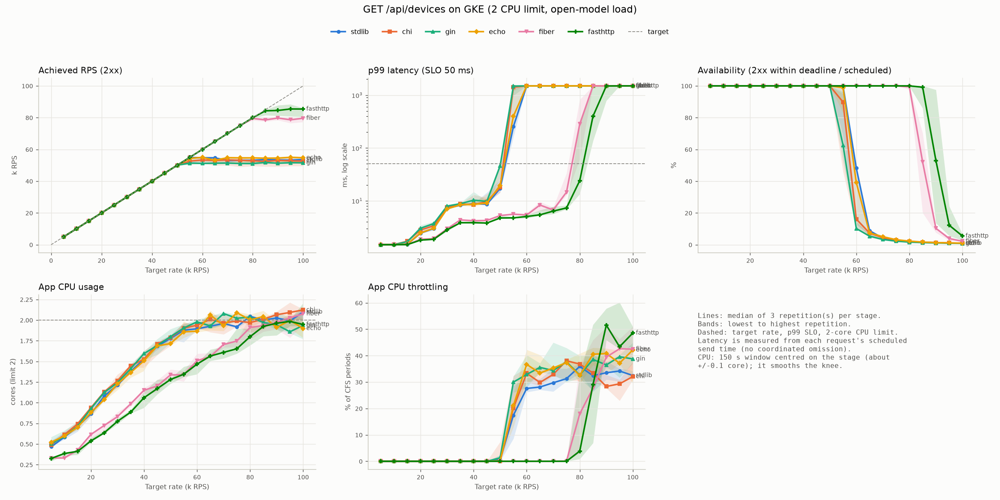
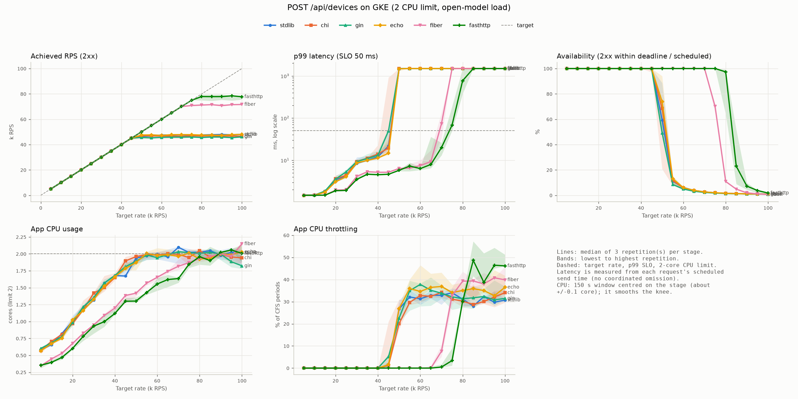

# GKE benchmark summary: gke-20260925-030716

SLO: p99 <= 50 ms, achieved >= 95% of target rate, errors (non-2xx, timeouts and dropped requests) <= 1% of target. 3 repetition(s); tables show per-repetition values and medians. Tester metrics cover each 30 s stage minus its first 5 s. App CPU comes from cAdvisor over a 150 s window centred on each stage, because cAdvisor timestamps lag by ~10-15 s (accuracy about +/-0.1 core; it smooths the knee). Throttling uses the stage itself.

## GET /api/devices

### Max rate within SLO (RPS)

| Framework | Rep 1 | Rep 2 | Rep 3 | Median | Median peak achieved RPS |
|---|---|---|---|---|---|
| fasthttp | 80,000 | 75,000 | 80,000 | 80,000 | 85,463 |
| fiber | 75,000 | 75,000 | 75,000 | 75,000 | 79,926 |
| echo | 50,000 | 50,000 | 50,000 | 50,000 | 55,028 |
| stdlib | 50,000 | 50,000 | 50,000 | 50,000 | 54,904 |
| chi | 50,000 | 45,000 | 50,000 | 50,000 | 53,532 |
| gin | 45,000 | 50,000 | 50,000 | 50,000 | 51,782 |

### Peak achieved RPS by node (median; runs in parentheses)

| Framework | gke-bench-apps-2978ac17-5dh9 | gke-bench-apps-2978ac17-rd8n | Ratio |
|---|---|---|---|
| chi | 53,601 (2) | 51,068 (1) | 1.050 |
| echo | 55,076 (2) | 52,507 (1) | 1.049 |
| fasthttp | 86,940 (2) | 81,528 (1) | 1.066 |
| fiber | - (0) | 79,926 (3) | - |
| gin | 53,491 (1) | 51,658 (2) | 1.035 |
| stdlib | 55,118 (2) | 52,451 (1) | 1.051 |

Median node ratio across frameworks: 1.050.

### Crossover comparisons (pairs measured in both node orders)

Peak ratio A/B with A on each node; the geometric mean cancels the node effect.

| A | B | A on gke-bench-apps-2978ac17-5dh9 | A on gke-bench-apps-2978ac17-rd8n | Node-free A/B |
|---|---|---|---|---|
| chi | stdlib | 1.021 (1) | 0.930 (1) | **0.974** |
| fasthttp | gin | 1.658 (1) | 1.524 (1) | **1.590** |

### Per stage (median across repetitions)

| Target RPS | Framework | Achieved RPS | Errors/s | Availability | p50 ms | p90 ms | p99 ms | p99.9 ms | CPU cores | Throttled | SLO passed |
|---|---|---|---|---|---|---|---|---|---|---|---|
| 5,000 | chi | 5,000 | 0 | 100.0% | 0.72 | 1.28 | 1.48 | 1.50 | 0.49 | 0.0% | 3/3 |
| 5,000 | echo | 5,000 | 0 | 100.0% | 0.72 | 1.28 | 1.48 | 1.50 | 0.52 | 0.0% | 3/3 |
| 5,000 | fasthttp | 5,000 | 0 | 100.0% | 0.68 | 1.25 | 1.48 | 1.50 | 0.33 | 0.0% | 3/3 |
| 5,000 | fiber | 5,000 | 0 | 100.0% | 0.69 | 1.26 | 1.48 | 1.50 | 0.33 | 0.0% | 3/3 |
| 5,000 | gin | 5,000 | 0 | 100.0% | 0.72 | 1.29 | 1.48 | 1.50 | 0.50 | 0.0% | 3/3 |
| 5,000 | stdlib | 5,000 | 0 | 100.0% | 0.71 | 1.28 | 1.48 | 1.50 | 0.47 | 0.0% | 3/3 |
| 10,000 | chi | 10,000 | 0 | 100.0% | 0.72 | 1.29 | 1.48 | 1.90 | 0.61 | 0.0% | 3/3 |
| 10,000 | echo | 10,000 | 0 | 100.0% | 0.72 | 1.30 | 1.48 | 1.82 | 0.60 | 0.0% | 3/3 |
| 10,000 | fasthttp | 10,000 | 0 | 100.0% | 0.70 | 1.27 | 1.48 | 1.50 | 0.39 | 0.0% | 3/3 |
| 10,000 | fiber | 10,000 | 0 | 100.0% | 0.71 | 1.29 | 1.48 | 1.50 | 0.33 | 0.0% | 3/3 |
| 10,000 | gin | 10,000 | 0 | 100.0% | 0.72 | 1.30 | 1.48 | 1.94 | 0.59 | 0.0% | 3/3 |
| 10,000 | stdlib | 10,000 | 0 | 100.0% | 0.71 | 1.29 | 1.48 | 1.85 | 0.58 | 0.0% | 3/3 |
| 15,000 | chi | 15,000 | 0 | 100.0% | 0.69 | 1.33 | 1.72 | 2.45 | 0.74 | 0.0% | 3/3 |
| 15,000 | echo | 15,000 | 0 | 100.0% | 0.68 | 1.32 | 1.51 | 2.36 | 0.70 | 0.0% | 3/3 |
| 15,000 | fasthttp | 15,000 | 0 | 100.0% | 0.67 | 1.29 | 1.48 | 1.64 | 0.41 | 0.0% | 3/3 |
| 15,000 | fiber | 15,000 | 0 | 100.0% | 0.68 | 1.30 | 1.48 | 1.84 | 0.43 | 0.0% | 3/3 |
| 15,000 | gin | 15,000 | 0 | 100.0% | 0.69 | 1.33 | 1.68 | 2.44 | 0.72 | 0.0% | 3/3 |
| 15,000 | stdlib | 15,000 | 0 | 100.0% | 0.68 | 1.32 | 1.50 | 2.33 | 0.71 | 0.0% | 3/3 |
| 20,000 | chi | 20,002 | 0 | 100.0% | 0.72 | 1.47 | 2.81 | 3.98 | 0.94 | 0.0% | 3/3 |
| 20,000 | echo | 20,000 | 0 | 100.0% | 0.72 | 1.45 | 2.46 | 3.65 | 0.88 | 0.0% | 3/3 |
| 20,000 | fasthttp | 20,003 | 0 | 100.0% | 0.67 | 1.35 | 1.80 | 2.30 | 0.54 | 0.0% | 3/3 |
| 20,000 | fiber | 19,998 | 0 | 100.0% | 0.68 | 1.36 | 1.87 | 2.35 | 0.62 | 0.0% | 3/3 |
| 20,000 | gin | 19,999 | 0 | 100.0% | 0.73 | 1.48 | 3.03 | 5.09 | 0.93 | 0.0% | 3/3 |
| 20,000 | stdlib | 19,999 | 0 | 100.0% | 0.72 | 1.44 | 2.44 | 3.91 | 0.87 | 0.0% | 3/3 |
| 25,000 | chi | 25,001 | 0 | 100.0% | 0.73 | 1.67 | 3.37 | 4.89 | 1.13 | 0.0% | 3/3 |
| 25,000 | echo | 25,001 | 0 | 100.0% | 0.71 | 1.55 | 3.03 | 5.39 | 1.04 | 0.0% | 3/3 |
| 25,000 | fasthttp | 25,000 | 0 | 100.0% | 0.66 | 1.36 | 1.87 | 2.41 | 0.64 | 0.0% | 3/3 |
| 25,000 | fiber | 25,000 | 0 | 100.0% | 0.66 | 1.39 | 1.93 | 2.78 | 0.72 | 0.0% | 3/3 |
| 25,000 | gin | 25,000 | 0 | 100.0% | 0.74 | 1.70 | 3.71 | 5.55 | 1.12 | 0.0% | 3/3 |
| 25,000 | stdlib | 25,000 | 0 | 100.0% | 0.71 | 1.54 | 3.00 | 4.49 | 1.08 | 0.0% | 3/3 |
| 30,000 | chi | 30,001 | 0 | 100.0% | 1.23 | 4.07 | 7.48 | 9.75 | 1.26 | 0.0% | 3/3 |
| 30,000 | echo | 30,000 | 0 | 100.0% | 1.17 | 3.82 | 7.01 | 9.45 | 1.23 | 0.0% | 3/3 |
| 30,000 | fasthttp | 30,000 | 0 | 100.0% | 0.66 | 1.46 | 2.83 | 5.55 | 0.78 | 0.0% | 3/3 |
| 30,000 | fiber | 29,999 | 0 | 100.0% | 0.71 | 1.54 | 2.95 | 5.36 | 0.83 | 0.0% | 3/3 |
| 30,000 | gin | 30,000 | 0 | 100.0% | 1.30 | 4.42 | 7.96 | 12.89 | 1.24 | 0.0% | 3/3 |
| 30,000 | stdlib | 30,000 | 0 | 100.0% | 1.19 | 3.84 | 7.33 | 9.57 | 1.21 | 0.0% | 3/3 |
| 35,000 | chi | 35,002 | 0 | 100.0% | 1.80 | 5.44 | 8.68 | 13.55 | 1.45 | 0.0% | 3/3 |
| 35,000 | echo | 34,999 | 0 | 100.0% | 1.71 | 5.17 | 8.42 | 15.39 | 1.37 | 0.0% | 3/3 |
| 35,000 | fasthttp | 35,002 | 0 | 100.0% | 0.84 | 2.02 | 3.85 | 5.84 | 0.89 | 0.0% | 3/3 |
| 35,000 | fiber | 34,999 | 0 | 100.0% | 0.90 | 2.34 | 4.35 | 6.39 | 0.99 | 0.0% | 3/3 |
| 35,000 | gin | 35,000 | 0 | 100.0% | 1.94 | 5.60 | 8.82 | 13.49 | 1.41 | 0.0% | 3/3 |
| 35,000 | stdlib | 35,000 | 0 | 100.0% | 1.70 | 5.20 | 8.23 | 12.26 | 1.38 | 0.0% | 3/3 |
| 40,000 | chi | 40,001 | 0 | 100.0% | 1.79 | 5.38 | 8.44 | 12.69 | 1.53 | 0.0% | 3/3 |
| 40,000 | echo | 39,999 | 0 | 100.0% | 1.74 | 5.28 | 8.59 | 13.22 | 1.51 | 0.0% | 3/3 |
| 40,000 | fasthttp | 40,001 | 0 | 100.0% | 0.83 | 2.00 | 3.87 | 5.97 | 1.06 | 0.0% | 3/3 |
| 40,000 | fiber | 39,998 | 0 | 100.0% | 0.88 | 2.30 | 4.20 | 6.34 | 1.15 | 0.0% | 3/3 |
| 40,000 | gin | 40,001 | 0 | 100.0% | 2.00 | 5.82 | 10.28 | 18.81 | 1.60 | 0.0% | 3/3 |
| 40,000 | stdlib | 39,999 | 0 | 100.0% | 1.76 | 5.31 | 8.86 | 16.95 | 1.53 | 0.0% | 3/3 |
| 45,000 | chi | 45,001 | 0 | 100.0% | 1.99 | 5.78 | 9.65 | 17.70 | 1.71 | 0.0% | 3/3 |
| 45,000 | echo | 45,000 | 0 | 100.0% | 1.83 | 5.38 | 9.02 | 22.91 | 1.69 | 0.0% | 3/3 |
| 45,000 | fasthttp | 44,998 | 0 | 100.0% | 0.84 | 2.03 | 3.79 | 5.72 | 1.17 | 0.0% | 3/3 |
| 45,000 | fiber | 44,999 | 0 | 100.0% | 0.92 | 2.34 | 4.24 | 6.32 | 1.20 | 0.0% | 3/3 |
| 45,000 | gin | 45,002 | 0 | 100.0% | 2.23 | 6.12 | 9.75 | 14.51 | 1.69 | 0.0% | 3/3 |
| 45,000 | stdlib | 45,000 | 0 | 100.0% | 1.84 | 5.37 | 8.59 | 13.49 | 1.68 | 0.0% | 3/3 |
| 50,000 | chi | 50,000 | 0 | 100.0% | 3.74 | 8.18 | 17.98 | 30.06 | 1.79 | 0.1% | 2/3 |
| 50,000 | echo | 50,001 | 0 | 100.0% | 3.24 | 7.46 | 19.59 | 34.12 | 1.72 | 0.2% | 3/3 |
| 50,000 | fasthttp | 49,999 | 0 | 100.0% | 1.22 | 3.03 | 4.73 | 6.87 | 1.28 | 0.0% | 3/3 |
| 50,000 | fiber | 49,999 | 0 | 100.0% | 1.47 | 3.60 | 5.26 | 7.68 | 1.34 | 0.0% | 3/3 |
| 50,000 | gin | 50,001 | 0 | 100.0% | 4.11 | 9.68 | 45.91 | 69.24 | 1.80 | 1.3% | 2/3 |
| 50,000 | stdlib | 49,998 | 0 | 100.0% | 3.40 | 7.64 | 17.16 | 39.33 | 1.78 | 0.6% | 3/3 |
| 55,000 | chi | 52,647 | 258 | 89.8% | 531.74 | 976.74 | 1419.25 | 1491.93 | 1.90 | 20.1% | 0/3 |
| 55,000 | echo | 54,381 | 0 | 98.9% | 130.01 | 296.18 | 399.45 | 483.14 | 1.86 | 21.1% | 0/3 |
| 55,000 | fasthttp | 55,000 | 0 | 100.0% | 1.20 | 3.01 | 4.76 | 6.92 | 1.35 | 0.0% | 3/3 |
| 55,000 | fiber | 54,998 | 0 | 100.0% | 1.50 | 3.69 | 5.58 | 9.51 | 1.34 | 0.0% | 3/3 |
| 55,000 | gin | 51,398 | 1,692 | 62.7% | 953.48 | 1348.01 | 1484.80 | 1498.48 | 1.90 | 30.0% | 0/3 |
| 55,000 | stdlib | 54,904 | 0 | 99.8% | 51.73 | 184.56 | 253.84 | 307.77 | 1.88 | 17.4% | 0/3 |
| 60,000 | chi | 53,360 | 6,581 | 16.2% | 1194.61 | 1438.92 | 1493.89 | 1499.39 | 1.94 | 33.3% | 0/3 |
| 60,000 | echo | 54,989 | 3,663 | 39.1% | 1063.92 | 1412.78 | 1491.28 | 1499.13 | 1.87 | 36.7% | 0/3 |
| 60,000 | fasthttp | 60,000 | 0 | 100.0% | 1.24 | 3.04 | 5.05 | 8.29 | 1.47 | 0.0% | 3/3 |
| 60,000 | fiber | 60,000 | 0 | 100.0% | 1.46 | 3.53 | 5.38 | 8.75 | 1.51 | 0.0% | 3/3 |
| 60,000 | gin | 51,178 | 8,822 | 10.2% | 1216.05 | 1443.21 | 1494.32 | 1499.43 | 1.98 | 32.9% | 0/3 |
| 60,000 | stdlib | 54,780 | 3,133 | 48.2% | 993.47 | 1394.81 | 1489.48 | 1498.95 | 1.89 | 27.6% | 0/3 |
| 65,000 | chi | 53,029 | 11,971 | 7.3% | 1225.36 | 1445.07 | 1494.51 | 1499.45 | 2.01 | 29.8% | 0/3 |
| 65,000 | echo | 53,156 | 11,824 | 7.4% | 1225.03 | 1445.01 | 1494.50 | 1499.45 | 2.06 | 33.4% | 0/3 |
| 65,000 | fasthttp | 65,000 | 0 | 100.0% | 1.41 | 3.25 | 5.43 | 11.23 | 1.57 | 0.0% | 3/3 |
| 65,000 | fiber | 64,998 | 0 | 100.0% | 1.64 | 3.78 | 8.32 | 25.16 | 1.56 | 0.0% | 3/3 |
| 65,000 | gin | 51,312 | 13,674 | 5.4% | 1231.70 | 1446.34 | 1494.63 | 1499.46 | 1.93 | 35.6% | 0/3 |
| 65,000 | stdlib | 54,701 | 10,269 | 8.9% | 1220.59 | 1444.12 | 1494.41 | 1499.44 | 1.93 | 28.1% | 0/3 |
| 70,000 | chi | 53,419 | 16,544 | 4.4% | 1234.62 | 1446.92 | 1494.69 | 1499.47 | 1.97 | 32.9% | 0/3 |
| 70,000 | echo | 54,811 | 15,169 | 5.1% | 1232.72 | 1446.54 | 1494.65 | 1499.47 | 1.93 | 35.4% | 0/3 |
| 70,000 | fasthttp | 70,000 | 0 | 100.0% | 1.93 | 3.82 | 6.39 | 17.76 | 1.61 | 0.0% | 3/3 |
| 70,000 | fiber | 69,999 | 0 | 100.0% | 2.18 | 4.16 | 6.72 | 9.86 | 1.70 | 0.0% | 3/3 |
| 70,000 | gin | 51,384 | 18,599 | 3.3% | 1238.27 | 1447.65 | 1494.77 | 1499.48 | 2.08 | 34.4% | 0/3 |
| 70,000 | stdlib | 52,966 | 17,031 | 4.1% | 1235.80 | 1447.16 | 1494.72 | 1499.47 | 1.96 | 29.7% | 0/3 |
| 75,000 | chi | 53,148 | 21,852 | 2.9% | 1239.48 | 1447.90 | 1494.79 | 1499.48 | 1.99 | 38.1% | 0/3 |
| 75,000 | echo | 54,675 | 20,272 | 3.1% | 1238.71 | 1447.74 | 1494.77 | 1499.48 | 2.09 | 37.3% | 0/3 |
| 75,000 | fasthttp | 75,001 | 0 | 100.0% | 2.11 | 4.02 | 7.32 | 16.30 | 1.65 | 0.0% | 3/3 |
| 75,000 | fiber | 74,997 | 0 | 100.0% | 2.38 | 4.67 | 14.55 | 35.65 | 1.75 | 0.1% | 3/3 |
| 75,000 | gin | 51,127 | 23,855 | 2.2% | 1241.48 | 1448.30 | 1494.83 | 1499.48 | 2.02 | 37.7% | 0/3 |
| 75,000 | stdlib | 53,116 | 21,881 | 2.7% | 1239.95 | 1447.99 | 1494.80 | 1499.48 | 1.92 | 31.3% | 0/3 |
| 80,000 | chi | 52,835 | 27,162 | 2.1% | 1241.96 | 1448.39 | 1494.84 | 1499.48 | 1.97 | 36.8% | 0/3 |
| 80,000 | echo | 54,671 | 25,278 | 2.3% | 1241.43 | 1448.29 | 1494.83 | 1499.48 | 2.00 | 32.5% | 0/3 |
| 80,000 | fasthttp | 80,001 | 0 | 100.0% | 2.27 | 4.83 | 24.08 | 39.73 | 1.80 | 3.9% | 2/3 |
| 80,000 | fiber | 79,518 | 0 | 99.4% | 68.61 | 197.64 | 282.72 | 337.18 | 1.91 | 18.0% | 0/3 |
| 80,000 | gin | 51,134 | 28,853 | 1.6% | 1243.41 | 1448.68 | 1494.87 | 1499.49 | 2.04 | 32.7% | 0/3 |
| 80,000 | stdlib | 53,157 | 26,841 | 2.0% | 1242.25 | 1448.45 | 1494.84 | 1499.48 | 2.05 | 35.9% | 0/3 |
| 85,000 | chi | 52,425 | 32,578 | 1.6% | 1243.45 | 1448.69 | 1494.87 | 1499.49 | 2.01 | 33.4% | 0/3 |
| 85,000 | echo | 54,478 | 30,502 | 1.7% | 1243.30 | 1448.66 | 1494.87 | 1499.49 | 2.04 | 40.6% | 0/3 |
| 85,000 | fasthttp | 84,300 | 0 | 99.2% | 169.53 | 311.14 | 399.76 | 465.31 | 1.92 | 29.0% | 0/3 |
| 85,000 | fiber | 78,578 | 4,206 | 52.0% | 974.87 | 1385.64 | 1488.56 | 1498.86 | 1.93 | 27.7% | 0/3 |
| 85,000 | gin | 51,782 | 33,202 | 1.3% | 1244.40 | 1448.88 | 1494.89 | 1499.49 | 1.97 | 38.6% | 0/3 |
| 85,000 | stdlib | 53,633 | 31,367 | 1.6% | 1243.55 | 1448.71 | 1494.87 | 1499.49 | 2.00 | 32.4% | 0/3 |
| 90,000 | chi | 53,109 | 36,892 | 1.3% | 1244.31 | 1448.86 | 1494.89 | 1499.49 | 2.07 | 28.3% | 0/3 |
| 90,000 | echo | 54,563 | 35,415 | 1.3% | 1244.40 | 1448.88 | 1494.89 | 1499.49 | 1.91 | 40.8% | 0/3 |
| 90,000 | fasthttp | 84,531 | 3,399 | 53.0% | 984.25 | 1385.28 | 1488.53 | 1498.85 | 1.96 | 51.6% | 0/3 |
| 90,000 | fiber | 79,773 | 10,207 | 10.3% | 1217.05 | 1443.41 | 1494.34 | 1499.43 | 1.97 | 39.5% | 0/3 |
| 90,000 | gin | 51,292 | 38,696 | 1.1% | 1245.13 | 1449.03 | 1494.90 | 1499.49 | 1.94 | 36.5% | 0/3 |
| 90,000 | stdlib | 53,416 | 36,583 | 1.3% | 1244.46 | 1448.89 | 1494.89 | 1499.49 | 2.03 | 33.5% | 0/3 |
| 95,000 | chi | 52,807 | 42,190 | 1.1% | 1244.82 | 1448.96 | 1494.90 | 1499.49 | 2.09 | 29.3% | 0/3 |
| 95,000 | echo | 55,028 | 39,917 | 1.1% | 1245.05 | 1449.01 | 1494.90 | 1499.49 | 2.00 | 37.2% | 0/3 |
| 95,000 | fasthttp | 85,463 | 9,520 | 12.3% | 1210.55 | 1442.11 | 1494.21 | 1499.42 | 1.99 | 43.4% | 0/3 |
| 95,000 | fiber | 78,633 | 16,342 | 3.9% | 1237.75 | 1447.55 | 1494.75 | 1499.48 | 2.03 | 42.6% | 0/3 |
| 95,000 | gin | 51,661 | 43,322 | 1.0% | 1245.52 | 1449.10 | 1494.91 | 1499.49 | 1.86 | 39.6% | 0/3 |
| 95,000 | stdlib | 53,208 | 41,787 | 1.1% | 1245.15 | 1449.03 | 1494.90 | 1499.49 | 1.99 | 34.2% | 0/3 |
| 100,000 | chi | 52,633 | 47,363 | 1.0% | 1245.35 | 1449.07 | 1494.91 | 1499.49 | 2.12 | 32.1% | 0/3 |
| 100,000 | echo | 54,772 | 45,187 | 1.0% | 1245.47 | 1449.09 | 1494.91 | 1499.49 | 1.90 | 42.2% | 0/3 |
| 100,000 | fasthttp | 85,419 | 14,564 | 5.5% | 1232.85 | 1446.57 | 1494.66 | 1499.47 | 1.95 | 48.6% | 0/3 |
| 100,000 | fiber | 79,637 | 20,335 | 2.2% | 1242.94 | 1448.59 | 1494.86 | 1499.49 | 2.08 | 42.5% | 0/3 |
| 100,000 | gin | 51,533 | 48,466 | 0.8% | 1245.87 | 1449.17 | 1494.92 | 1499.49 | 1.94 | 38.8% | 0/3 |
| 100,000 | stdlib | 53,683 | 46,316 | 0.9% | 1245.58 | 1449.12 | 1494.91 | 1499.49 | 2.10 | 32.5% | 0/3 |

## POST /api/devices

### Max rate within SLO (RPS)

| Framework | Rep 1 | Rep 2 | Rep 3 | Median | Median peak achieved RPS |
|---|---|---|---|---|---|
| fasthttp | 75,000 | 70,000 | 70,000 | 70,000 | 78,480 |
| fiber | 65,000 | 70,000 | 65,000 | 65,000 | 71,748 |
| echo | 45,000 | 45,000 | 45,000 | 45,000 | 48,448 |
| stdlib | 45,000 | 45,000 | 45,000 | 45,000 | 48,199 |
| chi | 45,000 | 40,000 | 45,000 | 45,000 | 47,115 |
| gin | 40,000 | 45,000 | 45,000 | 45,000 | 46,180 |

### Peak achieved RPS by node (median; runs in parentheses)

| Framework | gke-bench-apps-2978ac17-5dh9 | gke-bench-apps-2978ac17-rd8n | Ratio |
|---|---|---|---|
| chi | 47,214 (2) | 45,499 (1) | 1.038 |
| echo | 48,593 (2) | 46,771 (1) | 1.039 |
| fasthttp | 79,012 (2) | 75,541 (1) | 1.046 |
| fiber | - (0) | 71,748 (3) | - |
| gin | 47,484 (1) | 46,076 (2) | 1.031 |
| stdlib | 48,347 (2) | 45,998 (1) | 1.051 |

Median node ratio across frameworks: 1.039.

### Crossover comparisons (pairs measured in both node orders)

Peak ratio A/B with A on each node; the geometric mean cancels the node effect.

| A | B | A on gke-bench-apps-2978ac17-5dh9 | A on gke-bench-apps-2978ac17-rd8n | Node-free A/B |
|---|---|---|---|---|
| chi | stdlib | 1.024 (1) | 0.938 (1) | **0.980** |
| fasthttp | gin | 1.730 (1) | 1.591 (1) | **1.659** |

### Per stage (median across repetitions)

| Target RPS | Framework | Achieved RPS | Errors/s | Availability | p50 ms | p90 ms | p99 ms | p99.9 ms | CPU cores | Throttled | SLO passed |
|---|---|---|---|---|---|---|---|---|---|---|---|
| 5,000 | chi | 5,000 | 0 | 100.0% | 0.72 | 1.28 | 1.48 | 1.50 | 0.57 | 0.0% | 3/3 |
| 5,000 | echo | 5,000 | 0 | 100.0% | 0.72 | 1.29 | 1.48 | 1.56 | 0.57 | 0.0% | 3/3 |
| 5,000 | fasthttp | 5,000 | 0 | 100.0% | 0.69 | 1.26 | 1.48 | 1.50 | 0.35 | 0.0% | 3/3 |
| 5,000 | fiber | 5,000 | 0 | 100.0% | 0.70 | 1.28 | 1.48 | 1.50 | 0.34 | 0.0% | 3/3 |
| 5,000 | gin | 5,000 | 0 | 100.0% | 0.72 | 1.29 | 1.48 | 1.65 | 0.60 | 0.0% | 3/3 |
| 5,000 | stdlib | 5,000 | 0 | 100.0% | 0.72 | 1.28 | 1.48 | 1.60 | 0.58 | 0.0% | 3/3 |
| 10,000 | chi | 10,000 | 0 | 100.0% | 0.72 | 1.30 | 1.49 | 1.93 | 0.71 | 0.0% | 3/3 |
| 10,000 | echo | 10,000 | 0 | 100.0% | 0.72 | 1.30 | 1.49 | 1.94 | 0.67 | 0.0% | 3/3 |
| 10,000 | fasthttp | 10,000 | 0 | 100.0% | 0.71 | 1.28 | 1.48 | 1.50 | 0.40 | 0.0% | 3/3 |
| 10,000 | fiber | 10,000 | 0 | 100.0% | 0.71 | 1.29 | 1.48 | 1.51 | 0.45 | 0.0% | 3/3 |
| 10,000 | gin | 10,000 | 0 | 100.0% | 0.72 | 1.30 | 1.49 | 1.96 | 0.68 | 0.0% | 3/3 |
| 10,000 | stdlib | 10,000 | 0 | 100.0% | 0.72 | 1.30 | 1.49 | 1.92 | 0.66 | 0.0% | 3/3 |
| 15,000 | chi | 15,000 | 0 | 100.0% | 0.69 | 1.34 | 1.82 | 2.71 | 0.81 | 0.0% | 3/3 |
| 15,000 | echo | 15,000 | 0 | 100.0% | 0.69 | 1.33 | 1.75 | 2.48 | 0.75 | 0.0% | 3/3 |
| 15,000 | fasthttp | 15,000 | 0 | 100.0% | 0.68 | 1.30 | 1.48 | 1.87 | 0.47 | 0.0% | 3/3 |
| 15,000 | fiber | 15,000 | 0 | 100.0% | 0.68 | 1.31 | 1.49 | 1.96 | 0.53 | 0.0% | 3/3 |
| 15,000 | gin | 15,000 | 0 | 100.0% | 0.70 | 1.35 | 1.86 | 2.82 | 0.78 | 0.0% | 3/3 |
| 15,000 | stdlib | 15,000 | 0 | 100.0% | 0.69 | 1.33 | 1.76 | 2.80 | 0.82 | 0.0% | 3/3 |
| 20,000 | chi | 20,000 | 0 | 100.0% | 0.79 | 1.81 | 3.64 | 5.98 | 0.97 | 0.0% | 3/3 |
| 20,000 | echo | 20,001 | 0 | 100.0% | 0.76 | 1.60 | 3.09 | 4.40 | 1.03 | 0.0% | 3/3 |
| 20,000 | fasthttp | 20,001 | 0 | 100.0% | 0.68 | 1.37 | 1.89 | 2.71 | 0.60 | 0.0% | 3/3 |
| 20,000 | fiber | 19,998 | 0 | 100.0% | 0.68 | 1.39 | 1.96 | 2.96 | 0.68 | 0.0% | 3/3 |
| 20,000 | gin | 20,001 | 0 | 100.0% | 0.78 | 1.72 | 3.57 | 5.23 | 0.99 | 0.0% | 3/3 |
| 20,000 | stdlib | 19,999 | 0 | 100.0% | 0.76 | 1.65 | 3.41 | 5.01 | 1.00 | 0.0% | 3/3 |
| 25,000 | chi | 25,000 | 0 | 100.0% | 0.79 | 1.97 | 4.42 | 6.57 | 1.17 | 0.0% | 3/3 |
| 25,000 | echo | 24,998 | 0 | 100.0% | 0.77 | 1.90 | 4.08 | 6.30 | 1.16 | 0.0% | 3/3 |
| 25,000 | fasthttp | 25,001 | 0 | 100.0% | 0.66 | 1.38 | 1.93 | 2.80 | 0.78 | 0.0% | 3/3 |
| 25,000 | fiber | 24,999 | 0 | 100.0% | 0.67 | 1.42 | 2.00 | 3.18 | 0.83 | 0.0% | 3/3 |
| 25,000 | gin | 25,000 | 0 | 100.0% | 0.79 | 2.05 | 5.33 | 7.94 | 1.22 | 0.0% | 3/3 |
| 25,000 | stdlib | 25,002 | 0 | 100.0% | 0.77 | 1.89 | 4.28 | 7.30 | 1.17 | 0.0% | 3/3 |
| 30,000 | chi | 30,001 | 0 | 100.0% | 1.62 | 5.68 | 9.35 | 17.61 | 1.42 | 0.0% | 3/3 |
| 30,000 | echo | 29,999 | 0 | 100.0% | 1.45 | 5.08 | 8.66 | 14.79 | 1.33 | 0.0% | 3/3 |
| 30,000 | fasthttp | 29,998 | 0 | 100.0% | 0.73 | 1.64 | 3.51 | 7.05 | 0.93 | 0.0% | 3/3 |
| 30,000 | fiber | 30,001 | 0 | 100.0% | 0.80 | 1.87 | 4.14 | 7.20 | 0.95 | 0.0% | 3/3 |
| 30,000 | gin | 30,001 | 0 | 100.0% | 1.58 | 5.57 | 9.27 | 14.31 | 1.35 | 0.0% | 3/3 |
| 30,000 | stdlib | 29,999 | 0 | 100.0% | 1.46 | 5.10 | 8.40 | 12.52 | 1.32 | 0.0% | 3/3 |
| 35,000 | chi | 34,999 | 0 | 100.0% | 2.40 | 6.76 | 11.24 | 14.65 | 1.50 | 0.0% | 3/3 |
| 35,000 | echo | 35,000 | 0 | 100.0% | 2.27 | 6.44 | 9.90 | 14.51 | 1.52 | 0.0% | 3/3 |
| 35,000 | fasthttp | 34,999 | 0 | 100.0% | 0.93 | 2.47 | 4.65 | 6.90 | 1.00 | 0.0% | 3/3 |
| 35,000 | fiber | 35,000 | 0 | 100.0% | 1.10 | 3.07 | 5.35 | 7.45 | 1.09 | 0.0% | 3/3 |
| 35,000 | gin | 34,999 | 0 | 100.0% | 2.49 | 6.80 | 10.97 | 14.80 | 1.57 | 0.0% | 3/3 |
| 35,000 | stdlib | 35,000 | 0 | 100.0% | 2.29 | 6.43 | 10.02 | 14.92 | 1.57 | 0.0% | 3/3 |
| 40,000 | chi | 40,000 | 0 | 100.0% | 2.90 | 7.43 | 14.04 | 29.24 | 1.65 | 0.0% | 3/3 |
| 40,000 | echo | 39,997 | 0 | 100.0% | 2.50 | 6.68 | 11.27 | 14.84 | 1.66 | 0.0% | 3/3 |
| 40,000 | fasthttp | 39,999 | 0 | 100.0% | 0.91 | 2.44 | 4.53 | 6.97 | 1.12 | 0.0% | 3/3 |
| 40,000 | fiber | 39,998 | 0 | 100.0% | 1.08 | 2.97 | 5.19 | 7.40 | 1.20 | 0.0% | 3/3 |
| 40,000 | gin | 40,001 | 0 | 100.0% | 2.84 | 7.32 | 13.13 | 17.88 | 1.68 | 0.0% | 3/3 |
| 40,000 | stdlib | 39,999 | 0 | 100.0% | 2.50 | 6.70 | 12.08 | 32.16 | 1.68 | 0.0% | 3/3 |
| 45,000 | chi | 45,000 | 0 | 100.0% | 3.45 | 8.75 | 19.52 | 29.31 | 1.90 | 1.3% | 2/3 |
| 45,000 | echo | 44,995 | 0 | 100.0% | 3.06 | 7.78 | 14.72 | 44.60 | 1.78 | 1.5% | 3/3 |
| 45,000 | fasthttp | 44,999 | 0 | 100.0% | 0.94 | 2.47 | 4.65 | 7.09 | 1.30 | 0.0% | 3/3 |
| 45,000 | fiber | 45,000 | 0 | 100.0% | 1.08 | 2.92 | 5.18 | 7.63 | 1.38 | 0.0% | 3/3 |
| 45,000 | gin | 45,003 | 0 | 100.0% | 4.25 | 12.86 | 49.91 | 69.08 | 1.81 | 5.2% | 2/3 |
| 45,000 | stdlib | 44,999 | 0 | 100.0% | 3.18 | 8.32 | 21.83 | 41.86 | 1.67 | 1.2% | 3/3 |
| 50,000 | chi | 47,001 | 1,216 | 68.4% | 845.57 | 1316.56 | 1481.66 | 1498.17 | 1.96 | 20.1% | 0/3 |
| 50,000 | echo | 47,536 | 825 | 73.8% | 827.39 | 1276.82 | 1477.68 | 1497.77 | 1.87 | 26.9% | 0/3 |
| 50,000 | fasthttp | 50,000 | 0 | 100.0% | 1.48 | 3.67 | 5.78 | 8.15 | 1.30 | 0.0% | 3/3 |
| 50,000 | fiber | 49,999 | 0 | 100.0% | 1.80 | 4.24 | 6.40 | 9.07 | 1.42 | 0.0% | 3/3 |
| 50,000 | gin | 45,622 | 2,642 | 49.0% | 988.98 | 1391.90 | 1489.19 | 1498.92 | 1.89 | 22.5% | 0/3 |
| 50,000 | stdlib | 46,464 | 1,667 | 59.3% | 962.10 | 1361.87 | 1486.19 | 1498.62 | 1.94 | 26.7% | 0/3 |
| 55,000 | chi | 47,012 | 7,945 | 11.6% | 1210.55 | 1442.11 | 1494.21 | 1499.42 | 1.99 | 29.7% | 0/3 |
| 55,000 | echo | 47,646 | 7,352 | 13.1% | 1205.46 | 1441.09 | 1494.11 | 1499.41 | 2.01 | 35.9% | 0/3 |
| 55,000 | fasthttp | 55,001 | 0 | 100.0% | 1.47 | 3.72 | 7.29 | 19.27 | 1.43 | 0.0% | 3/3 |
| 55,000 | fiber | 55,002 | 0 | 100.0% | 1.76 | 4.18 | 6.48 | 9.59 | 1.57 | 0.0% | 3/3 |
| 55,000 | gin | 45,281 | 9,666 | 8.5% | 1221.13 | 1444.23 | 1494.42 | 1499.44 | 1.98 | 35.0% | 0/3 |
| 55,000 | stdlib | 46,807 | 8,155 | 11.1% | 1212.33 | 1442.47 | 1494.25 | 1499.42 | 1.97 | 32.1% | 0/3 |
| 60,000 | chi | 46,771 | 13,187 | 5.8% | 1229.92 | 1445.98 | 1494.60 | 1499.46 | 1.98 | 32.7% | 0/3 |
| 60,000 | echo | 47,234 | 12,730 | 6.0% | 1229.35 | 1445.87 | 1494.59 | 1499.46 | 1.98 | 34.6% | 0/3 |
| 60,000 | fasthttp | 59,999 | 0 | 100.0% | 1.44 | 3.57 | 6.35 | 10.52 | 1.55 | 0.0% | 3/3 |
| 60,000 | fiber | 60,001 | 0 | 100.0% | 1.86 | 4.35 | 7.50 | 12.12 | 1.65 | 0.0% | 3/3 |
| 60,000 | gin | 45,724 | 14,176 | 4.9% | 1232.73 | 1446.55 | 1494.65 | 1499.47 | 1.94 | 37.8% | 0/3 |
| 60,000 | stdlib | 47,518 | 12,446 | 6.2% | 1228.78 | 1445.76 | 1494.58 | 1499.46 | 1.99 | 31.3% | 0/3 |
| 65,000 | chi | 46,771 | 18,179 | 3.7% | 1236.50 | 1447.30 | 1494.73 | 1499.47 | 2.00 | 32.4% | 0/3 |
| 65,000 | echo | 47,830 | 17,132 | 3.9% | 1236.09 | 1447.22 | 1494.72 | 1499.47 | 1.99 | 36.4% | 0/3 |
| 65,000 | fasthttp | 65,000 | 0 | 100.0% | 1.71 | 3.91 | 7.94 | 15.49 | 1.62 | 0.0% | 3/3 |
| 65,000 | fiber | 65,000 | 0 | 100.0% | 2.12 | 4.64 | 9.29 | 26.65 | 1.74 | 0.0% | 3/3 |
| 65,000 | gin | 45,895 | 19,002 | 3.2% | 1238.20 | 1447.64 | 1494.76 | 1499.48 | 1.99 | 35.1% | 0/3 |
| 65,000 | stdlib | 47,607 | 17,355 | 3.9% | 1236.11 | 1447.22 | 1494.72 | 1499.47 | 1.96 | 32.9% | 0/3 |
| 70,000 | chi | 46,516 | 23,443 | 2.6% | 1239.83 | 1447.97 | 1494.80 | 1499.48 | 1.99 | 34.2% | 0/3 |
| 70,000 | echo | 47,874 | 22,127 | 2.6% | 1240.10 | 1448.02 | 1494.80 | 1499.48 | 1.96 | 36.9% | 0/3 |
| 70,000 | fasthttp | 70,001 | 0 | 100.0% | 2.42 | 5.02 | 19.98 | 34.23 | 1.64 | 0.5% | 3/3 |
| 70,000 | fiber | 69,999 | 0 | 100.0% | 3.77 | 30.36 | 73.56 | 94.20 | 1.82 | 7.6% | 1/3 |
| 70,000 | gin | 45,901 | 24,096 | 2.2% | 1241.13 | 1448.23 | 1494.82 | 1499.48 | 2.03 | 33.8% | 0/3 |
| 70,000 | stdlib | 47,782 | 22,182 | 2.7% | 1239.80 | 1447.96 | 1494.80 | 1499.48 | 2.10 | 32.9% | 0/3 |
| 75,000 | chi | 47,012 | 27,945 | 2.0% | 1241.81 | 1448.36 | 1494.84 | 1499.48 | 1.95 | 31.2% | 0/3 |
| 75,000 | echo | 47,850 | 27,151 | 2.0% | 1241.90 | 1448.38 | 1494.84 | 1499.48 | 2.01 | 34.1% | 0/3 |
| 75,000 | fasthttp | 75,003 | 0 | 100.0% | 2.80 | 12.36 | 68.11 | 94.65 | 1.85 | 3.4% | 1/3 |
| 75,000 | fiber | 70,856 | 1,516 | 70.1% | 886.72 | 1308.17 | 1480.82 | 1498.08 | 1.87 | 32.7% | 0/3 |
| 75,000 | gin | 45,975 | 29,024 | 1.7% | 1242.76 | 1448.55 | 1494.86 | 1499.49 | 2.02 | 32.2% | 0/3 |
| 75,000 | stdlib | 47,287 | 27,679 | 1.9% | 1242.05 | 1448.41 | 1494.84 | 1499.48 | 2.02 | 34.0% | 0/3 |
| 80,000 | chi | 46,820 | 33,149 | 1.6% | 1243.03 | 1448.61 | 1494.86 | 1499.49 | 2.05 | 30.2% | 0/3 |
| 80,000 | echo | 47,459 | 32,504 | 1.6% | 1243.21 | 1448.64 | 1494.86 | 1499.49 | 1.92 | 35.0% | 0/3 |
| 80,000 | fasthttp | 77,885 | 0 | 97.4% | 434.93 | 647.93 | 770.71 | 843.88 | 1.96 | 30.2% | 0/3 |
| 80,000 | fiber | 71,199 | 8,776 | 10.9% | 1215.09 | 1443.02 | 1494.30 | 1499.43 | 1.93 | 39.2% | 0/3 |
| 80,000 | gin | 45,611 | 34,288 | 1.4% | 1243.88 | 1448.78 | 1494.88 | 1499.49 | 2.01 | 31.3% | 0/3 |
| 80,000 | stdlib | 47,574 | 32,392 | 1.5% | 1243.34 | 1448.67 | 1494.87 | 1499.49 | 2.02 | 31.2% | 0/3 |
| 85,000 | chi | 47,036 | 37,924 | 1.3% | 1243.79 | 1448.76 | 1494.88 | 1499.49 | 1.95 | 28.8% | 0/3 |
| 85,000 | echo | 47,470 | 37,494 | 1.3% | 1244.15 | 1448.83 | 1494.88 | 1499.49 | 1.94 | 35.9% | 0/3 |
| 85,000 | fasthttp | 77,828 | 6,582 | 22.9% | 1166.55 | 1433.31 | 1493.33 | 1499.33 | 1.90 | 48.6% | 0/3 |
| 85,000 | fiber | 71,484 | 13,497 | 4.8% | 1234.76 | 1446.95 | 1494.70 | 1499.47 | 1.96 | 39.3% | 0/3 |
| 85,000 | gin | 45,972 | 38,929 | 1.2% | 1244.25 | 1448.85 | 1494.88 | 1499.49 | 2.02 | 31.7% | 0/3 |
| 85,000 | stdlib | 47,794 | 37,166 | 1.3% | 1244.08 | 1448.82 | 1494.88 | 1499.49 | 2.05 | 28.0% | 0/3 |
| 90,000 | chi | 46,733 | 43,223 | 1.2% | 1244.28 | 1448.86 | 1494.89 | 1499.49 | 1.99 | 30.0% | 0/3 |
| 90,000 | echo | 47,323 | 42,639 | 1.1% | 1244.61 | 1448.92 | 1494.89 | 1499.49 | 2.00 | 35.0% | 0/3 |
| 90,000 | fasthttp | 77,855 | 12,100 | 7.2% | 1227.19 | 1445.44 | 1494.54 | 1499.45 | 2.02 | 38.8% | 0/3 |
| 90,000 | fiber | 70,726 | 19,273 | 1.9% | 1243.71 | 1448.74 | 1494.87 | 1499.49 | 2.00 | 38.0% | 0/3 |
| 90,000 | gin | 45,997 | 44,001 | 1.0% | 1244.82 | 1448.96 | 1494.90 | 1499.49 | 2.00 | 32.3% | 0/3 |
| 90,000 | stdlib | 47,979 | 41,982 | 1.1% | 1244.69 | 1448.94 | 1494.89 | 1499.49 | 1.98 | 32.3% | 0/3 |
| 95,000 | chi | 46,875 | 48,100 | 1.0% | 1244.68 | 1448.94 | 1494.89 | 1499.49 | 1.95 | 32.1% | 0/3 |
| 95,000 | echo | 47,854 | 47,109 | 1.0% | 1244.96 | 1448.99 | 1494.90 | 1499.49 | 1.99 | 32.7% | 0/3 |
| 95,000 | fasthttp | 78,480 | 16,480 | 3.8% | 1237.99 | 1447.60 | 1494.76 | 1499.48 | 2.06 | 46.5% | 0/3 |
| 95,000 | fiber | 71,492 | 23,507 | 1.1% | 1246.19 | 1449.24 | 1494.92 | 1499.49 | 1.96 | 40.8% | 0/3 |
| 95,000 | gin | 45,432 | 49,468 | 0.9% | 1245.14 | 1449.03 | 1494.90 | 1499.49 | 1.88 | 30.8% | 0/3 |
| 95,000 | stdlib | 47,755 | 47,210 | 1.0% | 1244.97 | 1448.99 | 1494.90 | 1499.49 | 2.02 | 29.7% | 0/3 |
| 100,000 | chi | 46,468 | 53,487 | 0.9% | 1245.02 | 1449.00 | 1494.90 | 1499.49 | 1.94 | 34.0% | 0/3 |
| 100,000 | echo | 48,056 | 51,912 | 0.9% | 1245.27 | 1449.05 | 1494.91 | 1499.49 | 2.03 | 36.5% | 0/3 |
| 100,000 | fasthttp | 77,719 | 22,238 | 1.8% | 1244.19 | 1448.84 | 1494.88 | 1499.49 | 2.01 | 46.2% | 0/3 |
| 100,000 | fiber | 71,628 | 28,348 | 0.6% | 1247.82 | 1449.56 | 1494.96 | 1499.50 | 2.15 | 39.8% | 0/3 |
| 100,000 | gin | 46,180 | 53,819 | 0.8% | 1245.32 | 1449.06 | 1494.91 | 1499.49 | 1.82 | 31.5% | 0/3 |
| 100,000 | stdlib | 48,063 | 51,924 | 0.9% | 1245.30 | 1449.06 | 1494.91 | 1499.49 | 2.02 | 30.7% | 0/3 |
