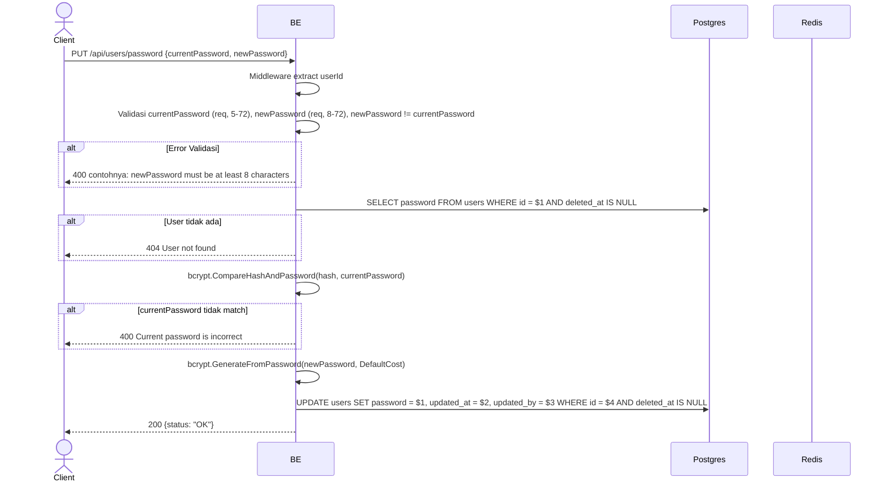

## Overview

API ini digunakan untuk mengganti password user. Backend cek `currentPassword` cocok via bcrypt, lalu update password hash baru. Tidak revoke refresh token yang aktif (lihat TD-007 multi-device).

---

## Auth

API ini adalah api protected jadi perlu authorization header `Bearer <accessToken>`.

## Flow



---

## Notes Redis

Endpoint ini tidak mengakses Redis (selain middleware auth check). Refresh token tidak di-revoke setelah change password (lihat TD-007).

---

## Notes Postgres/DB

| Tabel   | Kolom      | Aksi   | Keterangan                       |
| ------- | ---------- | ------ | -------------------------------- |
| `users` | password   | SELECT | Ambil hash buat verify           |
| `users` | password   | UPDATE | Set hash baru                    |
| `users` | updated_at | UPDATE | UTC now                          |
| `users` | updated_by | UPDATE | userId (self)                    |

---

## Prerequisites

User sudah login dengan access token valid. Tahu password lama.

---

## Validasi Request

| Field             | Tipe   | Wajib | Aturan                                                              |
| ----------------- | ------ | ----- | ------------------------------------------------------------------- |
| `currentPassword` | string | ya    | Required, min 5 karakter, max 72 karakter                           |
| `newPassword`     | string | ya    | Required, min 8 karakter, max 72 karakter, tidak boleh sama dengan currentPassword |

---

## Response

### 200 OK

```json
{
  "status": "OK"
}
```

### 400 Bad Request

| `error_message`                                  | Penyebab                                       |
| ------------------------------------------------ | ---------------------------------------------- |
| `currentPassword is required`                    | Password lama kosong                           |
| `currentPassword must be at least 5 characters`  | Password lama kurang dari 5                    |
| `currentPassword must be at most 72 characters`  | Password lama lebih dari 72                    |
| `newPassword is required`                        | Password baru kosong                           |
| `newPassword must be at least 8 characters`      | Password baru kurang dari 8                    |
| `newPassword must be at most 72 characters`      | Password baru lebih dari 72                    |
| `newPassword must not be equal to currentPassword` | Password baru sama dengan password lama       |
| `Current password is incorrect`                  | currentPassword tidak match dengan hash di DB  |

### 401 Unauthorized

| `error_message`                              | Penyebab           |
| -------------------------------------------- | ------------------ |
| `Authorization header is missing`            | Header tidak ada    |
| `Authentication token is invalid`            | JWT invalid        |
| `Authorization token not found or expired`   | Token tidak di cache |

### 404 Not Found

| `error_message`    | Penyebab                       |
| ------------------ | ------------------------------ |
| `User not found`   | User tidak ada / soft-deleted  |

---

## Update

Dokumentasi ini diupdate tanggal 23 Mei 2026.
