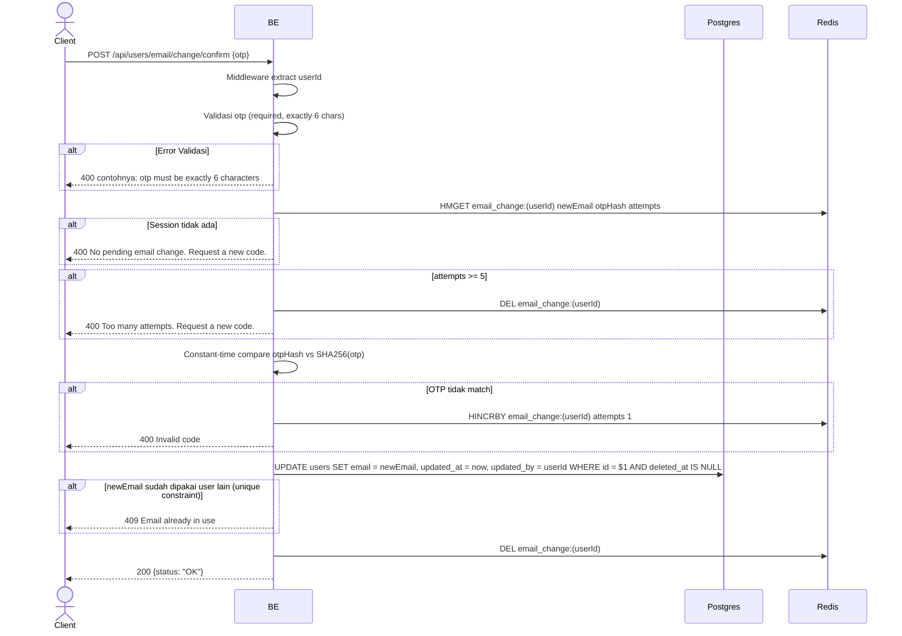

## Overview

API ini digunakan untuk konfirmasi ganti email dengan OTP yang sudah dikirim ke email lama. Kalau OTP benar, backend update kolom `email` di tabel users dan hapus session di Redis. Max 5 attempts — kalau lebih, session dihapus dan user harus request OTP baru.

---

## Auth

API ini adalah api protected jadi perlu authorization header `Bearer <accessToken>`.

## Flow



---

## Notes Redis

1. email change session:
   key: `email_change:(userId)`
   aksi: HMGET (read), HINCRBY attempts (on wrong OTP), DEL (cleanup)

---

## Notes Postgres/DB

| Tabel   | Kolom      | Aksi   | Keterangan                                |
| ------- | ---------- | ------ | ----------------------------------------- |
| `users` | email      | UPDATE | Set email baru                            |
| `users` | updated_at | UPDATE | UTC now                                    |
| `users` | updated_by | UPDATE | userId (self)                              |

---

## Prerequisites

User sudah hit `request_email_change` dan terima OTP di email lama. Session di Redis belum expired (TTL 10 menit) dan attempts belum mencapai 5.

---

## Validasi Request

| Field | Tipe   | Wajib | Aturan                       |
| ----- | ------ | ----- | ---------------------------- |
| `otp` | string | ya    | Required, exactly 6 karakter |

---

## Response

### 200 OK

```json
{
  "status": "OK"
}
```

### 400 Bad Request

| `error_message`                                  | Penyebab                                       |
| ------------------------------------------------ | ---------------------------------------------- |
| `otp is required`                                | OTP kosong                                     |
| `otp must be exactly 6 characters`               | Panjang OTP bukan 6                            |
| `No pending email change. Request a new code.`   | Session di Redis tidak ada / expired           |
| `Too many attempts. Request a new code.`         | Sudah 5 attempts gagal                         |
| `Invalid code`                                   | OTP tidak match                                |

### 409 Conflict

| `error_message`            | Penyebab                                |
| -------------------------- | --------------------------------------- |
| `Email already in use`     | newEmail keburu dipakai user lain         |

### 401 Unauthorized

| `error_message`                       | Penyebab        |
| ------------------------------------- | --------------- |
| `Authorization header is missing`     | Header tidak ada |
| `Authentication token is invalid`    | JWT invalid     |

---

## Update

Dokumentasi ini diupdate tanggal 23 Mei 2026.
