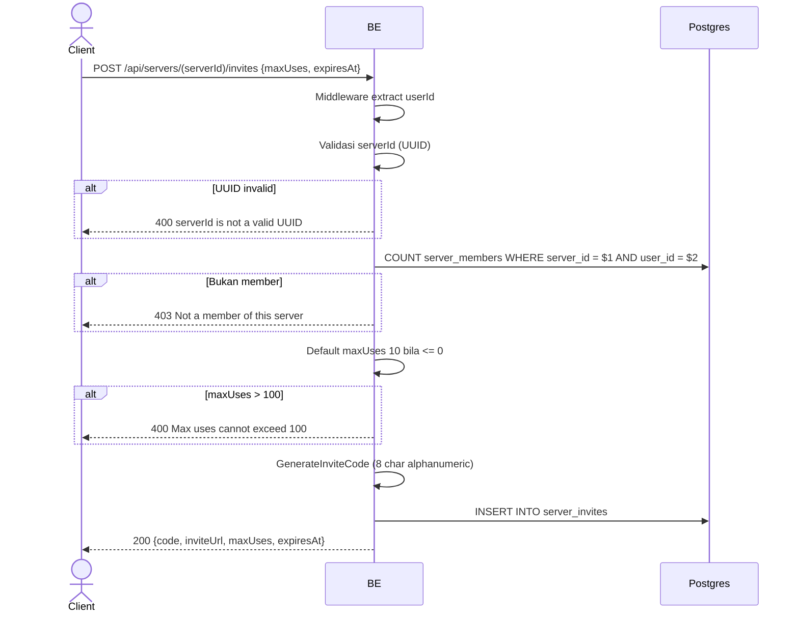

## Overview

API ini digunakan untuk generate invite link untuk server. Setiap member server boleh generate (tidak harus owner). Invite code 8 karakter alphanumeric (random). Max uses default 10, cap 100. Expiry optional.

---

## Auth

API ini adalah api protected jadi perlu authorization header `Bearer <accessToken>`.

## Flow



---

## Notes Redis

Tidak pakai Redis.

---

## Notes Postgres/DB

| Tabel            | Kolom                                       | Aksi   | Keterangan                          |
| ---------------- | ------------------------------------------- | ------ | ----------------------------------- |
| `server_members` | (count)                                     | SELECT | Cek apakah user member               |
| `server_invites` | id, server_id, code, max_uses, used_count, expires_at, is_active, created_at, ... | INSERT | Row invite baru                      |

---

## Prerequisites

User adalah member server (owner atau biasa).

---

## Validasi Request

Path parameter:

| Field      | Tipe   | Wajib | Aturan          |
| ---------- | ------ | ----- | --------------- |
| `serverId` | string | ya    | Required, UUID  |

Body JSON:

| Field       | Tipe              | Wajib | Aturan                                             |
| ----------- | ----------------- | ----- | -------------------------------------------------- |
| `maxUses`   | int               | tidak | Default 10 kalau <= 0, max 100                     |
| `expiresAt` | string (ISO 8601) | tidak | Timestamp expiry invite (null = tidak ada expiry)  |

---

## Response

### 200 OK

```json
{
  "code": "aB3xZ9pQ",
  "inviteUrl": "https://api.virdan.app/api/servers/invites/aB3xZ9pQ",
  "maxUses": 10,
  "expiresAt": "2026-06-01T10:00:00Z"
}
```

| Field       | Tipe        | Deskripsi                                    |
| ----------- | ----------- | -------------------------------------------- |
| `code`      | string      | 8 karakter alphanumeric                       |
| `inviteUrl` | string      | URL share (build pakai `APP_BASE_URL`)        |
| `maxUses`   | int         | Limit pemakaian                                |
| `expiresAt` | string/null | Timestamp expiry                              |

### 400 Bad Request

| `error_message`                  | Penyebab               |
| -------------------------------- | ---------------------- |
| `serverId is not a valid UUID`   | UUID invalid            |
| `Max uses cannot exceed 100`     | maxUses > 100           |

### 403 Forbidden

| `error_message`               | Penyebab           |
| ----------------------------- | ------------------ |
| `Not a member of this server` | User bukan member  |

### 401 Unauthorized

Standard auth errors.

---

## Update

Dokumentasi ini diupdate tanggal 23 Mei 2026.
