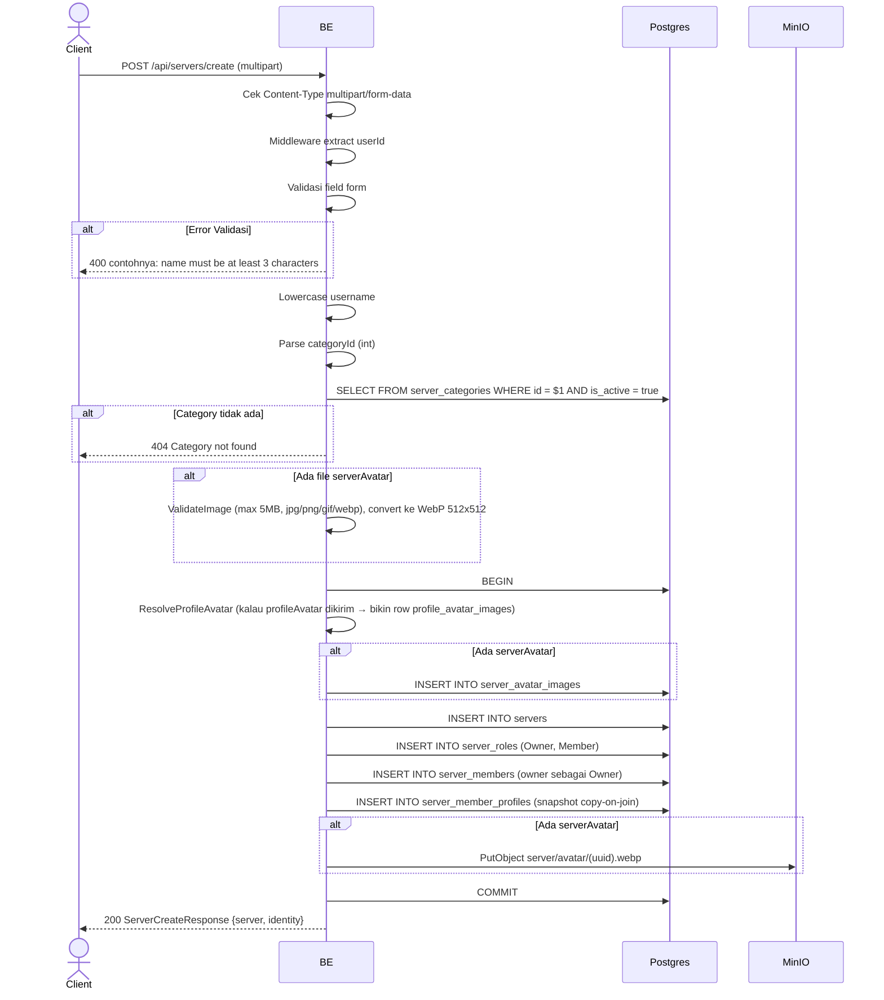

## Overview

API ini digunakan untuk membuat server baru. Format request: `multipart/form-data` (karena bisa upload avatar server + per-server profile avatar). Owner otomatis dibuat sebagai member dengan role Owner, dan dibuatkan row `server_member_profiles` (multi-identity Opsi B — copy-on-join).

---

## Auth

API ini adalah api protected jadi perlu authorization header `Bearer <accessToken>`.

## Flow



---

## Notes Redis

Tidak pakai Redis (selain middleware auth check).

---

## Notes Postgres/DB

| Tabel                     | Kolom                                           | Aksi   | Keterangan                                          |
| ------------------------- | ----------------------------------------------- | ------ | --------------------------------------------------- |
| `server_categories`       | id, is_active                                   | SELECT | Cek category exists & aktif                          |
| `profile_avatar_images`   | (full)                                          | INSERT | Bila ada upload profileAvatar (copy-on-join)         |
| `server_avatar_images`    | (full)                                          | INSERT | Bila ada upload serverAvatar                          |
| `servers`                 | id, owner_id, name, short_name, ...             | INSERT | Server baru                                          |
| `server_roles`            | id, server_id, name, permissions                | INSERT | Role Owner (`{"all":true}`) + Member (`{}`)         |
| `server_members`          | id, server_id, user_id, server_role_id, joined_at | INSERT | Owner sebagai member dengan role Owner               |
| `server_member_profiles`  | id, server_id, user_id, nickname, username, bio | INSERT | Snapshot profile per server (copy-on-join Opsi B)    |

---

## Prerequisites

User sudah login dengan access token valid.

---

## Validasi Request

Format request: `multipart/form-data`.

| Field           | Tipe          | Wajib | Aturan                                                                 |
| --------------- | ------------- | ----- | ---------------------------------------------------------------------- |
| `name`          | string        | ya    | Required, min 3 karakter, max 40 karakter                              |
| `shortName`     | string        | ya    | Required, min 2 karakter, max 10 karakter                              |
| `description`   | string        | tidak | Max 500 karakter                                                       |
| `categoryId`    | string (int)  | ya    | Required, harus int valid                                              |
| `isPrivate`     | string (bool) | ya    | Required ("true" atau bukan)                                           |
| `nickname`      | string        | ya    | Required, min 3 karakter, max 50 karakter                              |
| `username`      | string        | ya    | Required, min 3 karakter, max 22 karakter, regex `^[a-zA-Z0-9_.]+$`    |
| `bio`           | string        | tidak | Max 150 karakter                                                       |
| `serverAvatar`  | file          | tidak | Image (jpg/jpeg/png/gif/webp), max 5MB, di-convert ke WebP 512x512     |
| `profileAvatar` | file          | tidak | Profile avatar user untuk server ini (image rules sama)                |
| `avatarImageId` | string (UUID) | tidak | Alternatif: reuse existing `profile_avatar_images` UUID milik user     |

---

## Response

### 200 OK

```json
{
  "server": {
    "id": "550e8400-...",
    "ownerId": "user-uuid",
    "ownerNickname": "OwnerNick",
    "name": "Gaming Squad",
    "shortName": "GS",
    "categoryId": 3,
    "categoryName": null,
    "avatarUrl": "http://.../server/avatar/...webp",
    "bannerUrl": null,
    "description": "Server gaming",
    "settings": null,
    "memberCount": 1,
    "isMember": true,
    "createdAt": "2026-05-23T10:00:00Z",
    "updatedAt": "2026-05-23T10:00:00Z"
  },
  "identity": {
    "profileId": "profile-uuid",
    "serverId": "",
    "nickname": "OwnerNick",
    "username": "ownernick",
    "bio": "Owner bio",
    "avatarImageId": "avatar-uuid",
    "avatarUrl": null,
    "createdAt": "2026-05-23T10:00:00Z",
    "updatedAt": "2026-05-23T10:00:00Z"
  }
}
```

Catatan: pada response create server ini, field `settings`, `categoryName`, `bannerUrl`, `avatarUrl` (kalau tidak ada upload `serverAvatar`) tidak di-set di response builder sehingga di JSON akan jadi `null`. Demikian juga `Identity.ServerId` dan `Identity.AvatarUrl` tidak di-set di builder sehingga keluar sebagai string kosong / null. Untuk dapat field lengkap (incl. settings + URL avatar terpasang), client bisa hit `GET /api/servers/{id}` setelah create.

### 400 Bad Request

| `error_message`                                | Penyebab                              |
| ---------------------------------------------- | ------------------------------------- |
| `Invalid Content-Type header. Endpoint requires multipart/form-data.` | Content-Type bukan multipart  |
| `name is required` / `name must be at least 3 characters` | Name kosong / kurang dari 3 |
| `name must be at most 40 characters`           | Name lebih dari 40                     |
| `shortName is required`                        | ShortName kosong                       |
| `shortName must be at least 2 characters`      | ShortName kurang dari 2                |
| `shortName must be at most 10 characters`      | ShortName lebih dari 10                |
| `description must be at most 500 characters`   | Description terlalu panjang            |
| `categoryId is required`                       | CategoryId tidak diisi                 |
| `categoryId must be int`                       | CategoryId bukan integer               |
| `isPrivate is required`                        | IsPrivate tidak diisi                  |
| `nickname is required`                         | Nickname kosong                        |
| `nickname must be at least 3 characters`       | Nickname kurang 3                       |
| `nickname must be at most 50 characters`       | Nickname lebih dari 50                  |
| `username is required`                         | Username kosong                         |
| `username must be at least 3 characters`       | Username kurang 3                       |
| `username must be at most 22 characters`       | Username lebih dari 22                  |
| `Username may only contain letters, digits, underscores and dots` | Username gagal regex |
| `bio must be at most 150 characters`           | Bio lebih dari 150                      |
| `image size exceeded 5MB limit`                | File lebih dari 5 MB                    |
| `invalid file extension: ...`                  | Ekstensi file tidak diizinkan          |
| `invalid image type: ...`                      | MIME type sniff tidak diizinkan        |

### 404 Not Found

| `error_message`         | Penyebab                                |
| ----------------------- | --------------------------------------- |
| `Category not found`    | categoryId tidak ada / inactive         |

### 401 Unauthorized

| `error_message`                       | Penyebab           |
| ------------------------------------- | ------------------ |
| `Authorization header is missing`     | Header tidak ada    |
| `Authentication token is invalid`    | JWT invalid        |

---

## Update

Dokumentasi ini diupdate tanggal 23 Mei 2026.
