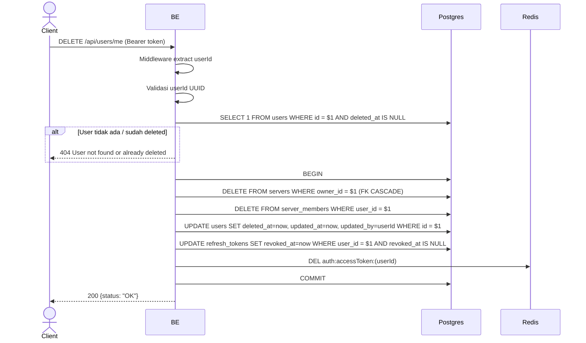

## Overview

API ini digunakan untuk soft-delete akun user yang sedang login. Backend akan:
1. Hard-delete semua server yang dimiliki user (FK CASCADE membersihkan roles/members/profiles/posts/comments/likes/invites di server tsb).
2. Hard-delete semua server_members user di server lain.
3. Soft-delete row users (set `deleted_at`).
4. Revoke semua refresh token user.
5. Clear access token cache di Redis.

Object di MinIO sengaja dibiarkan orphan di Phase 1 (cleanup job di Phase 2). Comment/like di server lain juga retained karena FK ke users yang masih ada (soft delete).

---

## Auth

API ini adalah api protected jadi perlu authorization header `Bearer <accessToken>`.

## Flow



---

## Notes Redis

1. auth access token:
   key: `auth:accessToken:(userId)`
   aksi: DEL

---

## Notes Postgres/DB

| Tabel             | Kolom        | Aksi   | Keterangan                                                                  |
| ----------------- | ------------ | ------ | --------------------------------------------------------------------------- |
| `users`           | id           | SELECT | Cek user aktif (`deleted_at IS NULL`)                                       |
| `servers`         | owner_id     | DELETE | Hard-delete semua server milik user (FK CASCADE membersihkan tabel terkait) |
| `server_members`  | user_id      | DELETE | Hard-delete membership user di server lain                                  |
| `users`           | deleted_at   | UPDATE | Soft-delete timestamp                                                       |
| `users`           | updated_at   | UPDATE | UTC now                                                                     |
| `users`           | updated_by   | UPDATE | userId (self)                                                               |
| `refresh_tokens`  | revoked_at   | UPDATE | Revoke semua refresh token                                                  |
| `refresh_tokens`  | updated_at   | UPDATE | UTC now                                                                     |
| `refresh_tokens`  | updated_by   | UPDATE | userId                                                                      |

Tabel `server_member_profiles` di-retain (snapshot historical) karena FK CASCADE dari `servers` sudah handle row terkait server yang dihapus, sedangkan di server lain row tetap (no cascade dari `users` karena soft-delete).

---

## Prerequisites

User sudah login dan punya access token valid.

---

## Validasi Request

Endpoint tidak menerima body. Otentikasi via header.

---

## Response

### 200 OK

```json
{
  "status": "OK"
}
```

### 401 Unauthorized

| `error_message`                       | Penyebab                |
| ------------------------------------- | ----------------------- |
| `Authorization header is missing`     | Header tidak ada        |
| `Authentication token is expired`    | JWT expired             |
| `Authentication token is invalid`    | JWT invalid             |

### 404 Not Found

| `error_message`                       | Penyebab                                |
| ------------------------------------- | --------------------------------------- |
| `User not found or already deleted`   | User sudah di-soft-delete sebelumnya     |

---

## Update

Dokumentasi ini diupdate tanggal 23 Mei 2026.
