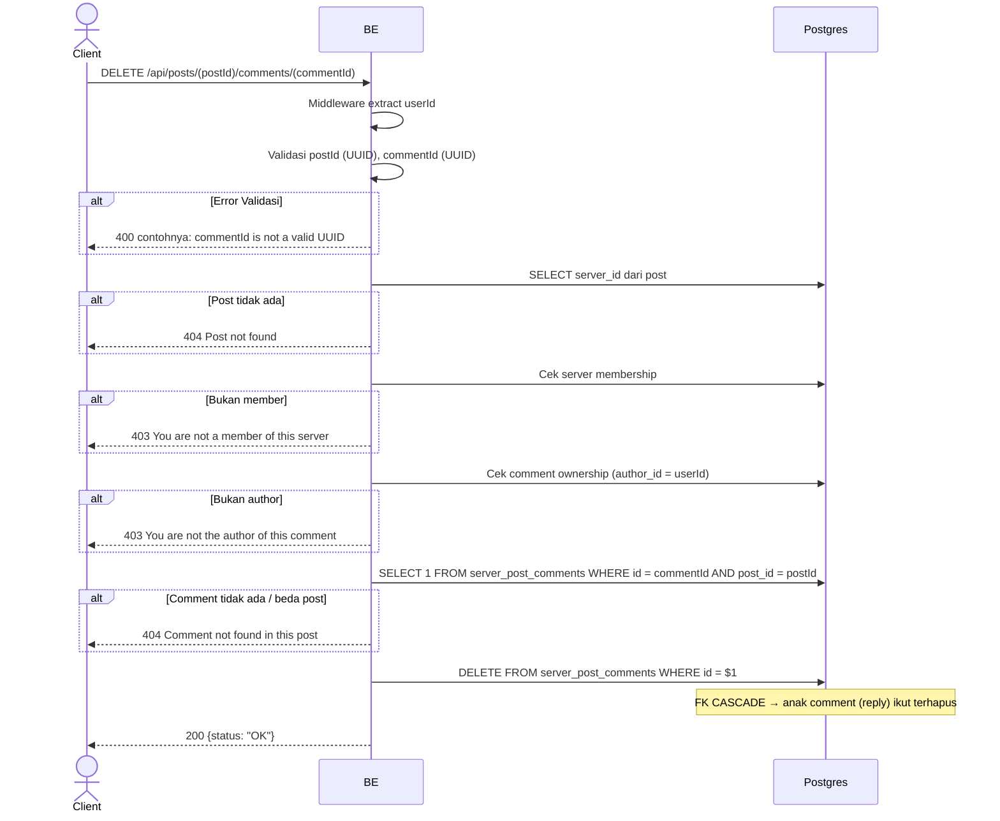

## Overview

API ini digunakan untuk hard-delete comment. Hanya author comment yang boleh. FK CASCADE menghapus reply (anak comment) bila ada.

---

## Auth

API ini adalah api protected jadi perlu authorization header `Bearer <accessToken>`.

## Flow



---

## Notes Redis

Tidak pakai Redis.

---

## Notes Postgres/DB

| Tabel                  | Kolom              | Aksi   | Keterangan                                  |
| ---------------------- | ------------------ | ------ | ------------------------------------------- |
| `server_posts`         | server_id          | SELECT | Ambil server_id buat membership check        |
| `server_members`       | (count)            | SELECT | Cek membership                                |
| `server_post_comments` | author_id          | SELECT | Cek ownership                                 |
| `server_post_comments` | id, post_id        | SELECT | Cek comment exists & belong to post           |
| `server_post_comments` | id                 | DELETE | Hard-delete (FK CASCADE → reply)               |

---

## Prerequisites

User adalah member server dan author comment.

---

## Validasi Request

Path parameter:

| Field       | Tipe   | Wajib | Aturan          |
| ----------- | ------ | ----- | --------------- |
| `postId`    | string | ya    | Required, UUID  |
| `commentId` | string | ya    | Required, UUID  |

Tidak ada body.

---

## Response

### 200 OK

```json
{
  "status": "OK"
}
```

### 400 Bad Request

| `error_message`                   | Penyebab     |
| --------------------------------- | ------------ |
| `postId is not a valid UUID`      | UUID invalid  |
| `commentId is not a valid UUID`   | UUID invalid  |

### 403 Forbidden

| `error_message`                              | Penyebab                |
| -------------------------------------------- | ----------------------- |
| `You are not a member of this server`        | Bukan member             |
| `You are not the author of this comment`     | Bukan author comment     |

### 404 Not Found

| `error_message`                          | Penyebab                              |
| ---------------------------------------- | ------------------------------------- |
| `Post not found`                         | Post tidak ada                        |
| `Comment not found in this post`         | Comment tidak ada / beda post         |

### 401 Unauthorized

Standard auth errors.

---

## Update

Dokumentasi ini diupdate tanggal 23 Mei 2026.
