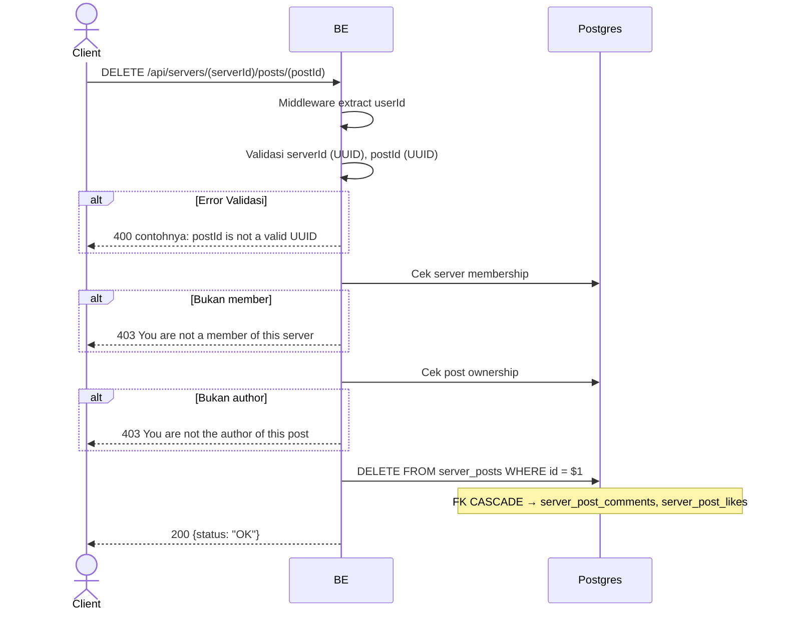

## Overview

API ini digunakan untuk hard-delete post. Hanya author yang boleh. FK CASCADE menghapus comments + likes terkait. Image di MinIO sengaja dibiarkan orphan (cleanup job Phase 2).

---

## Auth

API ini adalah api protected jadi perlu authorization header `Bearer <accessToken>`.

## Flow



---

## Notes Redis

Tidak pakai Redis.

---

## Notes Postgres/DB

| Tabel            | Kolom              | Aksi   | Keterangan                                   |
| ---------------- | ------------------ | ------ | -------------------------------------------- |
| `server_members` | (count)            | SELECT | Cek membership                                |
| `server_posts`   | author_id          | SELECT | Cek ownership                                 |
| `server_posts`   | id                 | DELETE | Hard-delete (FK CASCADE → comments & likes)   |

---

## Prerequisites

User adalah member server dan author post.

---

## Validasi Request

Path parameter:

| Field      | Tipe   | Wajib | Aturan          |
| ---------- | ------ | ----- | --------------- |
| `serverId` | string | ya    | Required, UUID  |
| `postId`   | string | ya    | Required, UUID  |

Tidak ada body.

---

## Response

### 200 OK

```json
{
  "status": "OK"
}
```

### 400 Bad Request

| `error_message`                | Penyebab        |
| ------------------------------ | --------------- |
| `serverId is not a valid UUID` | UUID invalid    |
| `postId is not a valid UUID`   | UUID invalid    |

### 403 Forbidden

| `error_message`                          | Penyebab                |
| ---------------------------------------- | ----------------------- |
| `You are not a member of this server`    | Bukan member             |
| `You are not the author of this post`    | Bukan author             |

### 401 Unauthorized

Standard auth errors.

---

## Update

Dokumentasi ini diupdate tanggal 23 Mei 2026.
