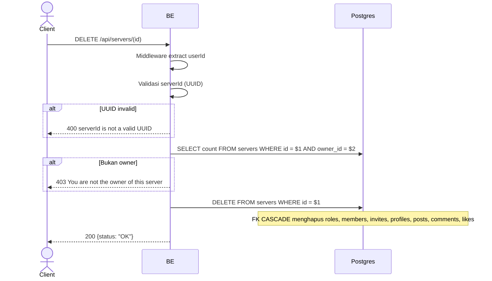

## Overview

API ini digunakan untuk hard-delete server. Hanya owner yang boleh. FK CASCADE membersihkan `server_roles`, `server_members`, `server_invites`, `server_member_profiles`, `server_posts`, `server_post_comments`, `server_post_likes`. Object MinIO sengaja dibiarkan orphan di Phase 1 (cleanup job di Phase 2).

---

## Auth

API ini adalah api protected jadi perlu authorization header `Bearer <accessToken>`.

## Flow



---

## Notes Redis

Tidak pakai Redis.

---

## Notes Postgres/DB

| Tabel     | Kolom    | Aksi   | Keterangan                                            |
| --------- | -------- | ------ | ----------------------------------------------------- |
| `servers` | owner_id | SELECT | Cek ownership                                         |
| `servers` | id       | DELETE | Hard delete (FK CASCADE → roles, members, profiles, posts, comments, likes, invites) |

---

## Prerequisites

User adalah owner server.

---

## Validasi Request

Path parameter:

| Field | Tipe   | Wajib | Aturan          |
| ----- | ------ | ----- | --------------- |
| `id`  | string | ya    | Required, UUID  |

Tidak ada body.

---

## Response

### 200 OK

```json
{
  "status": "OK"
}
```

### 400 Bad Request

| `error_message`                  | Penyebab     |
| -------------------------------- | ------------ |
| `serverId is not a valid UUID`   | UUID invalid  |

### 403 Forbidden

| `error_message`                          | Penyebab     |
| ---------------------------------------- | ------------ |
| `You are not the owner of this server`   | Bukan owner   |

### 401 Unauthorized

Standard auth errors.

---

## Update

Dokumentasi ini diupdate tanggal 23 Mei 2026.
