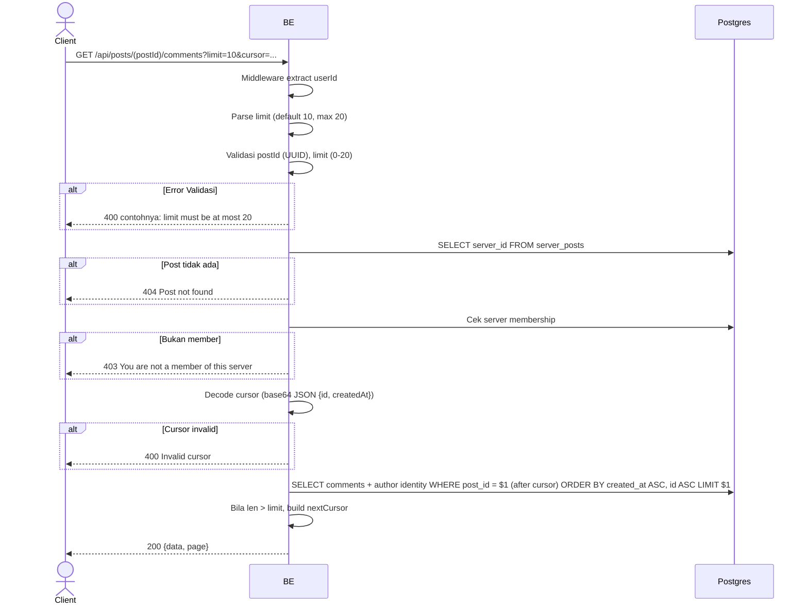

## Overview

API ini digunakan untuk ambil daftar comment di post. Sorted by `created_at` ASC (oldest first). Pagination cursor-based.

---

## Auth

API ini adalah api protected jadi perlu authorization header `Bearer <accessToken>`.

## Flow



---

## Notes Redis

Tidak pakai Redis.

---

## Notes Postgres/DB

| Tabel                    | Kolom                                | Aksi   | Keterangan                                   |
| ------------------------ | ------------------------------------ | ------ | -------------------------------------------- |
| `server_posts`           | server_id                            | SELECT | Ambil server_id                               |
| `server_members`         | (count)                              | SELECT | Cek membership                                |
| `server_post_comments`   | (semua)                              | SELECT | Filter post_id, ORDER BY created_at ASC, id ASC |
| `server_member_profiles` | nickname, username, avatar_image_id  | SELECT | Author identity di server                     |

---

## Prerequisites

User adalah member server tempat post berada.

---

## Validasi Request

Path parameter:

| Field    | Tipe   | Wajib | Aturan          |
| -------- | ------ | ----- | --------------- |
| `postId` | string | ya    | Required, UUID  |

Query parameters:

| Field    | Tipe   | Wajib | Aturan                                              |
| -------- | ------ | ----- | --------------------------------------------------- |
| `limit`  | int    | tidak | 0-20, default 10                                    |
| `cursor` | string | tidak | Base64 JSON `{id, createdAt}` dari halaman sebelumnya |

---

## Response

### 200 OK

```json
{
  "data": [
    {
      "id": "comment-uuid",
      "postId": "post-uuid",
      "parentId": null,
      "content": "Mantap!",
      "author": {
        "userId": "user-uuid",
        "nickname": "GamerX",
        "username": "gamerx",
        "avatarUrl": "http://.../webp",
        "status": "ACTIVE"
      },
      "isOwner": false,
      "createdAt": "2026-05-23T10:00:00Z",
      "updatedAt": "2026-05-23T10:00:00Z"
    }
  ],
  "page": {
    "nextCursor": "base64-encoded-cursor"
  }
}
```

### 400 Bad Request

| `error_message`               | Penyebab            |
| ----------------------------- | ------------------- |
| `postId is not a valid UUID`  | UUID invalid         |
| `limit must be at most 20`    | Limit > 20           |
| `Invalid limit value`         | Limit bukan integer   |
| `Invalid cursor`              | Cursor invalid        |

### 403 Forbidden

| `error_message`                          | Penyebab     |
| ---------------------------------------- | ------------ |
| `You are not a member of this server`    | Bukan member  |

### 404 Not Found

| `error_message`     | Penyebab        |
| ------------------- | --------------- |
| `Post not found`    | Post tidak ada   |

### 401 Unauthorized

Standard auth errors.

---

## Update

Dokumentasi ini diupdate tanggal 23 Mei 2026.
