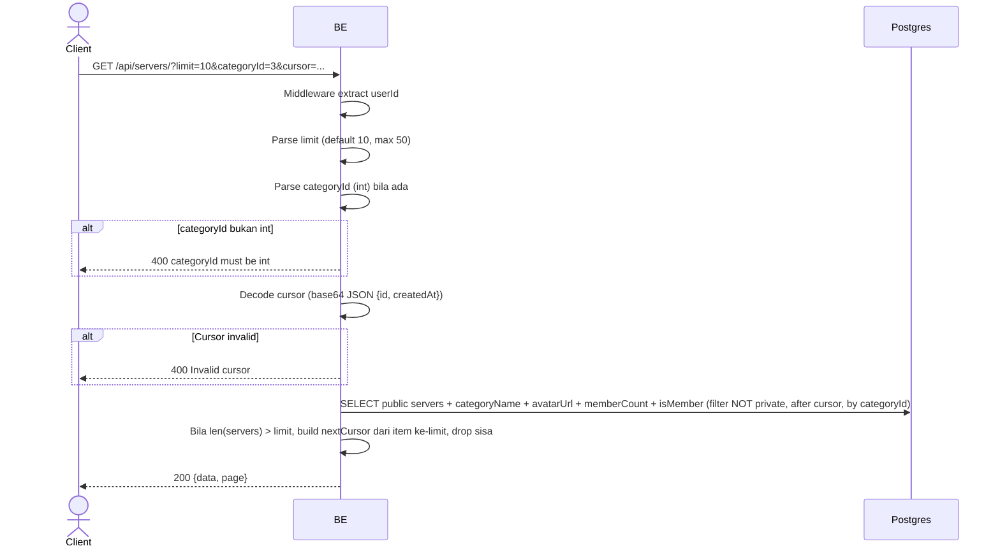

## Overview

API ini digunakan untuk discovery server public — list server yang bisa di-join user. Pagination cursor-based (encoded base64 JSON). Bisa filter by category.

---

## Auth

API ini adalah api protected jadi perlu authorization header `Bearer <accessToken>`.

## Flow



---

## Notes Redis

Tidak pakai Redis (selain middleware auth check).

---

## Notes Postgres/DB

| Tabel                  | Kolom                                                                | Aksi   | Keterangan                                       |
| ---------------------- | -------------------------------------------------------------------- | ------ | ------------------------------------------------ |
| `servers`              | id, name, short_name, category_id, description, avatar_image_id, created_at, settings | SELECT | Filter `settings->>'isPrivate' = 'false'`        |
| `server_categories`    | id, name                                                             | SELECT | Join untuk dapat categoryName                    |
| `server_avatar_images` | object_key                                                           | SELECT | Build avatar URL                                  |
| `server_members`       | (count + EXISTS)                                                     | SELECT | Member count + apakah user adalah member         |

---

## Prerequisites

User sudah login dengan access token valid.

---

## Validasi Request

Query parameters:

| Field        | Tipe   | Wajib | Aturan                                                  |
| ------------ | ------ | ----- | ------------------------------------------------------- |
| `limit`      | int    | tidak | 1-50, default 10 (kalau di luar range dibalik ke 10)     |
| `categoryId` | int    | tidak | Filter by category id (kalau tidak diisi: semua public) |
| `cursor`     | string | tidak | Base64 JSON `{id, createdAt}` dari nextCursor sebelumnya |

---

## Response

### 200 OK

```json
{
  "data": [
    {
      "id": "uuid",
      "name": "Gaming Squad",
      "shortName": "GS",
      "categoryId": 3,
      "categoryName": "Gaming",
      "avatarUrl": "http://.../webp",
      "bannerUrl": null,
      "memberCount": 42,
      "isMember": false,
      "description": "Server gaming",
      "createdAt": "2026-05-23T10:00:00Z"
    }
  ],
  "page": {
    "nextCursor": "base64-encoded-cursor"
  }
}
```

`nextCursor` kosong/empty kalau tidak ada halaman berikutnya.

### 400 Bad Request

| `error_message`           | Penyebab                                |
| ------------------------- | --------------------------------------- |
| `categoryId must be int`  | categoryId bukan integer                |
| `Invalid cursor`          | Cursor tidak bisa di-decode base64/JSON  |

### 401 Unauthorized

| `error_message`                          | Penyebab           |
| ---------------------------------------- | ------------------ |
| `Authorization header is missing`        | Header tidak ada    |
| `Authentication token is invalid`        | JWT invalid        |

---

## Update

Dokumentasi ini diupdate tanggal 23 Mei 2026.
