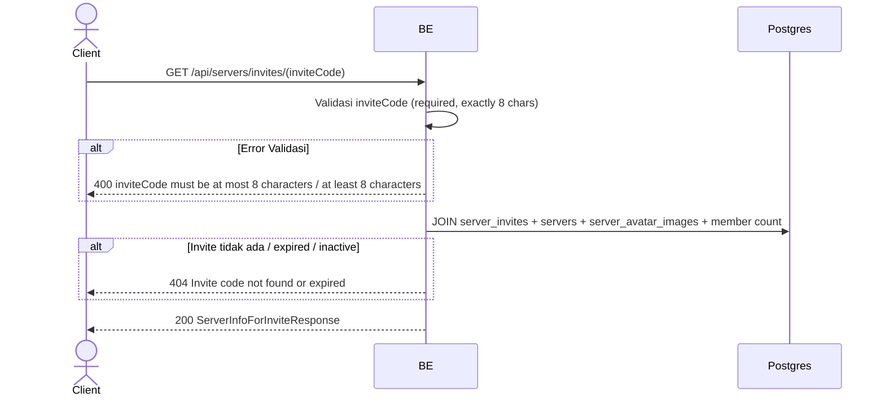

## Overview

API ini digunakan untuk lihat info server dari invite code SEBELUM user benar-benar join. Berguna untuk preview "Anda akan join ke server X yang punya N member". Endpoint ini bersifat publik agar bisa diakses dari link share invite tanpa login dulu.

---

## Auth

API ini adalah api public jadi tidak perlu authorization header.

## Flow



---

## Notes Redis

Endpoint ini tidak mengakses Redis.

---

## Notes Postgres/DB

| Tabel                  | Kolom                            | Aksi   | Keterangan                                        |
| ---------------------- | -------------------------------- | ------ | ------------------------------------------------- |
| `server_invites`       | code, server_id, expires_at, is_active | SELECT | Cek invite valid & ambil server_id              |
| `servers`              | id, name, avatar_image_id, owner_id | SELECT | Ambil info server untuk preview                |
| `server_avatar_images` | object_key                       | SELECT | Build URL avatar server                          |
| `server_members`       | (count)                          | SELECT | Hitung member count                              |
| `server_member_profiles` | nickname                       | SELECT | Ambil nickname owner di server tsb               |

---

## Prerequisites

User punya invite code yang valid (8 karakter alphanumeric).

---

## Validasi Request

Path parameter:

| Field        | Tipe   | Wajib | Aturan                                          |
| ------------ | ------ | ----- | ----------------------------------------------- |
| `inviteCode` | string | ya    | Required, exactly 8 karakter (min 8, max 8)     |

---

## Response

### 200 OK

```json
{
  "code": "aB3xZ9pQ",
  "serverId": "550e8400-e29b-41d4-a716-446655440000",
  "serverName": "Gaming Squad",
  "serverAvatarUrl": "http://localhost:9000/virdan/server/avatar/...webp",
  "ownerNickname": "Owner_Nick",
  "memberCount": 42,
  "expiresAt": "2026-06-01T10:00:00Z"
}
```

| Field             | Tipe         | Deskripsi                                         |
| ----------------- | ------------ | ------------------------------------------------- |
| `code`            | string       | Invite code                                       |
| `serverId`        | string       | UUID server                                       |
| `serverName`      | string       | Nama server                                       |
| `serverAvatarUrl` | string/null  | URL avatar server (null kalau tidak ada)          |
| `ownerNickname`   | string       | Nickname owner di server tsb                       |
| `memberCount`     | int          | Jumlah member aktif                                |
| `expiresAt`       | string/null  | ISO 8601 timestamp expiry invite (null kalau no expiry) |

### 400 Bad Request

| `error_message`                              | Penyebab                       |
| -------------------------------------------- | ------------------------------ |
| `inviteCode is required`                     | inviteCode kosong              |
| `inviteCode must be at least 8 characters`   | Panjang kurang dari 8           |
| `inviteCode must be at most 8 characters`    | Panjang lebih dari 8            |

### 404 Not Found

| `error_message`                       | Penyebab                                       |
| ------------------------------------- | ---------------------------------------------- |
| `Invite code not found or expired`    | Invite tidak ada / expired / is_active = false |

---

## Update

Dokumentasi ini diupdate tanggal 23 Mei 2026.
