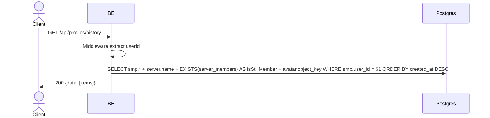

## Overview

API ini digunakan untuk ambil semua profile per-server milik user (snapshot historical). Berguna untuk "pick a profile from another server" picker — user bisa reuse profile yang sudah pernah dibuat di server lain (multi-identity Opsi B). Termasuk server yang user sudah keluar (`server_member_profiles` retained setelah leave).

---

## Auth

API ini adalah api protected jadi perlu authorization header `Bearer <accessToken>`.

## Flow



---

## Notes Redis

Tidak pakai Redis.

---

## Notes Postgres/DB

| Tabel                     | Kolom                                                                | Aksi   | Keterangan                                |
| ------------------------- | -------------------------------------------------------------------- | ------ | ----------------------------------------- |
| `server_member_profiles`  | id, server_id, nickname, username, bio, avatar_image_id, created_at, updated_at | SELECT | Filter user_id, ORDER BY created_at DESC |
| `servers`                 | name                                                                 | SELECT | JOIN untuk serverName                     |
| `server_members`          | (EXISTS)                                                             | SELECT | Cek `isStillMember`                       |
| `profile_avatar_images`   | object_key                                                           | SELECT | Build avatarUrl                            |

---

## Prerequisites

User sudah login. Pernah join minimal satu server.

---

## Validasi Request

Tidak ada body, tidak ada path/query parameter.

---

## Response

### 200 OK

```json
{
  "data": [
    {
      "profileId": "profile-uuid",
      "serverId": "server-uuid",
      "serverName": "Gaming Squad",
      "nickname": "GamerX",
      "username": "gamerx",
      "bio": "Always grinding",
      "avatarImageId": "avatar-uuid",
      "avatarUrl": "http://.../profile/avatar/uuid.webp",
      "isStillMember": true,
      "createdAt": "2026-05-20T10:00:00Z",
      "updatedAt": "2026-05-22T08:00:00Z"
    }
  ]
}
```

| Field           | Tipe        | Deskripsi                                          |
| --------------- | ----------- | -------------------------------------------------- |
| `profileId`     | string      | UUID `server_member_profiles`                       |
| `serverId`      | string      | UUID server                                         |
| `serverName`    | string      | Nama server                                         |
| `nickname`      | string      | Nickname di server tsb                              |
| `username`      | string      | Username di server tsb (unique per server)          |
| `bio`           | string/null | Bio di server tsb                                   |
| `avatarImageId` | string/null | UUID avatar                                          |
| `avatarUrl`     | string/null | URL avatar (null kalau tidak ada)                   |
| `isStillMember` | bool        | `true` kalau user masih member, `false` kalau sudah keluar |
| `createdAt`     | string      | ISO 8601                                             |
| `updatedAt`     | string      | ISO 8601                                             |

### 401 Unauthorized

| `error_message`                       | Penyebab       |
| ------------------------------------- | -------------- |
| `Authorization header is missing`     | Header tidak ada |
| `Authentication token is invalid`    | JWT invalid    |

---

## Update

Dokumentasi ini diupdate tanggal 23 Mei 2026.
