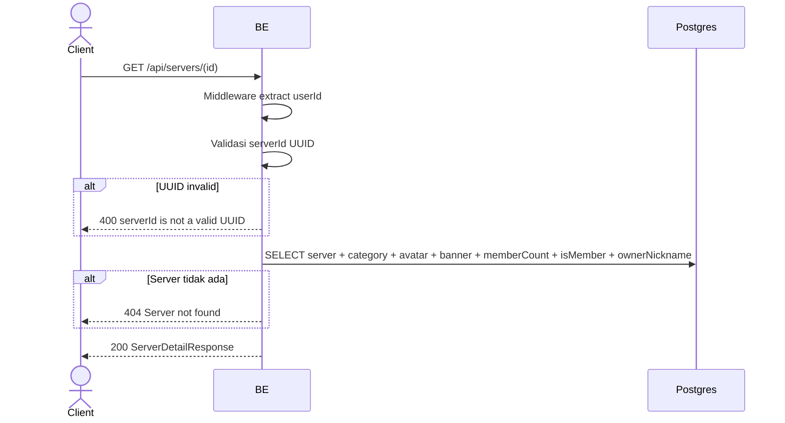

## Overview

API ini digunakan untuk ambil detail server by ID. Returnable untuk user manapun (tidak ada filter membership) — frontend bisa cek `isMember` di response.

---

## Auth

API ini adalah api protected jadi perlu authorization header `Bearer <accessToken>`.

## Flow



---

## Notes Redis

Tidak pakai Redis (selain middleware auth check).

---

## Notes Postgres/DB

| Tabel                     | Kolom                                    | Aksi   | Keterangan                                  |
| ------------------------- | ---------------------------------------- | ------ | ------------------------------------------- |
| `servers`                 | (semua)                                  | SELECT | Detail server                                |
| `server_categories`       | id, name                                 | SELECT | JOIN untuk categoryName                     |
| `server_avatar_images`    | object_key                               | SELECT | Build avatarUrl                              |
| `server_banner_images`    | object_key                               | SELECT | Build bannerUrl                              |
| `server_members`          | (count + EXISTS)                         | SELECT | memberCount + isMember                       |
| `server_member_profiles`  | nickname                                 | SELECT | Owner nickname                                |

---

## Prerequisites

User sudah login dengan access token valid.

---

## Validasi Request

Path parameter:

| Field | Tipe   | Wajib | Aturan                     |
| ----- | ------ | ----- | -------------------------- |
| `id`  | string | ya    | Required, harus UUID valid |

---

## Response

### 200 OK

```json
{
  "id": "uuid",
  "ownerId": "user-uuid",
  "ownerNickname": "OwnerNick",
  "name": "Gaming Squad",
  "shortName": "GS",
  "categoryId": 3,
  "categoryName": "Gaming",
  "avatarUrl": "http://.../webp",
  "bannerUrl": null,
  "description": "Server gaming",
  "settings": {"isPrivate": false},
  "memberCount": 42,
  "isMember": true,
  "createdAt": "2026-05-23T10:00:00Z",
  "updatedAt": "2026-05-23T10:00:00Z"
}
```

### 400 Bad Request

| `error_message`                 | Penyebab                  |
| ------------------------------- | ------------------------- |
| `serverId is required`          | serverId kosong            |
| `serverId is not a valid UUID`  | Format bukan UUID         |

### 404 Not Found

| `error_message`        | Penyebab              |
| ---------------------- | --------------------- |
| `Server not found`     | Server tidak ada       |

### 401 Unauthorized

Standard auth errors.

---

## Update

Dokumentasi ini diupdate tanggal 23 Mei 2026.
