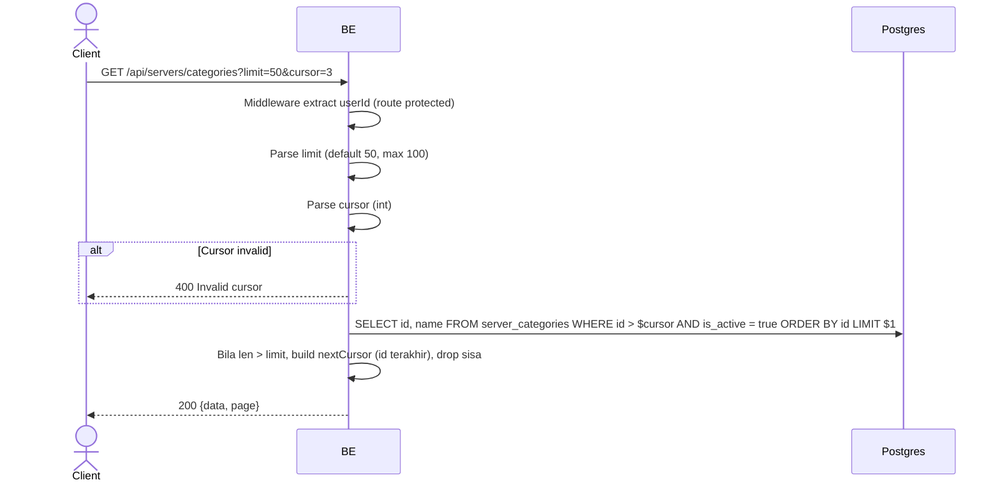

## Overview

API ini digunakan untuk ambil daftar kategori server. Pagination cursor-based (cursor = id integer terakhir).

---

## Auth

API ini adalah api protected jadi perlu authorization header `Bearer <accessToken>`.

## Flow



---

## Notes Redis

Tidak pakai Redis (selain middleware auth check).

---

## Notes Postgres/DB

| Tabel               | Kolom        | Aksi   | Keterangan                          |
| ------------------- | ------------ | ------ | ----------------------------------- |
| `server_categories` | id, name, is_active | SELECT | Filter aktif, ORDER BY id ASC |

---

## Prerequisites

User sudah login dengan access token valid.

---

## Validasi Request

Query parameters:

| Field    | Tipe   | Wajib | Aturan                                          |
| -------- | ------ | ----- | ----------------------------------------------- |
| `limit`  | int    | tidak | 1-100, default 50 (di luar range → 50)          |
| `cursor` | int    | tidak | Id terakhir dari halaman sebelumnya             |

---

## Response

### 200 OK

```json
{
  "data": [
    { "id": 1, "categoryName": "Education" },
    { "id": 2, "categoryName": "Music" },
    { "id": 3, "categoryName": "Gaming" }
  ],
  "page": {
    "nextCursor": "3"
  }
}
```

| Field          | Tipe   | Deskripsi                                          |
| -------------- | ------ | -------------------------------------------------- |
| `id`           | int    | Category ID                                        |
| `categoryName` | string | Nama kategori                                      |
| `nextCursor`   | string | Id terakhir untuk halaman berikut (kosong = habis) |

### 400 Bad Request

| `error_message`     | Penyebab                                       |
| ------------------- | ---------------------------------------------- |
| `Invalid cursor`    | Cursor bukan integer valid                     |

### 401 Unauthorized

Standard auth errors.

---

## Update

Dokumentasi ini diupdate tanggal 23 Mei 2026.
