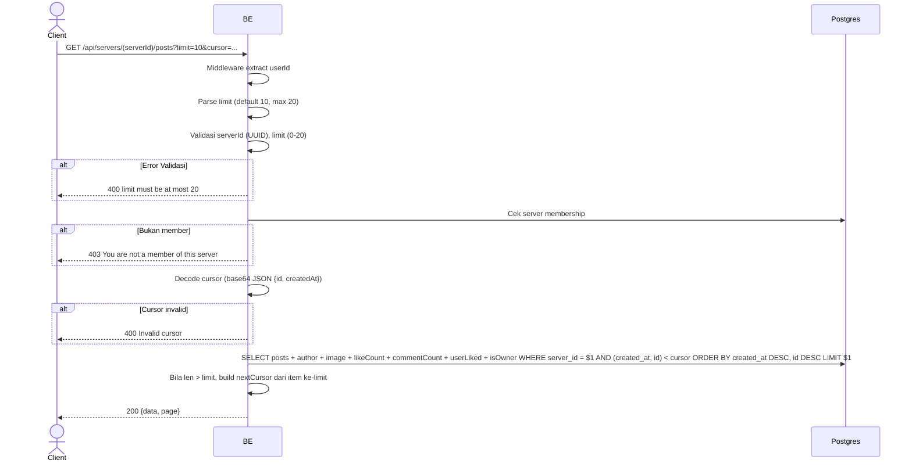

## Overview

API ini digunakan untuk mengambil daftar post di server (feed). Sorted by `created_at` descending (newest first). Pagination cursor-based. User harus member server tsb.

---

## Auth

API ini adalah api protected jadi perlu authorization header `Bearer <accessToken>`.

## Flow



---

## Notes Redis

Tidak pakai Redis.

---

## Notes Postgres/DB

| Tabel                    | Kolom                   | Aksi   | Keterangan                                       |
| ------------------------ | ----------------------- | ------ | ------------------------------------------------ |
| `server_members`         | (count)                 | SELECT | Cek membership                                    |
| `server_posts`           | (semua)                 | SELECT | Filter server_id, ORDER BY created_at DESC, id DESC |
| `server_post_images`     | object_key              | SELECT | Build imageUrl                                    |
| `server_post_likes`      | (count + EXISTS)        | SELECT | likeCount + userLiked                             |
| `server_post_comments`   | (count)                 | SELECT | commentCount                                      |
| `server_member_profiles` | nickname, username, avatar_image_id | SELECT | Author identity per server                  |

---

## Prerequisites

User adalah member server.

---

## Validasi Request

Path parameter:

| Field      | Tipe   | Wajib | Aturan          |
| ---------- | ------ | ----- | --------------- |
| `serverId` | string | ya    | Required, UUID  |

Query parameters:

| Field    | Tipe   | Wajib | Aturan                                              |
| -------- | ------ | ----- | --------------------------------------------------- |
| `limit`  | int    | tidak | 0-20, default 10                                    |
| `cursor` | string | tidak | Base64 JSON `{id, createdAt}` dari halaman sebelumnya |

---

## Response

### 200 OK

```json
{
  "data": [
    {
      "id": "post-uuid",
      "serverId": "server-uuid",
      "caption": "Hello!",
      "imageUrl": "http://.../webp",
      "author": {
        "userId": "user-uuid",
        "nickname": "GamerX",
        "username": "gamerx",
        "avatarUrl": "http://.../webp",
        "status": "ACTIVE"
      },
      "likeCount": 12,
      "commentCount": 3,
      "userLiked": false,
      "isOwner": false,
      "createdAt": "2026-05-23T10:00:00Z",
      "updatedAt": "2026-05-23T10:00:00Z"
    }
  ],
  "page": {
    "nextCursor": "base64-encoded-cursor"
  }
}
```

### 400 Bad Request

| `error_message`                  | Penyebab                |
| -------------------------------- | ----------------------- |
| `serverId is not a valid UUID`   | UUID invalid             |
| `limit must be at most 20`       | Limit lebih dari 20      |
| `limit must be at least 0`       | Limit negatif            |
| `Invalid cursor`                 | Cursor tidak bisa decode  |

### 403 Forbidden

| `error_message`                          | Penyebab     |
| ---------------------------------------- | ------------ |
| `You are not a member of this server`    | Bukan member  |

### 401 Unauthorized

Standard auth errors.

---

## Update

Dokumentasi ini diupdate tanggal 23 Mei 2026.
