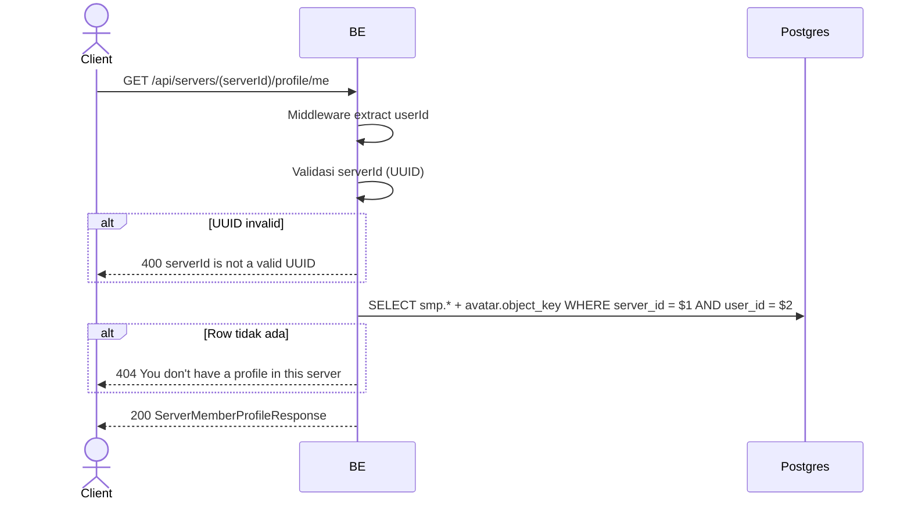

## Overview

API ini digunakan untuk ambil profile per-server user yang sedang login pada server tertentu. Berguna untuk frontend menampilkan "identitas Anda di server ini".

---

## Auth

API ini adalah api protected jadi perlu authorization header `Bearer <accessToken>`.

## Flow



---

## Notes Redis

Tidak pakai Redis.

---

## Notes Postgres/DB

| Tabel                     | Kolom                                                  | Aksi   | Keterangan                              |
| ------------------------- | ------------------------------------------------------ | ------ | --------------------------------------- |
| `server_member_profiles`  | id, server_id, nickname, username, bio, avatar_image_id, created_at, updated_at | SELECT | Filter (server_id, user_id) |
| `profile_avatar_images`   | object_key                                             | SELECT | Build avatarUrl                          |

---

## Prerequisites

User sudah login. User pernah join server (row `server_member_profiles` exists — bahkan setelah leave row masih ada).

---

## Validasi Request

Path parameter:

| Field      | Tipe   | Wajib | Aturan          |
| ---------- | ------ | ----- | --------------- |
| `serverId` | string | ya    | Required, UUID  |

Tidak ada body.

---

## Response

### 200 OK

```json
{
  "profileId": "profile-uuid",
  "serverId": "server-uuid",
  "nickname": "GamerX",
  "username": "gamerx",
  "bio": "Always grinding",
  "avatarImageId": "avatar-uuid",
  "avatarUrl": "http://.../profile/avatar/uuid.webp",
  "createdAt": "2026-05-20T10:00:00Z",
  "updatedAt": "2026-05-22T08:00:00Z"
}
```

### 400 Bad Request

| `error_message`                  | Penyebab        |
| -------------------------------- | --------------- |
| `serverId is not a valid UUID`   | UUID invalid    |

### 404 Not Found

| `error_message`                              | Penyebab                                |
| -------------------------------------------- | --------------------------------------- |
| `You don't have a profile in this server`    | Row di `server_member_profiles` tidak ada |

### 401 Unauthorized

Standard auth errors.

---

## Update

Dokumentasi ini diupdate tanggal 23 Mei 2026.
