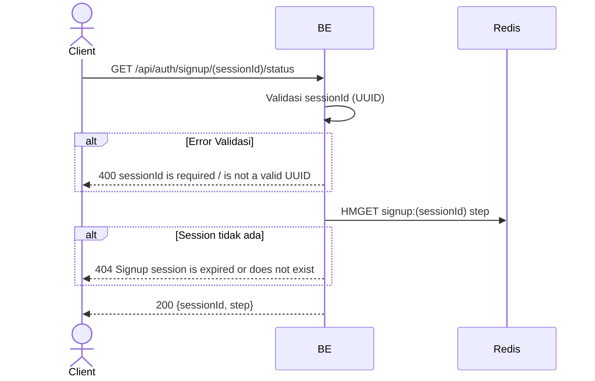

## Overview

API ini digunakan untuk cek progress signup session. Berguna untuk frontend agar tahu user sedang di step mana (misal setelah refresh halaman).

---

## Auth

API ini adalah api public jadi tidak perlu authorization header.

## Flow



---

## Notes Redis

1. signup session:
   key: `signup:(sessionId)`
   aksi: HMGET field `step`

---

## Notes Postgres/DB

Endpoint ini tidak mengakses Postgres.

---

## Prerequisites

User punya `sessionId` dari step `start_signup` sebelumnya.

---

## Validasi Request

Path parameter:

| Field       | Tipe   | Wajib | Aturan                     |
| ----------- | ------ | ----- | -------------------------- |
| `sessionId` | string | ya    | Required, harus UUID valid |

---

## Response

### 200 OK

```json
{
  "sessionId": "550e8400-e29b-41d4-a716-446655440000",
  "step": "otp_verified"
}
```

| Field       | Tipe   | Deskripsi                                                                 |
| ----------- | ------ | ------------------------------------------------------------------------- |
| `sessionId` | string | UUID session signup                                                       |
| `step`      | string | Salah satu: `start_signup`, `otp_verified`, `password_set`                |

### 400 Bad Request

| `error_message`                 | Penyebab                    |
| ------------------------------- | --------------------------- |
| `sessionId is required`         | Session id kosong            |
| `sessionId is not a valid UUID` | Format bukan UUID            |

### 404 Not Found

| `error_message`                                | Penyebab                              |
| ---------------------------------------------- | ------------------------------------- |
| `Signup session is expired or does not exist`  | Session di Redis sudah tidak ada       |

---

## Update

Dokumentasi ini diupdate tanggal 23 Mei 2026.
