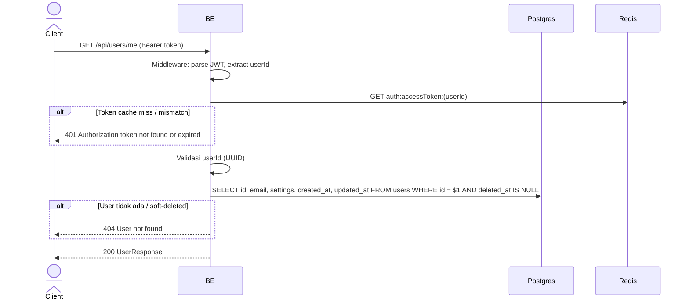

## Overview

API ini digunakan untuk mendapatkan info akun user yang sedang login. Mengambil data global user (id, email, settings, timestamps). Field per-server (nickname/bio/avatar) ada di endpoint profile, bukan disini (multi-identity Opsi B).

---

## Auth

API ini adalah api protected jadi perlu authorization header `Bearer <accessToken>`.

## Flow



---

## Notes Redis

1. auth access token (dicek oleh middleware):
   key: `auth:accessToken:(userId)`
   aksi: GET

---

## Notes Postgres/DB

| Tabel   | Kolom                                       | Aksi   | Keterangan                              |
| ------- | ------------------------------------------- | ------ | --------------------------------------- |
| `users` | id, email, settings, created_at, updated_at | SELECT | Ambil data global user, filter soft-delete |

---

## Prerequisites

User sudah login dan punya access token valid (belum expired).

---

## Validasi Request

Endpoint ini tidak menerima body. Otentikasi via header `Authorization: Bearer <accessToken>`.

---

## Response

### 200 OK

```json
{
  "id": "550e8400-e29b-41d4-a716-446655440000",
  "email": "user@example.com",
  "settings": {},
  "createdAt": "2026-05-23T10:00:00Z",
  "updatedAt": "2026-05-23T10:00:00Z"
}
```

| Field       | Tipe   | Deskripsi                              |
| ----------- | ------ | -------------------------------------- |
| `id`        | string | UUID user                              |
| `email`     | string | Email user                             |
| `settings`  | object | JSONB settings (default `{}`)          |
| `createdAt` | string | ISO 8601 timestamp UTC                 |
| `updatedAt` | string | ISO 8601 timestamp UTC                 |

### 401 Unauthorized

| `error_message`                              | Penyebab                                       |
| -------------------------------------------- | ---------------------------------------------- |
| `Authorization header is missing`            | Header `Authorization` tidak ada               |
| `Invalid authorization scheme`               | Tidak pakai prefix `Bearer `                    |
| `Authentication token is empty`              | Token kosong setelah strip prefix              |
| `Authentication token is malformed`          | Format JWT rusak                                |
| `Authentication token is expired`            | JWT expired                                     |
| `Authentication token is invalid`            | JWT signature invalid / claim invalid           |
| `Authorization token not found or expired`   | Token tidak ada di Redis cache                  |
| `Authorization token is expired`             | Token hash beda dengan yang di cache           |

### 404 Not Found

| `error_message`    | Penyebab                                |
| ------------------ | --------------------------------------- |
| `User not found`   | User tidak ada atau sudah soft-deleted  |

---

## Update

Dokumentasi ini diupdate tanggal 23 Mei 2026.
