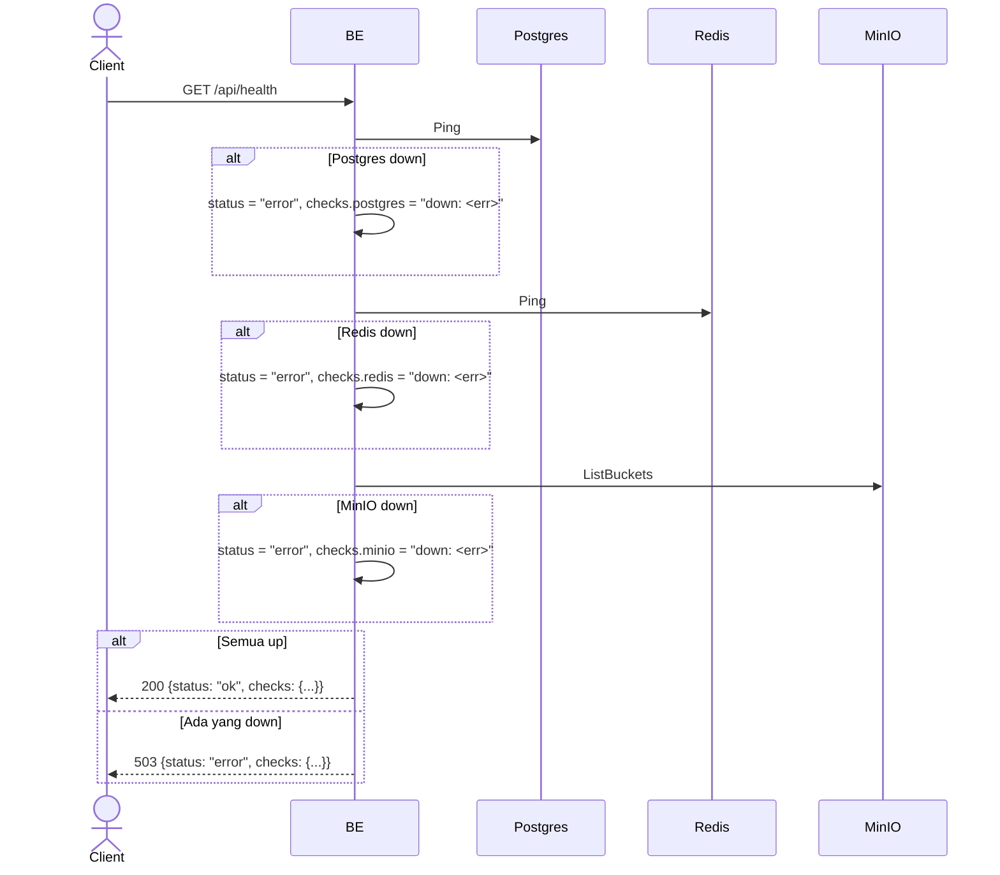

## Overview

API ini digunakan untuk health check service. Backend cek koneksi Postgres, Redis, dan MinIO. Endpoint ini dipakai oleh load balancer / k8s liveness probe / monitoring tool.

---

## Auth

API ini adalah api public jadi tidak perlu authorization header.

## Flow



---

## Notes Redis

Aksi: PING (cek koneksi saja, tidak baca/tulis data).

---

## Notes Postgres/DB

Aksi: PING via `pgxpool.Pool.Ping()` (cek koneksi saja, tidak ada query ke table).

---

## Notes MinIO

Aksi: `ListBuckets()` (cek koneksi + permission saja).

---

## Prerequisites

Tidak ada.

---

## Validasi Request

Endpoint ini tidak menerima body atau query parameter.

---

## Response

### 200 OK

```json
{
  "status": "ok",
  "checks": {
    "postgres": "up",
    "redis": "up",
    "minio": "up"
  }
}
```

| Field             | Tipe   | Deskripsi                                                  |
| ----------------- | ------ | ---------------------------------------------------------- |
| `status`          | string | "ok" kalau semua service up, "error" kalau ada yang down   |
| `checks.postgres` | string | "up" atau "down: <error message>"                          |
| `checks.redis`    | string | "up" atau "down: <error message>"                          |
| `checks.minio`    | string | "up" atau "down: <error message>"                          |

### 503 Service Unavailable

Body sama dengan 200 OK tapi `status` = "error" dan salah satu check ada nilai "down: ...".

```json
{
  "status": "error",
  "checks": {
    "postgres": "down: dial tcp 127.0.0.1:5435: connect: connection refused",
    "redis": "up",
    "minio": "up"
  }
}
```

---

## Update

Dokumentasi ini diupdate tanggal 23 Mei 2026.
