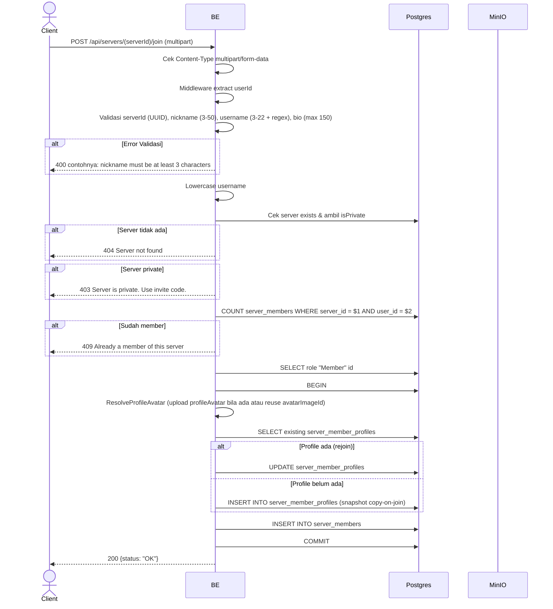

## Overview

API ini digunakan untuk join ke server public secara langsung. Format request multipart (untuk upload profileAvatar per-server). Server private akan ditolak — harus pakai invite code. Saat join, dibuat row di `server_members` + snapshot `server_member_profiles` (copy-on-join Opsi B).

---

## Auth

API ini adalah api protected jadi perlu authorization header `Bearer <accessToken>`.

## Flow



---

## Notes Redis

Tidak pakai Redis.

---

## Notes MinIO

Bila ada upload `profileAvatar`:
- Bucket: `MINIO_BUCKET_NAME`
- Object key: `profile/avatar/{uuid}.webp`
- Aksi: PutObject

---

## Notes Postgres/DB

| Tabel                     | Kolom                                            | Aksi          | Keterangan                                  |
| ------------------------- | ------------------------------------------------ | ------------- | ------------------------------------------- |
| `servers`                 | id, settings                                     | SELECT        | Cek exists & isPrivate                       |
| `server_members`          | (count)                                          | SELECT        | Cek apakah sudah member                       |
| `server_roles`            | id                                               | SELECT        | Ambil id role "Member"                       |
| `profile_avatar_images`   | (full)                                           | INSERT        | Bila ada upload profileAvatar                 |
| `server_member_profiles`  | (full)                                           | INSERT/UPDATE | Snapshot copy-on-join (atau update kalau rejoin) |
| `server_members`          | id, server_id, user_id, server_role_id, joined_at | INSERT        | Membership baru                              |

---

## Prerequisites

User sudah login. Server target public (bukan private). User belum jadi member.

---

## Validasi Request

Path parameter:

| Field      | Tipe   | Wajib | Aturan          |
| ---------- | ------ | ----- | --------------- |
| `serverId` | string | ya    | Required, UUID  |

Multipart body:

| Field           | Tipe          | Wajib | Aturan                                                              |
| --------------- | ------------- | ----- | ------------------------------------------------------------------- |
| `nickname`      | string        | ya    | Required, min 3, max 50                                             |
| `username`      | string        | ya    | Required, min 3, max 22, regex `^[a-zA-Z0-9_.]+$`                   |
| `bio`           | string        | tidak | Max 150 karakter                                                     |
| `avatarImageId` | string (UUID) | tidak | Reuse existing profile_avatar_images UUID milik user                |
| `profileAvatar` | file          | tidak | Image baru (jpg/jpeg/png/gif/webp), max 5MB                          |

---

## Response

### 200 OK

```json
{
  "status": "OK"
}
```

### 400 Bad Request

| `error_message`                                                       | Penyebab                       |
| --------------------------------------------------------------------- | ------------------------------ |
| `Invalid Content-Type header. Endpoint requires multipart/form-data.` | Content-Type salah             |
| `serverId is not a valid UUID`                                        | UUID invalid                    |
| `nickname is required`                                                | Nickname kosong                 |
| `nickname must be at least 3 characters`                              | Nickname kurang dari 3          |
| `nickname must be at most 50 characters`                              | Nickname lebih dari 50          |
| `username is required`                                                | Username kosong                 |
| `username must be at least 3 characters`                              | Username kurang dari 3          |
| `username must be at most 22 characters`                              | Username lebih dari 22          |
| `Username may only contain letters, digits, underscores and dots`     | Username gagal regex            |
| `bio must be at most 150 characters`                                  | Bio lebih dari 150              |

### 403 Forbidden

| `error_message`                          | Penyebab                            |
| ---------------------------------------- | ----------------------------------- |
| `Server is private. Use invite code.`    | Server private (settings.isPrivate=true) |

### 404 Not Found

| `error_message`        | Penyebab              |
| ---------------------- | --------------------- |
| `Server not found`     | Server tidak ada       |

### 409 Conflict

| `error_message`                                       | Penyebab                                                              |
| ----------------------------------------------------- | --------------------------------------------------------------------- |
| `Already a member of this server`                     | User sudah member                                                      |
| `Nickname is already taken in this server`            | Collision `idx_server_member_profiles_uk_02` (`server_id, nickname`)  |
| `Username is already taken in this server`            | Collision `idx_server_member_profiles_uk_03` (`server_id, username`)  |
| `You already have a profile in this server`           | Race condition collision `idx_server_member_profiles_uk_01` (jarang) |

### 401 Unauthorized

Standard auth errors.

---

## Update

Dokumentasi ini diupdate tanggal 23 Mei 2026.
