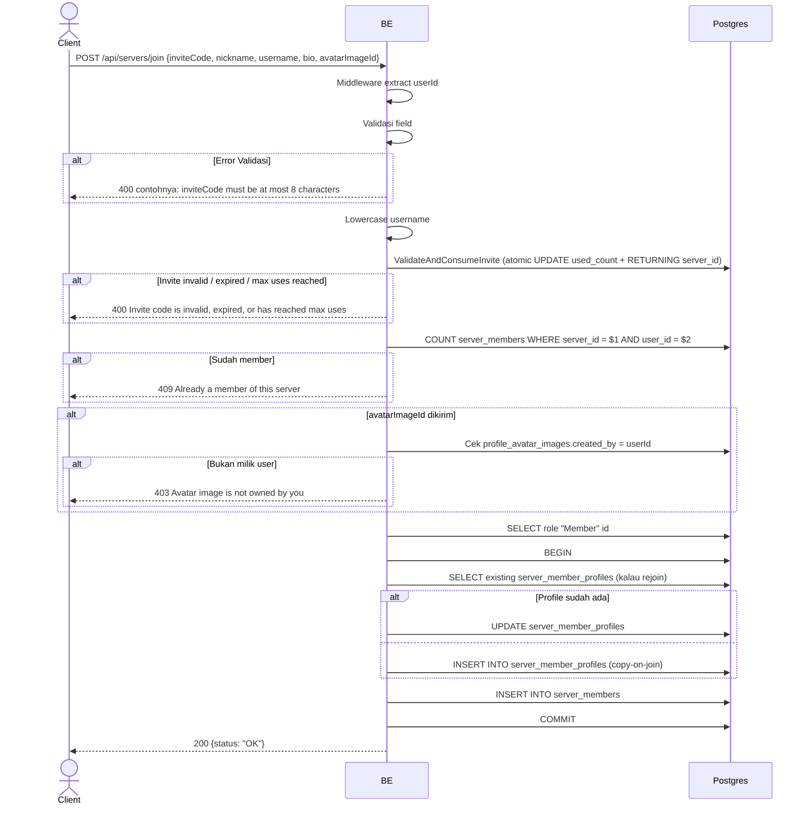

## Overview

API ini digunakan untuk join server via invite code (8 karakter). Backend validate + atomic increment `used_count` invite (ValidateAndConsumeInvite). Sama seperti `join_server`, copy-on-join profile per server (Opsi B).

---

## Auth

API ini adalah api protected jadi perlu authorization header `Bearer <accessToken>`.

## Flow



---

## Notes Redis

Tidak pakai Redis.

---

## Notes Postgres/DB

| Tabel                     | Kolom                                  | Aksi          | Keterangan                                              |
| ------------------------- | -------------------------------------- | ------------- | ------------------------------------------------------- |
| `server_invites`          | code, used_count, max_uses, is_active, expires_at | UPDATE | Atomic consume — increment used_count, return server_id |
| `server_members`          | (count)                                | SELECT        | Cek already member                                      |
| `profile_avatar_images`   | id, created_by                         | SELECT        | Cek ownership avatarImageId (kalau dikirim)              |
| `server_roles`            | id                                     | SELECT        | Ambil role "Member"                                     |
| `server_member_profiles`  | (full)                                 | INSERT/UPDATE | Snapshot copy-on-join                                   |
| `server_members`          | (full)                                 | INSERT        | Membership baru                                          |

---

## Prerequisites

User sudah login. Punya invite code valid (8 char, belum expired, belum max-uses).

---

## Validasi Request

Body JSON:

| Field           | Tipe          | Wajib | Aturan                                                              |
| --------------- | ------------- | ----- | ------------------------------------------------------------------- |
| `inviteCode`    | string        | ya    | Required, exactly 8 karakter                                        |
| `nickname`      | string        | ya    | Required, min 3, max 50                                             |
| `username`      | string        | ya    | Required, min 3, max 22, regex `^[a-zA-Z0-9_.]+$`                   |
| `bio`           | string        | tidak | Max 500 karakter                                                     |
| `avatarImageId` | string (UUID) | tidak | Reuse existing avatar milik user                                    |

---

## Response

### 200 OK

```json
{
  "status": "OK"
}
```

### 400 Bad Request

| `error_message`                                                       | Penyebab                                                   |
| --------------------------------------------------------------------- | ---------------------------------------------------------- |
| `inviteCode is required`                                              | Kosong                                                      |
| `inviteCode must be at least 8 characters`                            | Kurang dari 8                                              |
| `inviteCode must be at most 8 characters`                             | Lebih dari 8                                                |
| `nickname is required` / `nickname must be at least 3 characters`     | Nickname kosong / kurang                                    |
| `nickname must be at most 50 characters`                              | Nickname terlalu panjang                                    |
| `username is required` / `username must be at least 3 characters`     | Username kosong / kurang                                    |
| `username must be at most 22 characters`                              | Username terlalu panjang                                    |
| `Username may only contain letters, digits, underscores and dots`     | Username gagal regex                                        |
| `bio must be at most 500 characters`                                  | Bio terlalu panjang                                         |
| `avatarImageId is not a valid UUID`                                   | avatarImageId bukan UUID                                    |
| `Invite code is invalid, expired, or has reached max uses`            | Invite gagal validate+consume                                |

### 403 Forbidden

| `error_message`                       | Penyebab                                |
| ------------------------------------- | --------------------------------------- |
| `Avatar image is not owned by you`    | avatarImageId bukan milik user           |

### 409 Conflict

| `error_message`                                       | Penyebab                                                              |
| ----------------------------------------------------- | --------------------------------------------------------------------- |
| `Already a member of this server`                     | User sudah member                                                      |
| `Nickname is already taken in this server`            | Collision `idx_server_member_profiles_uk_02` (`server_id, nickname`)  |
| `Username is already taken in this server`            | Collision `idx_server_member_profiles_uk_03` (`server_id, username`)  |
| `You already have a profile in this server`           | Race condition collision `idx_server_member_profiles_uk_01` (jarang) |

### 401 Unauthorized

Standard auth errors.

---

## Update

Dokumentasi ini diupdate tanggal 23 Mei 2026.
