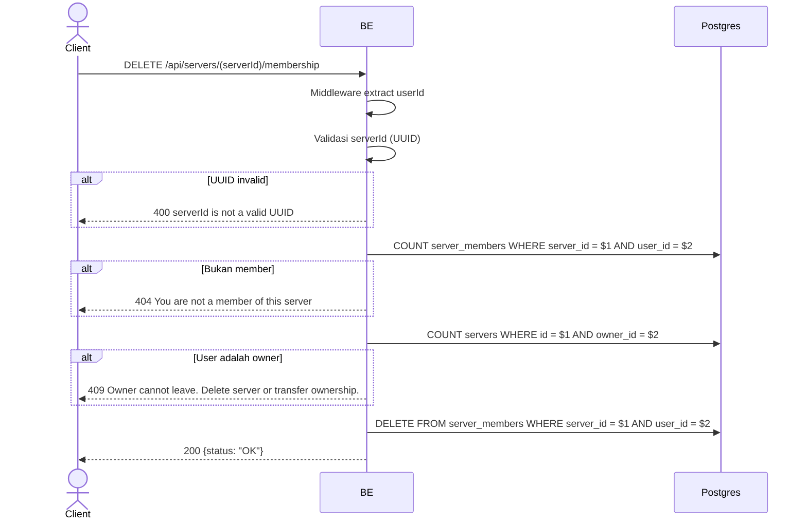

## Overview

API ini digunakan untuk leave server. Owner tidak boleh leave — harus delete server atau transfer ownership dulu. Row `server_members` di-hard-delete, tapi `server_member_profiles` retained (historical snapshot).

---

## Auth

API ini adalah api protected jadi perlu authorization header `Bearer <accessToken>`.

## Flow



---

## Notes Redis

Tidak pakai Redis.

---

## Notes Postgres/DB

| Tabel            | Kolom              | Aksi   | Keterangan                                  |
| ---------------- | ------------------ | ------ | ------------------------------------------- |
| `server_members` | (count)            | SELECT | Cek apakah user member                       |
| `servers`        | owner_id           | SELECT | Cek apakah user adalah owner                 |
| `server_members` | server_id, user_id | DELETE | Hard-delete membership                       |

Catatan: row di `server_member_profiles` tidak ikut dihapus — snapshot disimpan untuk history (lihat endpoint `get_profile_history`).

---

## Prerequisites

User adalah member server (bukan owner).

---

## Validasi Request

Path parameter:

| Field      | Tipe   | Wajib | Aturan          |
| ---------- | ------ | ----- | --------------- |
| `serverId` | string | ya    | Required, UUID  |

Tidak ada body.

---

## Response

### 200 OK

```json
{
  "status": "OK"
}
```

### 400 Bad Request

| `error_message`                  | Penyebab     |
| -------------------------------- | ------------ |
| `serverId is not a valid UUID`   | UUID invalid  |

### 404 Not Found

| `error_message`                         | Penyebab            |
| --------------------------------------- | ------------------- |
| `You are not a member of this server`   | User bukan member   |

### 409 Conflict

| `error_message`                                              | Penyebab           |
| ------------------------------------------------------------ | ------------------ |
| `Owner cannot leave. Delete server or transfer ownership.`   | User adalah owner   |

### 401 Unauthorized

Standard auth errors.

---

## Update

Dokumentasi ini diupdate tanggal 23 Mei 2026.
