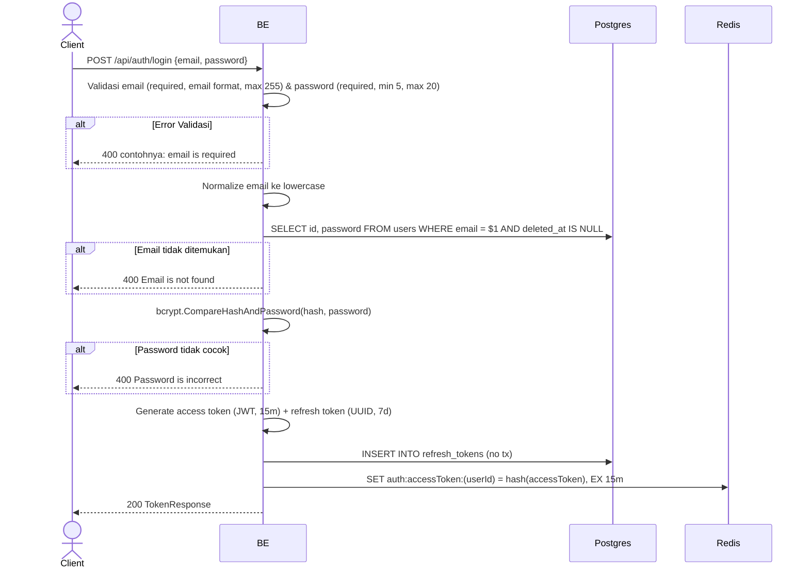

## Overview

API ini digunakan untuk login dengan email dan password. Backend cek email exist + password match (bcrypt), lalu generate token pair (access JWT + refresh UUID).

---

## Auth

API ini adalah api public jadi tidak perlu authorization header.

## Flow



---

## Notes Redis

1. auth access token:
   key: `auth:accessToken:(userId)`
   value: SHA256 hash dari access token
   ttl: 15 menit

---

## Notes Postgres/DB

| Tabel            | Kolom        | Aksi   | Keterangan                                       |
| ---------------- | ------------ | ------ | ------------------------------------------------ |
| `users`          | id, password | SELECT | Cek email exist + ambil password hash buat bcrypt |
| `refresh_tokens` | id           | INSERT | UUID primary key refresh token                   |
| `refresh_tokens` | user_id      | INSERT | Owner refresh token                              |
| `refresh_tokens` | token_hash   | INSERT | SHA256 hash dari refresh token                   |
| `refresh_tokens` | token_family | INSERT | UUID family untuk rotation strategy              |
| `refresh_tokens` | expires_at   | INSERT | now + 7 hari                                     |
| `refresh_tokens` | created_at   | INSERT | UTC now                                          |
| `refresh_tokens` | updated_at   | INSERT | UTC now                                          |
| `refresh_tokens` | created_by   | INSERT | userId                                           |
| `refresh_tokens` | updated_by   | INSERT | userId                                           |

---

## Prerequisites

Tidak ada. Endpoint bisa dipanggil dalam kondisi apapun.

---

## Validasi Request

| Field      | Tipe   | Wajib | Aturan                                                |
| ---------- | ------ | ----- | ----------------------------------------------------- |
| `email`    | string | ya    | Required, format email valid, max 255 karakter        |
| `password` | string | ya    | Required, min 5 karakter, max 20 karakter             |

Email otomatis di-lowercase setelah validasi.

---

## Response

### 200 OK

```json
{
  "accessToken": "eyJhbGciOiJIUzI1NiIsInR5cCI6IkpXVCJ9...",
  "accessTokenExpiresIn": 900,
  "refreshToken": "550e8400-e29b-41d4-a716-446655440000",
  "refreshTokenExpiresIn": 604800,
  "tokenType": "Bearer"
}
```

| Field                   | Tipe   | Deskripsi                                       |
| ----------------------- | ------ | ----------------------------------------------- |
| `accessToken`           | string | JWT access token                                |
| `accessTokenExpiresIn`  | int    | TTL access token dalam detik (900 = 15 menit)   |
| `refreshToken`          | string | UUID refresh token                              |
| `refreshTokenExpiresIn` | int    | TTL refresh token dalam detik (604800 = 7 hari) |
| `tokenType`             | string | Selalu "Bearer"                                 |

### 400 Bad Request

| `error_message`                       | Penyebab                       |
| ------------------------------------- | ------------------------------ |
| `email is required`                   | Email kosong                   |
| `email must be a valid email address` | Format email tidak valid       |
| `email must be at most 255 characters`| Email lebih dari 255 karakter  |
| `password is required`                | Password kosong                |
| `password must be at least 5 characters` | Password kurang dari 5      |
| `password must be at most 20 characters` | Password lebih dari 20      |
| `Email is not found`                  | Email tidak terdaftar          |
| `Password is incorrect`               | Password salah                 |

---

## Update

Dokumentasi ini diupdate tanggal 23 Mei 2026.
