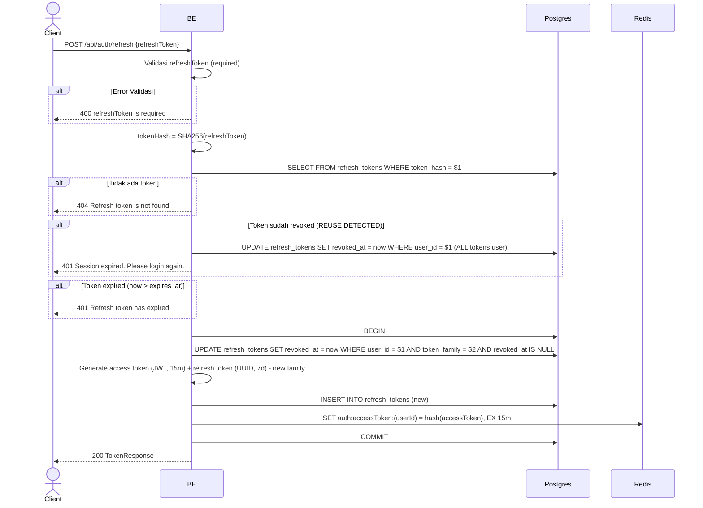

## Overview

API ini digunakan untuk rotate access token + refresh token. Akan revoke refresh token family yang lama dan generate pasangan baru. Kalau refresh token yang sudah revoked dipakai lagi (token reuse), system anggap sebagai theft dan revoke SEMUA token user (security escalation).

---

## Auth

API ini adalah api public jadi tidak perlu authorization header. Yang diperlukan: body dengan `refreshToken` valid.

## Flow



---

## Notes Redis

1. auth access token:
   key: `auth:accessToken:(userId)`
   value: SHA256 hash access token baru
   ttl: 15 menit

---

## Notes Postgres/DB

| Tabel            | Kolom         | Aksi   | Keterangan                                                                |
| ---------------- | ------------- | ------ | ------------------------------------------------------------------------- |
| `refresh_tokens` | (semua)       | SELECT | Cari refresh token by token_hash                                          |
| `refresh_tokens` | revoked_at    | UPDATE | Revoke token family lama (atau ALL token user kalau reuse detected)        |
| `refresh_tokens` | updated_at    | UPDATE | UTC now                                                                   |
| `refresh_tokens` | updated_by    | UPDATE | userId                                                                    |
| `refresh_tokens` | id, ...       | INSERT | Refresh token baru dengan family UUID baru                                |

---

## Prerequisites

User punya refresh token aktif (belum expired, belum revoked).

---

## Validasi Request

| Field          | Tipe   | Wajib | Aturan                |
| -------------- | ------ | ----- | --------------------- |
| `refreshToken` | string | ya    | Required, tidak kosong |

---

## Response

### 200 OK

```json
{
  "accessToken": "eyJhbGciOiJIUzI1NiIsInR5cCI6IkpXVCJ9...",
  "accessTokenExpiresIn": 900,
  "refreshToken": "new-uuid-refresh-token",
  "refreshTokenExpiresIn": 604800,
  "tokenType": "Bearer"
}
```

### 400 Bad Request

| `error_message`            | Penyebab                  |
| -------------------------- | ------------------------- |
| `refreshToken is required` | Refresh token kosong      |

### 401 Unauthorized

| `error_message`                          | Penyebab                                                                |
| ---------------------------------------- | ----------------------------------------------------------------------- |
| `Session expired. Please login again.`   | Token sudah revoked dipakai lagi (token theft escalation - ALL revoked)  |
| `Refresh token has expired`              | Refresh token sudah lewat expiry (7 hari)                                |

### 404 Not Found

| `error_message`                | Penyebab                                       |
| ------------------------------ | ---------------------------------------------- |
| `Refresh token is not found`   | token_hash tidak ditemukan di tabel refresh_tokens |

---

## Update

Dokumentasi ini diupdate tanggal 23 Mei 2026.
