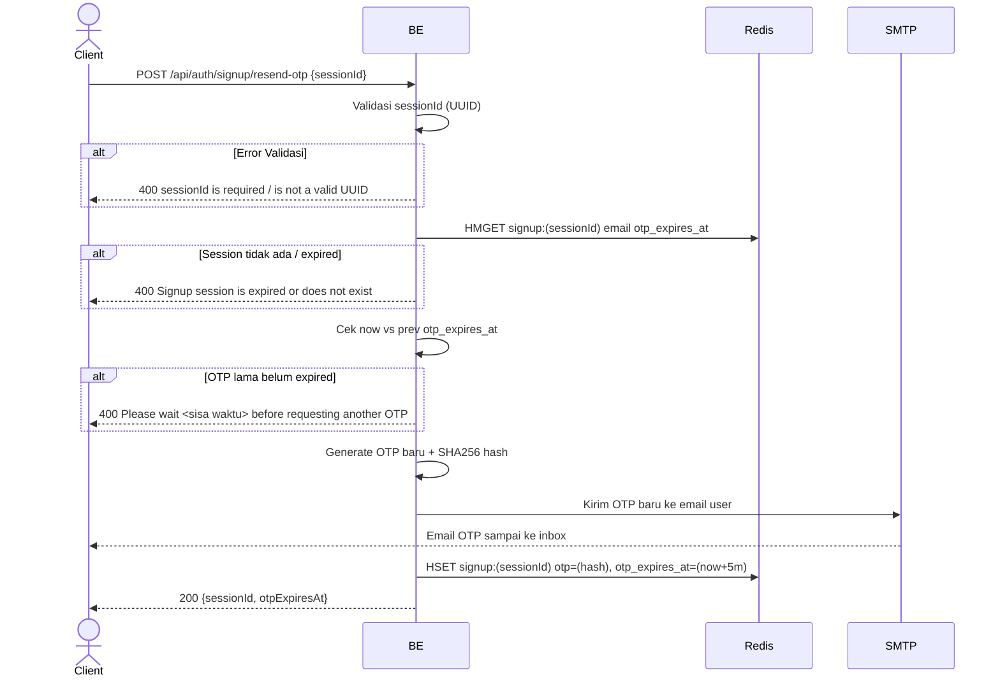

## Overview

API ini digunakan untuk meminta kirim ulang OTP signup. Hanya boleh dipanggil kalau OTP sebelumnya sudah expired (tidak ada cooldown khusus, tapi OTP sebelumnya harus sudah lewat `otp_expires_at`).

---

## Auth

API ini adalah api public jadi tidak perlu authorization header. Tapi butuh `sessionId` valid dari step `start_signup`.

## Flow



---

## Notes Redis

1. signup session:
   key: `signup:(sessionId)`
   type: HASH

| Field            | Aksi | Keterangan                                  |
| ---------------- | ---- | ------------------------------------------- |
| `email`          | HMGET | Diambil untuk kirim ulang email             |
| `otp_expires_at` | HMGET | Cek apakah OTP lama masih berlaku           |
| `otp`            | HSET | Update dengan hash OTP baru                 |
| `otp_expires_at` | HSET | Update jadi unix timestamp (now + 5 menit) |

---

## Notes Postgres/DB

Endpoint ini tidak mengakses Postgres.

---

## Prerequisites

- User harus sudah hit `start_signup` dan memiliki `sessionId` aktif.
- OTP sebelumnya sudah expired (kalau belum, akan dapat pesan tunggu sekian detik/menit).

---

## Validasi Request

| Field       | Tipe   | Wajib | Aturan                     |
| ----------- | ------ | ----- | -------------------------- |
| `sessionId` | string | ya    | Required, harus UUID valid |

---

## Response

### 200 OK

```json
{
  "sessionId": "550e8400-e29b-41d4-a716-446655440000",
  "otpExpiresAt": 1714829700
}
```

| Field          | Tipe   | Deskripsi                                       |
| -------------- | ------ | ----------------------------------------------- |
| `sessionId`    | string | UUID session (sama seperti sebelumnya)           |
| `otpExpiresAt` | int64  | Unix timestamp expiry OTP baru (5 menit) |

### 400 Bad Request

| `error_message`                                                  | Penyebab                                              |
| ---------------------------------------------------------------- | ----------------------------------------------------- |
| `sessionId is required`                                          | Session id kosong                                      |
| `sessionId is not a valid UUID`                                  | Format sessionId bukan UUID                            |
| `Signup session is expired or does not exist`                    | Session di Redis sudah tidak ada                        |
| `Please wait <sisa waktu> before requesting another OTP`         | OTP lama masih aktif. Format sisa waktu: `X seconds`, `X minutes`, atau `X minutes and Y seconds` (sesuai `util.FormatRemainingTime`) |

---

## Update

Dokumentasi ini diupdate tanggal 23 Mei 2026.
