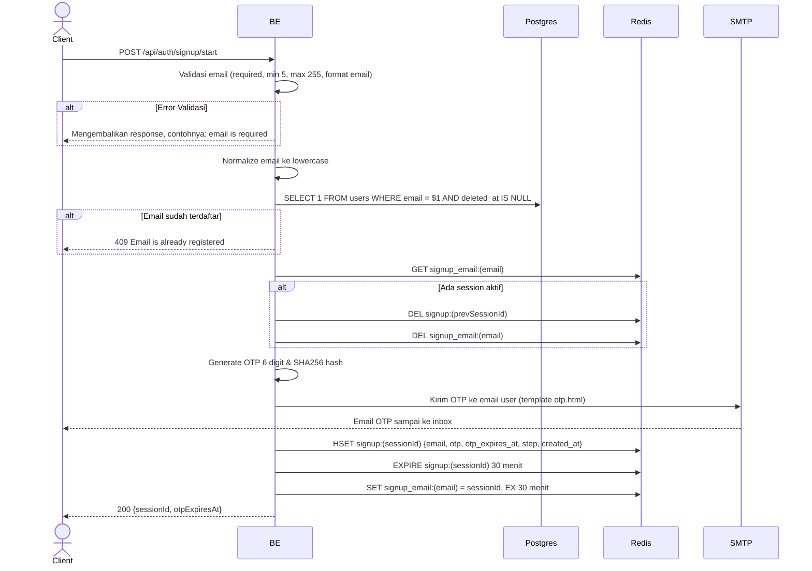

## Overview

API ini digunakan untuk memulai proses signup dengan mengirim OTP ke email yang diberikan. Akan dibuat session di Redis dan email dikirim via SMTP.

---

## Auth

API ini adalah api public jadi tidak perlu authorization header.

## Flow



---

## Notes Redis

1. signup session:
   key: `signup:(sessionId)`
   type: HASH
   ttl: 30 menit
   fields:
   - `email`
   - `otp` (SHA256 hash dari OTP)
   - `otp_expires_at` (unix timestamp, 5 menit dari sekarang)
   - `step` = `start_signup`
   - `created_at` (unix timestamp)

2. signup email session:
   key: `signup_email:(email)`
   value: sessionId
   ttl: 30 menit

---

## Notes Postgres/DB

| Tabel   | Kolom | Aksi   | Keterangan                                                |
| ------- | ----- | ------ | --------------------------------------------------------- |
| `users` | email | SELECT | Cek email unique (filter `deleted_at IS NULL`) sebelum kirim OTP |

---

## Prerequisites

Tidak ada. Endpoint bisa dipanggil dalam kondisi apapun. Kalau ada session signup aktif untuk email yang sama, session lama akan dihapus dan diganti session baru.

---

## Validasi Request

| Field   | Tipe   | Wajib | Aturan                                                              |
| ------- | ------ | ----- | ------------------------------------------------------------------- |
| `email` | string | ya    | Required, min 5 karakter, max 255 karakter, harus format email valid |

Email otomatis di-lowercase setelah validasi.

---

## Response

### 200 OK

```json
{
  "sessionId": "550e8400-e29b-41d4-a716-446655440000",
  "otpExpiresAt": 1714829400
}
```

| Field          | Tipe   | Deskripsi                                            |
| -------------- | ------ | ---------------------------------------------------- |
| `sessionId`    | string | UUID session untuk lanjut ke verify OTP              |
| `otpExpiresAt` | int64  | Unix timestamp expiry OTP (5 menit dari sekarang) |

### 400 Bad Request

| `error_message`                       | Penyebab                      |
| ------------------------------------- | ----------------------------- |
| `email is required`                   | Email tidak diisi             |
| `email must be at least 5 characters` | Email kurang dari 5 karakter  |
| `email must be at most 255 characters`| Email lebih dari 255 karakter |
| `email must be a valid email address` | Format email tidak valid      |

### 409 Conflict

| `error_message`                | Penyebab                              |
| ------------------------------ | ------------------------------------- |
| `Email is already registered`  | Email sudah terdaftar di tabel users  |

---

## Update

Dokumentasi ini diupdate tanggal 23 Mei 2026.
