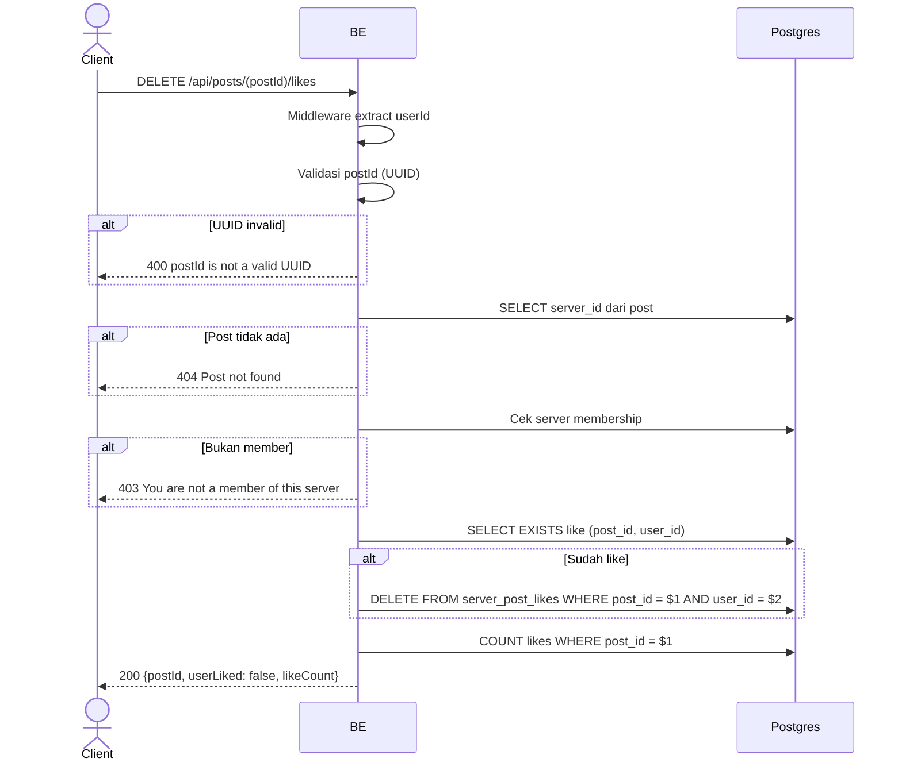

## Overview

API ini digunakan untuk unlike post. Idempotent — kalau user belum like, request ini tetap return 200 (tidak error). Return likeCount terbaru + `userLiked: false`.

---

## Auth

API ini adalah api protected jadi perlu authorization header `Bearer <accessToken>`.

## Flow



---

## Notes Redis

Tidak pakai Redis.

---

## Notes Postgres/DB

| Tabel                | Kolom              | Aksi   | Keterangan                  |
| -------------------- | ------------------ | ------ | --------------------------- |
| `server_posts`       | server_id          | SELECT | Ambil server_id              |
| `server_members`     | (count)            | SELECT | Cek membership               |
| `server_post_likes`  | (exists)           | SELECT | Cek apakah user sudah like   |
| `server_post_likes`  | post_id, user_id   | DELETE | Hapus like (kalau ada)        |
| `server_post_likes`  | (count)            | SELECT | likeCount baru                |

---

## Prerequisites

User adalah member server tempat post berada.

---

## Validasi Request

Path parameter:

| Field    | Tipe   | Wajib | Aturan          |
| -------- | ------ | ----- | --------------- |
| `postId` | string | ya    | Required, UUID  |

Tidak ada body.

---

## Response

### 200 OK

```json
{
  "postId": "post-uuid",
  "userLiked": false,
  "likeCount": 12
}
```

### 400 Bad Request

| `error_message`               | Penyebab     |
| ----------------------------- | ------------ |
| `postId is not a valid UUID`  | UUID invalid  |

### 403 Forbidden

| `error_message`                          | Penyebab     |
| ---------------------------------------- | ------------ |
| `You are not a member of this server`    | Bukan member  |

### 404 Not Found

| `error_message`     | Penyebab            |
| ------------------- | ------------------- |
| `Post not found`    | Post tidak ada       |

### 401 Unauthorized

Standard auth errors.

---

## Update

Dokumentasi ini diupdate tanggal 23 Mei 2026.
