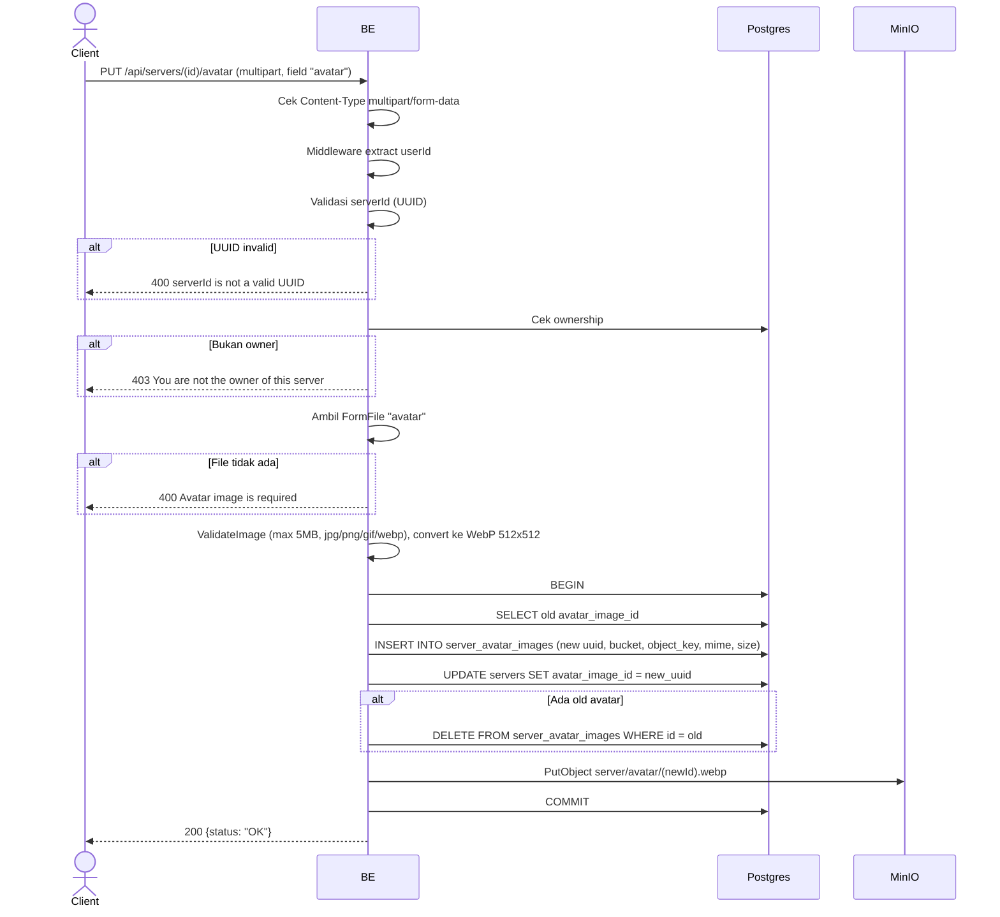

## Overview

API ini digunakan untuk update avatar server. Format request multipart, file di-validate (max 5MB, image format), convert ke WebP, upload ke MinIO, dan replace avatar lama di DB. Avatar lama dihapus dari DB (CASCADE handle row turunan). Hanya owner yang boleh.

---

## Auth

API ini adalah api protected jadi perlu authorization header `Bearer <accessToken>`.

## Flow



---

## Notes Redis

Tidak pakai Redis.

---

## Notes MinIO

- Bucket: `MINIO_BUCKET_NAME` (default `virdan`)
- Object key pattern: `server/avatar/{newImageId}.webp`
- Content-Type: `image/webp` (di-convert dari original)
- Aksi: PutObject

---

## Notes Postgres/DB

| Tabel                  | Kolom                                              | Aksi   | Keterangan                          |
| ---------------------- | -------------------------------------------------- | ------ | ----------------------------------- |
| `servers`              | owner_id                                           | SELECT | Cek ownership                       |
| `servers`              | avatar_image_id                                    | SELECT | Ambil avatar_image_id lama          |
| `server_avatar_images` | id, bucket, object_key, mime_type, size, ...       | INSERT | Row image baru                       |
| `servers`              | avatar_image_id, updated_at, updated_by            | UPDATE | Set ke uuid avatar baru             |
| `server_avatar_images` | id                                                 | DELETE | Hapus image lama (kalau ada)         |

---

## Prerequisites

User adalah owner server. Punya file image valid.

---

## Validasi Request

Format request: `multipart/form-data`.

| Field        | Tipe   | Wajib | Aturan                                                 |
| ------------ | ------ | ----- | ------------------------------------------------------ |
| `id` (path)  | string | ya    | Required, UUID                                         |
| `avatar`     | file   | ya    | Image (jpg/jpeg/png/gif/webp), max 5MB                 |

---

## Response

### 200 OK

```json
{
  "status": "OK"
}
```

### 400 Bad Request

| `error_message`                                                       | Penyebab                       |
| --------------------------------------------------------------------- | ------------------------------ |
| `Invalid Content-Type header. Endpoint requires multipart/form-data.` | Content-Type bukan multipart   |
| `serverId is not a valid UUID`                                        | UUID invalid                    |
| `Avatar image is required`                                            | File `avatar` tidak ada         |
| `image size exceeded 5MB limit`                                       | File lebih dari 5 MB            |
| `invalid file extension: ...`                                         | Ekstensi tidak diizinkan        |
| `invalid image type: ...`                                             | MIME type tidak diizinkan       |

### 403 Forbidden

| `error_message`                          | Penyebab     |
| ---------------------------------------- | ------------ |
| `You are not the owner of this server`   | Bukan owner   |

### 401 Unauthorized

Standard auth errors.

---

## Update

Dokumentasi ini diupdate tanggal 23 Mei 2026.
