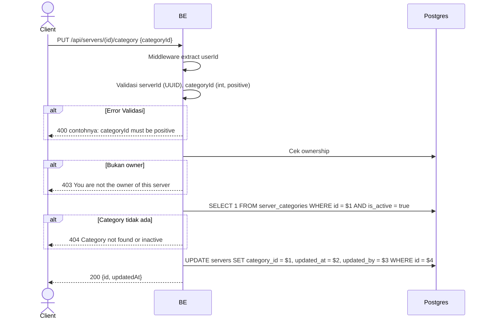

## Overview

API ini digunakan untuk mengubah kategori server. Hanya owner yang boleh. Backend cek category aktif sebelum update.

---

## Auth

API ini adalah api protected jadi perlu authorization header `Bearer <accessToken>`.

## Flow



---

## Notes Redis

Tidak pakai Redis.

---

## Notes Postgres/DB

| Tabel               | Kolom        | Aksi   | Keterangan                    |
| ------------------- | ------------ | ------ | ----------------------------- |
| `servers`           | owner_id     | SELECT | Cek ownership                 |
| `server_categories` | id, is_active | SELECT | Cek category exists & aktif   |
| `servers`           | category_id  | UPDATE | Set category baru             |
| `servers`           | updated_at   | UPDATE | UTC now                        |
| `servers`           | updated_by   | UPDATE | userId                         |

---

## Prerequisites

User adalah owner server.

---

## Validasi Request

| Field        | Tipe   | Wajib | Aturan                  |
| ------------ | ------ | ----- | ----------------------- |
| `id` (path)  | string | ya    | Required, UUID          |
| `categoryId` | int    | ya    | Required, positif > 0   |

---

## Response

### 200 OK

```json
{
  "id": "uuid",
  "updatedAt": "2026-05-23T10:00:00Z"
}
```

### 400 Bad Request

| `error_message`                  | Penyebab                       |
| -------------------------------- | ------------------------------ |
| `serverId is not a valid UUID`   | UUID invalid                    |
| `categoryId is required`         | CategoryId kosong               |
| `categoryId must be positive`    | CategoryId <= 0                 |

### 403 Forbidden

| `error_message`                          | Penyebab          |
| ---------------------------------------- | ----------------- |
| `You are not the owner of this server`   | Bukan owner       |

### 404 Not Found

| `error_message`                       | Penyebab                          |
| ------------------------------------- | --------------------------------- |
| `Category not found or inactive`      | Category tidak ada / is_active=false |

### 401 Unauthorized

Standard auth errors.

---

## Update

Dokumentasi ini diupdate tanggal 23 Mei 2026.
