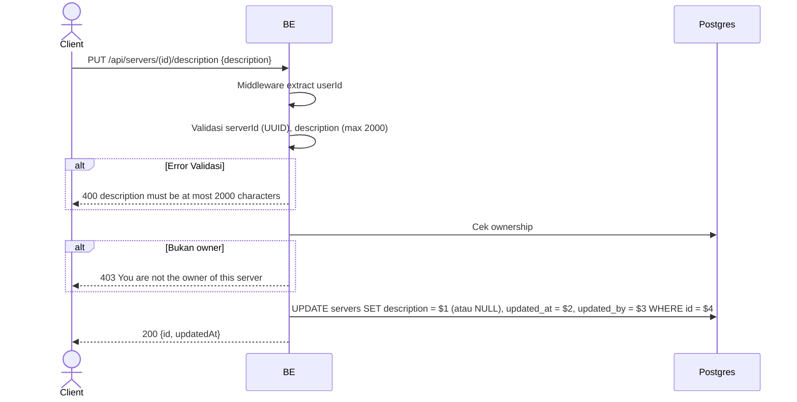

## Overview

API ini digunakan untuk mengubah deskripsi server. Hanya owner yang boleh. Description boleh kosong (akan jadi NULL di DB).

---

## Auth

API ini adalah api protected jadi perlu authorization header `Bearer <accessToken>`.

## Flow



---

## Notes Redis

Tidak pakai Redis.

---

## Notes Postgres/DB

| Tabel     | Kolom       | Aksi   | Keterangan                                        |
| --------- | ----------- | ------ | ------------------------------------------------- |
| `servers` | owner_id    | SELECT | Cek ownership                                     |
| `servers` | description | UPDATE | Set description baru (NULL bila string kosong)    |
| `servers` | updated_at  | UPDATE | UTC now                                            |
| `servers` | updated_by  | UPDATE | userId                                             |

---

## Prerequisites

User adalah owner server.

---

## Validasi Request

| Field         | Tipe   | Wajib | Aturan                       |
| ------------- | ------ | ----- | ---------------------------- |
| `id` (path)   | string | ya    | Required, UUID               |
| `description` | string | tidak | Max 2000 karakter            |

---

## Response

### 200 OK

```json
{
  "id": "uuid",
  "updatedAt": "2026-05-23T10:00:00Z"
}
```

### 400 Bad Request

| `error_message`                              | Penyebab          |
| -------------------------------------------- | ----------------- |
| `serverId is not a valid UUID`               | UUID invalid       |
| `description must be at most 2000 characters` | Description > 2000 |

### 403 Forbidden

| `error_message`                          | Penyebab     |
| ---------------------------------------- | ------------ |
| `You are not the owner of this server`   | Bukan owner   |

### 401 Unauthorized

Standard auth errors.

---

## Update

Dokumentasi ini diupdate tanggal 23 Mei 2026.
