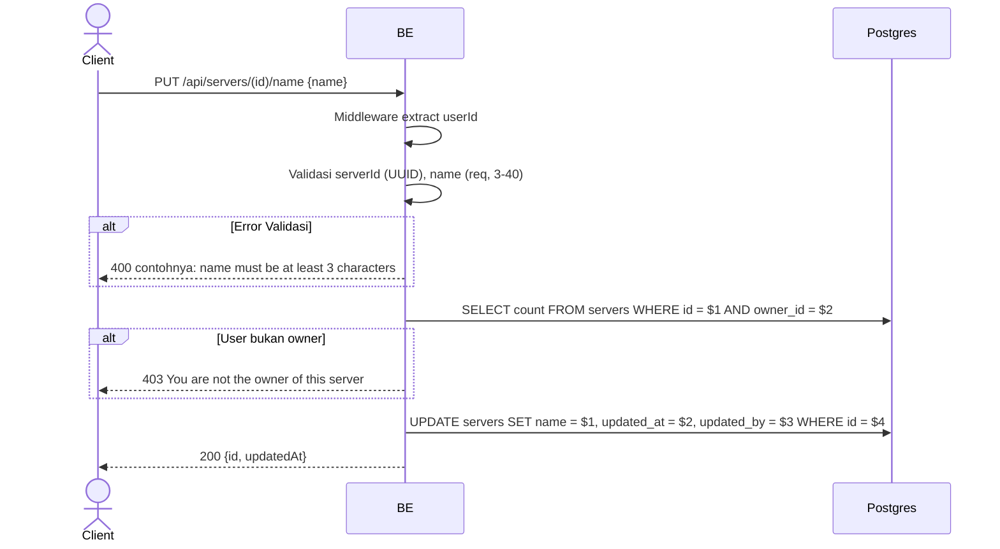

## Overview

API ini digunakan untuk mengubah nama server. Hanya owner server yang boleh.

---

## Auth

API ini adalah api protected jadi perlu authorization header `Bearer <accessToken>`.

## Flow



---

## Notes Redis

Tidak pakai Redis (selain middleware auth check).

---

## Notes Postgres/DB

| Tabel     | Kolom              | Aksi   | Keterangan                       |
| --------- | ------------------ | ------ | -------------------------------- |
| `servers` | owner_id           | SELECT | Cek ownership                    |
| `servers` | name               | UPDATE | Set nama baru                    |
| `servers` | updated_at         | UPDATE | UTC now                          |
| `servers` | updated_by         | UPDATE | userId (self)                    |

---

## Prerequisites

User adalah owner server dan punya access token valid.

---

## Validasi Request

Path parameter:

| Field | Tipe   | Wajib | Aturan          |
| ----- | ------ | ----- | --------------- |
| `id`  | string | ya    | Required, UUID  |

Body JSON:

| Field  | Tipe   | Wajib | Aturan                            |
| ------ | ------ | ----- | --------------------------------- |
| `name` | string | ya    | Required, min 3, max 40 karakter  |

---

## Response

### 200 OK

```json
{
  "id": "uuid",
  "updatedAt": "2026-05-23T10:00:00Z"
}
```

### 400 Bad Request

| `error_message`                       | Penyebab                       |
| ------------------------------------- | ------------------------------ |
| `serverId is not a valid UUID`        | serverId bukan UUID             |
| `name is required`                    | Name kosong                     |
| `name must be at least 3 characters`  | Name kurang dari 3              |
| `name must be at most 40 characters`  | Name lebih dari 40              |

### 403 Forbidden

| `error_message`                          | Penyebab                |
| ---------------------------------------- | ----------------------- |
| `You are not the owner of this server`   | User bukan owner         |

### 401 Unauthorized

Standard auth errors.

---

## Update

Dokumentasi ini diupdate tanggal 23 Mei 2026.
