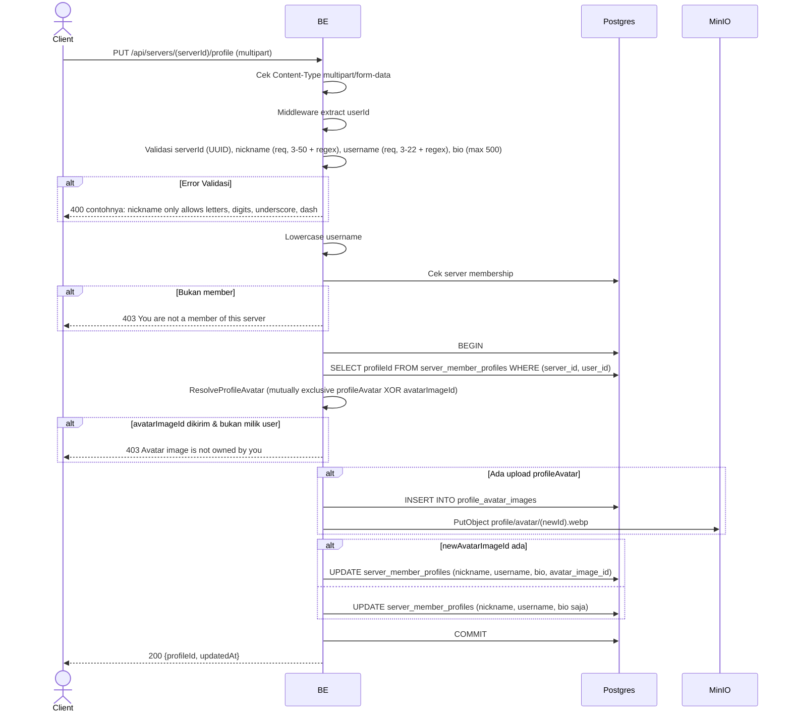

## Overview

API ini digunakan untuk update profile per-server user. Bisa update nickname, username, bio, dan avatar (file baru ATAU reuse `avatarImageId` existing). Avatar mutually exclusive — kirim salah satu, atau tidak keduanya (avatar lama dipertahankan). Format request multipart.

Username unique per server (unique index `(server_id, username)`).

---

## Auth

API ini adalah api protected jadi perlu authorization header `Bearer <accessToken>`.

## Flow



---

## Notes Redis

Tidak pakai Redis.

---

## Notes MinIO

Bila upload `profileAvatar`:
- Bucket: `MINIO_BUCKET_NAME`
- Object key: `profile/avatar/{newId}.webp`
- Content-Type: `image/webp`
- Aksi: PutObject

---

## Notes Postgres/DB

| Tabel                     | Kolom                                                       | Aksi   | Keterangan                                  |
| ------------------------- | ----------------------------------------------------------- | ------ | ------------------------------------------- |
| `server_members`          | (count)                                                     | SELECT | Cek membership                                |
| `server_member_profiles`  | id                                                          | SELECT | Ambil profileId                              |
| `profile_avatar_images`   | (full)                                                      | INSERT | Bila ada upload `profileAvatar`              |
| `profile_avatar_images`   | id, created_by                                              | SELECT | Cek ownership `avatarImageId` (kalau dikirim) |
| `server_member_profiles`  | nickname, username, bio, [avatar_image_id], updated_at, updated_by | UPDATE | Update profile per server                 |

---

## Prerequisites

User adalah member server. Punya row di `server_member_profiles` (otomatis ada karena copy-on-join).

---

## Validasi Request

Path parameter:

| Field      | Tipe   | Wajib | Aturan          |
| ---------- | ------ | ----- | --------------- |
| `serverId` | string | ya    | Required, UUID  |

Multipart body:

| Field           | Tipe          | Wajib | Aturan                                                                          |
| --------------- | ------------- | ----- | ------------------------------------------------------------------------------- |
| `nickname`      | string        | ya    | Required, min 3, max 50, regex `^[a-zA-Z0-9_-]+$`                               |
| `username`      | string        | ya    | Required, min 3, max 22, regex `^[a-zA-Z0-9_.]+$` (auto-lowercase)              |
| `bio`           | string        | tidak | Max 500 karakter (trimmed; kosong → NULL)                                       |
| `profileAvatar` | file          | tidak | Image baru (jpg/jpeg/png/gif/webp), max 5MB. Mutually exclusive dengan `avatarImageId` |
| `avatarImageId` | string (UUID) | tidak | Reuse existing `profile_avatar_images` UUID milik user. Mutually exclusive dengan `profileAvatar` |

---

## Response

### 200 OK

```json
{
  "profileId": "profile-uuid",
  "updatedAt": "2026-05-23T10:00:00Z"
}
```

### 400 Bad Request

| `error_message`                                                       | Penyebab                       |
| --------------------------------------------------------------------- | ------------------------------ |
| `Invalid Content-Type header. Endpoint requires multipart/form-data.` | Content-Type salah             |
| `serverId is not a valid UUID`                                        | UUID invalid                    |
| `nickname is required`                                                | Nickname kosong                 |
| `nickname must be at least 3 characters`                              | Nickname kurang dari 3          |
| `nickname must be at most 50 characters`                              | Nickname lebih dari 50          |
| `nickname only allows letters, digits, underscore, dash`              | Nickname gagal regex             |
| `username is required`                                                | Username kosong                 |
| `username must be at least 3 characters`                              | Username kurang dari 3          |
| `username must be at most 22 characters`                              | Username lebih dari 22          |
| `Username may only contain letters, digits, underscores and dots`     | Username gagal regex             |
| `bio must be at most 500 characters`                                  | Bio terlalu panjang             |
| `image size exceeded 5MB limit`                                       | profileAvatar > 5MB             |
| `invalid file extension: ...`                                         | Ekstensi tidak diizinkan         |
| `invalid image type: ...`                                             | MIME type tidak diizinkan        |

### 403 Forbidden

| `error_message`                          | Penyebab                                |
| ---------------------------------------- | --------------------------------------- |
| `You are not a member of this server`    | Bukan member                             |
| `Avatar image is not owned by you`       | avatarImageId bukan milik user           |

### 409 Conflict

Repository `UpdateServerProfileFull` / `UpdateServerProfileNickBioTx` menangkap SQL error `23505` dan mapping ke `ConflictError` (HTTP 409) per constraint name:

| `error_message`                              | Penyebab                                                                                |
| -------------------------------------------- | --------------------------------------------------------------------------------------- |
| `Nickname is already taken in this server`   | Collision dengan unique index `idx_server_member_profiles_uk_02` (`server_id, nickname`) |
| `Username is already taken in this server`   | Collision dengan unique index `idx_server_member_profiles_uk_03` (`server_id, username`) |

### 401 Unauthorized

Standard auth errors.

---

## Update

Dokumentasi ini diupdate tanggal 23 Mei 2026.
