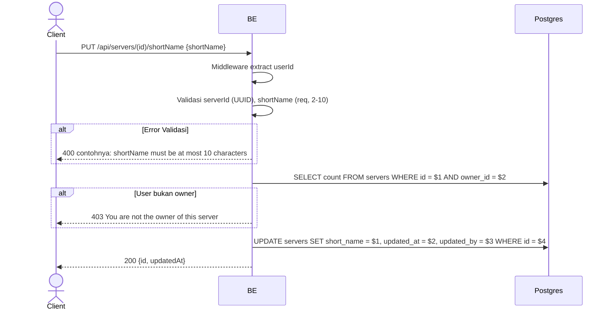

## Overview

API ini digunakan untuk mengubah short name server. Hanya owner yang boleh.

---

## Auth

API ini adalah api protected jadi perlu authorization header `Bearer <accessToken>`.

## Flow



---

## Notes Redis

Tidak pakai Redis.

---

## Notes Postgres/DB

| Tabel     | Kolom       | Aksi   | Keterangan          |
| --------- | ----------- | ------ | ------------------- |
| `servers` | owner_id    | SELECT | Cek ownership       |
| `servers` | short_name  | UPDATE | Set short name baru |
| `servers` | updated_at  | UPDATE | UTC now              |
| `servers` | updated_by  | UPDATE | userId               |

---

## Prerequisites

User adalah owner server.

---

## Validasi Request

| Field       | Tipe   | Wajib | Aturan                            |
| ----------- | ------ | ----- | --------------------------------- |
| `id` (path) | string | ya    | Required, UUID                    |
| `shortName` | string | ya    | Required, min 2, max 10 karakter  |

---

## Response

### 200 OK

```json
{
  "id": "uuid",
  "updatedAt": "2026-05-23T10:00:00Z"
}
```

### 400 Bad Request

| `error_message`                            | Penyebab                       |
| ------------------------------------------ | ------------------------------ |
| `serverId is not a valid UUID`             | serverId bukan UUID             |
| `shortName is required`                    | ShortName kosong                |
| `shortName must be at least 2 characters`  | Kurang dari 2                   |
| `shortName must be at most 10 characters`  | Lebih dari 10                   |

### 403 Forbidden

| `error_message`                          | Penyebab          |
| ---------------------------------------- | ----------------- |
| `You are not the owner of this server`   | Bukan owner       |

### 401 Unauthorized

Standard auth errors.

---

## Update

Dokumentasi ini diupdate tanggal 23 Mei 2026.
