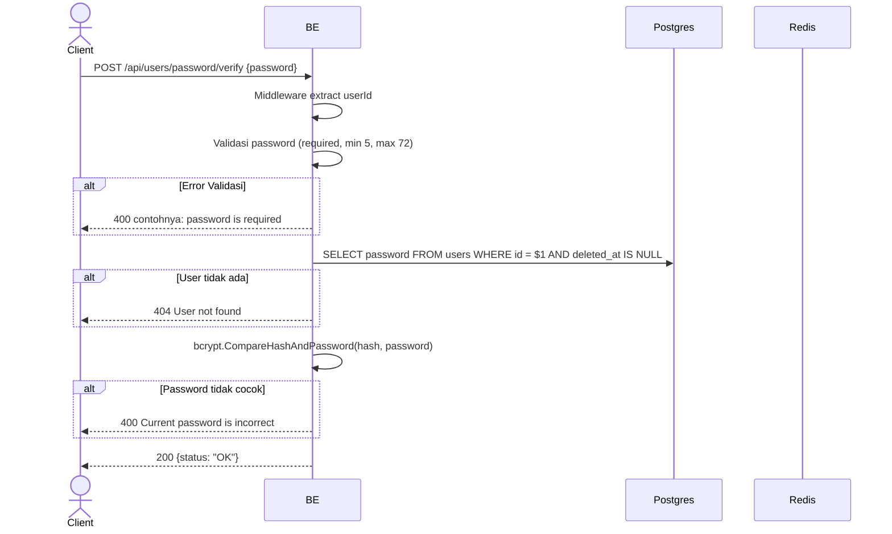

## Overview

API ini digunakan untuk verify password user saat ini. Endpoint ini adalah step 1 dari flow change-password di frontend (sebelum user input password baru). Tidak melakukan perubahan apapun di database.

---

## Auth

API ini adalah api protected jadi perlu authorization header `Bearer <accessToken>`.

## Flow



---

## Notes Redis

Endpoint ini tidak mengakses Redis (selain middleware auth check).

---

## Notes Postgres/DB

| Tabel   | Kolom    | Aksi   | Keterangan                            |
| ------- | -------- | ------ | ------------------------------------- |
| `users` | password | SELECT | Ambil password hash buat dibandingkan |

---

## Prerequisites

User sudah login dengan access token valid.

---

## Validasi Request

| Field      | Tipe   | Wajib | Aturan                                    |
| ---------- | ------ | ----- | ----------------------------------------- |
| `password` | string | ya    | Required, min 5 karakter, max 72 karakter |

---

## Response

### 200 OK

```json
{
  "status": "OK"
}
```

### 400 Bad Request

| `error_message`                          | Penyebab                       |
| ---------------------------------------- | ------------------------------ |
| `password is required`                   | Password kosong                |
| `password must be at least 5 characters` | Password kurang dari 5 karakter |
| `password must be at most 72 characters` | Password lebih dari 72 karakter |
| `Current password is incorrect`          | Password tidak cocok dengan hash |

### 401 Unauthorized

| `error_message`                              | Penyebab                                |
| -------------------------------------------- | --------------------------------------- |
| `Authorization header is missing`            | Header tidak ada                        |
| `Authentication token is invalid`            | JWT invalid                              |
| `Authorization token not found or expired`   | Token tidak ada di cache Redis           |

### 404 Not Found

| `error_message`    | Penyebab                       |
| ------------------ | ------------------------------ |
| `User not found`   | User tidak ada / soft-deleted  |

---

## Update

Dokumentasi ini diupdate tanggal 23 Mei 2026.
