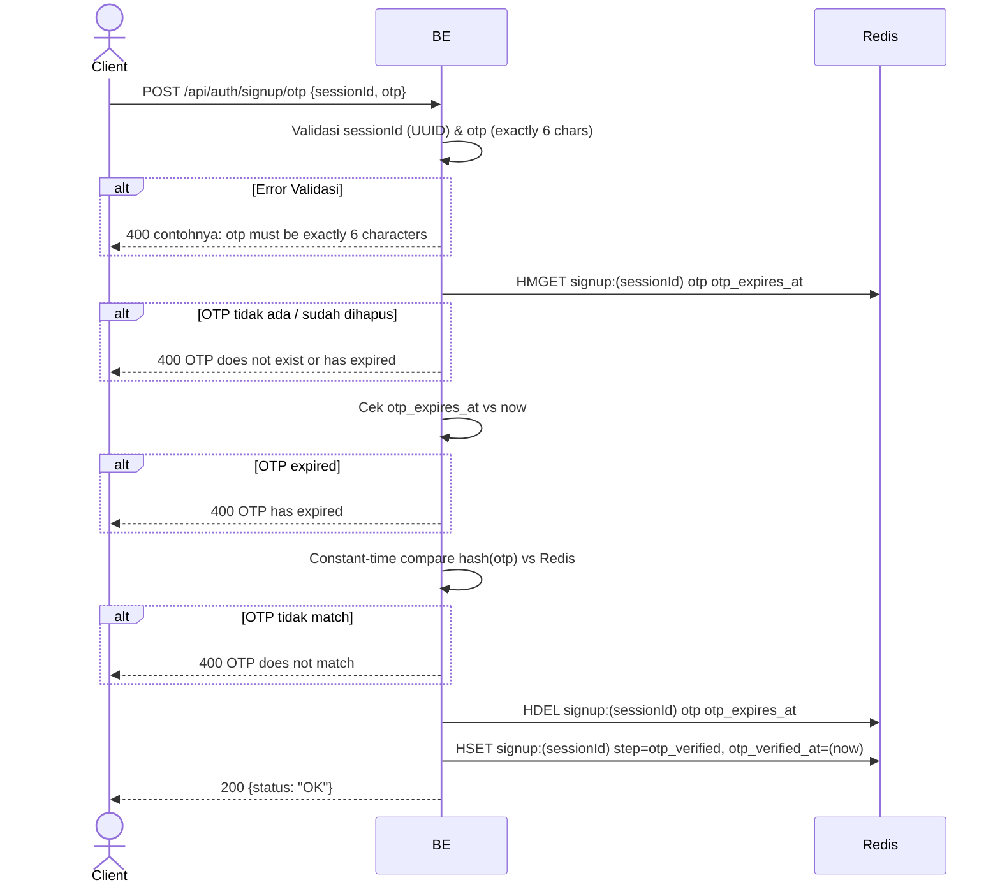

## Overview

API ini digunakan untuk verifikasi OTP yang dikirim ke email saat signup. Backend cek OTP hash, expiry, lalu update step session ke `otp_verified`.

---

## Auth

API ini adalah api public jadi tidak perlu authorization header. Tapi butuh `sessionId` valid dari step `start_signup`.

## Flow



---

## Notes Redis

1. signup session:
   key: `signup:(sessionId)`
   type: HASH

| Field             | Tipe   | Aksi | Keterangan                                       |
| ----------------- | ------ | ---- | ------------------------------------------------ |
| `otp`             | string | HDEL | OTP hash dihapus setelah berhasil verifikasi     |
| `otp_expires_at`  | string | HDEL | Timestamp expiry dihapus setelah verifikasi      |
| `step`            | string | HSET | Diupdate jadi `otp_verified`                     |
| `otp_verified_at` | string | HSET | Unix timestamp waktu verifikasi sukses           |

---

## Notes Postgres/DB

Endpoint ini tidak mengakses Postgres.

---

## Prerequisites

User harus sudah hit `start_signup` dan memiliki `sessionId` aktif di Redis. OTP yang dikirim ke email belum boleh expired (TTL OTP 5 menit).

---

## Validasi Request

| Field       | Tipe   | Wajib | Aturan                                |
| ----------- | ------ | ----- | ------------------------------------- |
| `sessionId` | string | ya    | Required, harus UUID valid            |
| `otp`       | string | ya    | Required, exactly 6 karakter          |

---

## Response

### 200 OK

```json
{
  "status": "OK"
}
```

### 400 Bad Request

| `error_message`                       | Penyebab                                       |
| ------------------------------------- | ---------------------------------------------- |
| `sessionId is required`               | sessionId kosong                               |
| `sessionId is not a valid UUID`       | sessionId bukan format UUID                    |
| `otp is required`                     | OTP kosong                                     |
| `otp must be exactly 6 characters`    | Panjang OTP bukan 6 karakter                   |
| `OTP does not exist or has expired`   | OTP sudah tidak ada di Redis (TTL habis / dihapus) |
| `OTP has expired`                     | Field `otp_expires_at` sudah lewat             |
| `OTP does not match`                  | Hash OTP user tidak cocok dengan yang tersimpan |

---

## Update

Dokumentasi ini diupdate tanggal 23 Mei 2026.
