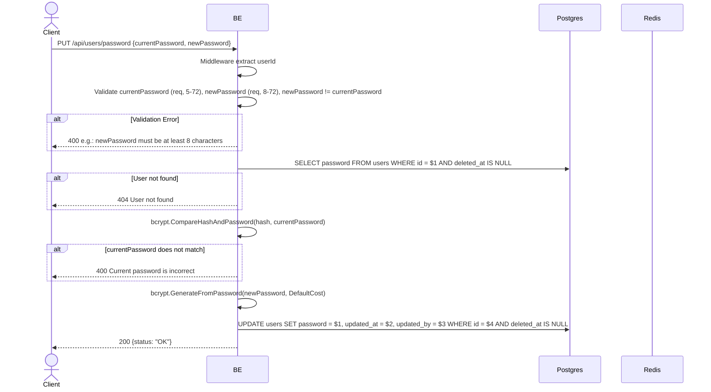

## Overview

This API is used to change the user's password. The backend checks that `currentPassword` matches via bcrypt, then updates with the new password hash. Active refresh tokens are not revoked (see TD-007 multi-device).

---

## Auth

This is a protected API, so it requires the authorization header `Bearer <accessToken>`.

## Flow



---

## Notes Redis

This endpoint does not access Redis (other than the auth-check middleware). The refresh token is not revoked after a password change (see TD-007).

---

## Notes Postgres/DB

| Table   | Column     | Action | Notes                            |
| ------- | ---------- | ------ | -------------------------------- |
| `users` | password   | SELECT | Fetch hash to verify             |
| `users` | password   | UPDATE | Set new hash                     |
| `users` | updated_at | UPDATE | UTC now                          |
| `users` | updated_by | UPDATE | userId (self)                    |

---

## Prerequisites

User is already logged in with a valid access token. Knows the old password.

---

## Request Validation

| Field             | Type   | Required | Rules                                                               |
| ----------------- | ------ | -------- | ------------------------------------------------------------------- |
| `currentPassword` | string | yes      | Required, min 5 characters, max 72 characters                       |
| `newPassword`     | string | yes      | Required, min 8 characters, max 72 characters, must not be equal to currentPassword |

---

## Response

### 200 OK

```json
{
  "status": "OK"
}
```

### 400 Bad Request

| `error_message`                                  | Cause                                          |
| ------------------------------------------------ | ---------------------------------------------- |
| `currentPassword is required`                    | Old password empty                             |
| `currentPassword must be at least 5 characters`  | Old password less than 5                        |
| `currentPassword must be at most 72 characters`  | Old password more than 72                       |
| `newPassword is required`                        | New password empty                             |
| `newPassword must be at least 8 characters`      | New password less than 8                        |
| `newPassword must be at most 72 characters`      | New password more than 72                       |
| `newPassword must not be equal to currentPassword` | New password same as old password             |
| `Current password is incorrect`                  | currentPassword does not match the hash in DB  |

### 401 Unauthorized

| `error_message`                              | Cause              |
| -------------------------------------------- | ------------------ |
| `Authorization header is missing`            | Header not present  |
| `Authentication token is invalid`            | JWT invalid        |
| `Authorization token not found or expired`   | Token not in cache |

### 404 Not Found

| `error_message`    | Cause                          |
| ------------------ | ------------------------------ |
| `User not found`   | User not found / soft-deleted  |

---

## Update

This documentation was last updated on 23 May 2026.
