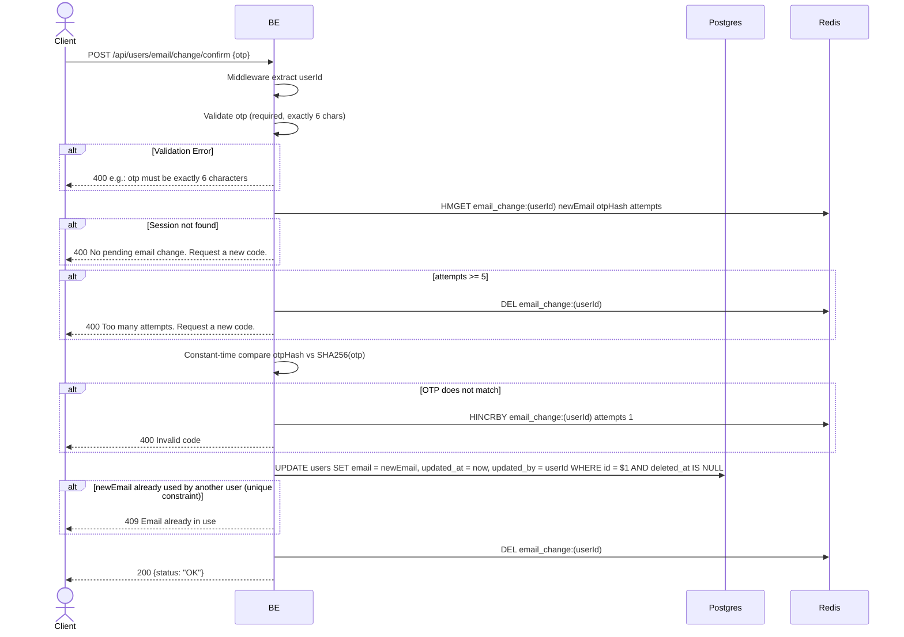

## Overview

This API is used to confirm an email change with the OTP that was sent to the old email. If the OTP is correct, the backend updates the `email` column in the users table and deletes the session in Redis. Max 5 attempts — if exceeded, the session is deleted and the user must request a new OTP.

---

## Auth

This is a protected API, so it requires the authorization header `Bearer <accessToken>`.

## Flow



---

## Notes Redis

1. email change session:
   key: `email_change:(userId)`
   action: HMGET (read), HINCRBY attempts (on wrong OTP), DEL (cleanup)

---

## Notes Postgres/DB

| Table   | Column     | Action | Notes                                     |
| ------- | ---------- | ------ | ----------------------------------------- |
| `users` | email      | UPDATE | Set new email                             |
| `users` | updated_at | UPDATE | UTC now                                    |
| `users` | updated_by | UPDATE | userId (self)                              |

---

## Prerequisites

User has already hit `request_email_change` and received the OTP at the old email. The session in Redis has not yet expired (TTL 10 minutes) and attempts have not reached 5.

---

## Request Validation

| Field | Type   | Required | Rules                        |
| ----- | ------ | -------- | ---------------------------- |
| `otp` | string | yes      | Required, exactly 6 characters |

---

## Response

### 200 OK

```json
{
  "status": "OK"
}
```

### 400 Bad Request

| `error_message`                                  | Cause                                          |
| ------------------------------------------------ | ---------------------------------------------- |
| `otp is required`                                | OTP empty                                      |
| `otp must be exactly 6 characters`               | OTP length is not 6                            |
| `No pending email change. Request a new code.`   | Session in Redis not found / expired           |
| `Too many attempts. Request a new code.`         | Already 5 failed attempts                      |
| `Invalid code`                                   | OTP does not match                             |

### 409 Conflict

| `error_message`            | Cause                                   |
| -------------------------- | --------------------------------------- |
| `Email already in use`     | newEmail was taken by another user first  |

### 401 Unauthorized

| `error_message`                       | Cause           |
| ------------------------------------- | --------------- |
| `Authorization header is missing`     | Header not present |
| `Authentication token is invalid`    | JWT invalid     |

---

## Update

This documentation was last updated on 23 May 2026.
