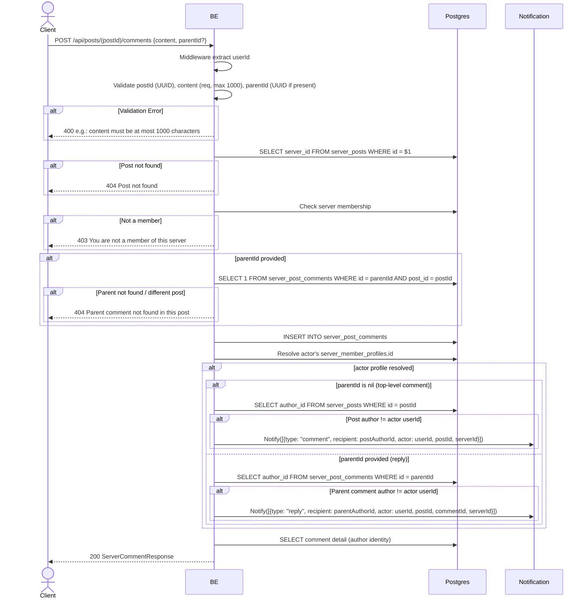

## Overview

This API is used to create a comment on a post. You can also reply to another comment by sending `parentId` (the UUID of the parent comment). The user must be a server member. On success, a push notification is sent to the relevant recipient — the post author for a top-level comment, or the parent comment's author for a reply — but only if that recipient is a different user than the commenter (no self-notification).

---

## Auth

This is a protected API, so it requires the authorization header `Bearer <accessToken>`.

## Flow



---

## Notes Redis

Does not use Redis.

---

## Notes Postgres/DB

| Table                    | Column                                       | Action | Notes                                   |
| ------------------------ | -------------------------------------------- | ------ | --------------------------------------- |
| `server_posts`           | server_id                                    | SELECT | Fetch server_id                          |
| `server_members`         | (count)                                      | SELECT | Check membership                         |
| `server_post_comments`   | (count)                                      | SELECT | Check parent valid (if parentId provided) |
| `server_post_comments`   | id, post_id, author_id, parent_id, content   | INSERT | New comment                              |
| `server_member_profiles` | (profile id)                                 | SELECT | Resolve actor's profile id for the notification |
| `server_posts`           | author_id                                    | SELECT | Resolve post author (top-level comment notification only) |
| `server_post_comments`   | author_id                                    | SELECT | Resolve parent comment author (reply notification only) |
| `server_member_profiles` | nickname, username, avatar_image_id          | SELECT | Author identity in the server            |

Note: the notification is skipped whenever the recipient (post author or parent comment author) is the same user as the commenter.

---

## Prerequisites

User is a member of the server where the post resides. If replying, the parent comment must exist in the same post.

---

## Request Validation

Path parameter:

| Field    | Type   | Required | Rules           |
| -------- | ------ | -------- | --------------- |
| `postId` | string | yes      | Required, UUID  |

Body JSON:

| Field      | Type          | Required | Rules                                     |
| ---------- | ------------- | -------- | ----------------------------------------- |
| `content`  | string        | yes      | Required, max 1000 characters             |
| `parentId` | string (UUID) | no       | If provided, must be a UUID + parent must exist in the same post |

---

## Response

### 200 OK

```json
{
  "id": "comment-uuid",
  "postId": "post-uuid",
  "parentId": null,
  "content": "Mantap!",
  "author": {
    "userId": "user-uuid",
    "nickname": "GamerX",
    "username": "gamerx",
    "avatarUrl": "http://.../webp",
    "status": "active"
  },
  "isOwner": true,
  "createdAt": "2026-05-23T10:00:00Z",
  "updatedAt": "2026-05-23T10:00:00Z"
}
```

### 400 Bad Request

| `error_message`                              | Cause                          |
| -------------------------------------------- | ------------------------------ |
| `postId is not a valid UUID`                 | postId invalid                  |
| `content is required`                        | Content empty                   |
| `content must be at most 1000 characters`    | Content too long                |
| `parentId is not a valid UUID`               | parentId is not a UUID          |

### 403 Forbidden

| `error_message`                          | Cause        |
| ---------------------------------------- | ------------ |
| `You are not a member of this server`    | Not a member  |

### 404 Not Found

| `error_message`                                 | Cause                                   |
| ----------------------------------------------- | --------------------------------------- |
| `Post not found`                                | Post not found                          |
| `Parent comment not found in this post`         | parentId not found / parent on a different post |

### 401 Unauthorized

Standard auth errors.

---

## Update

This documentation was last updated on 20 July 2026.
