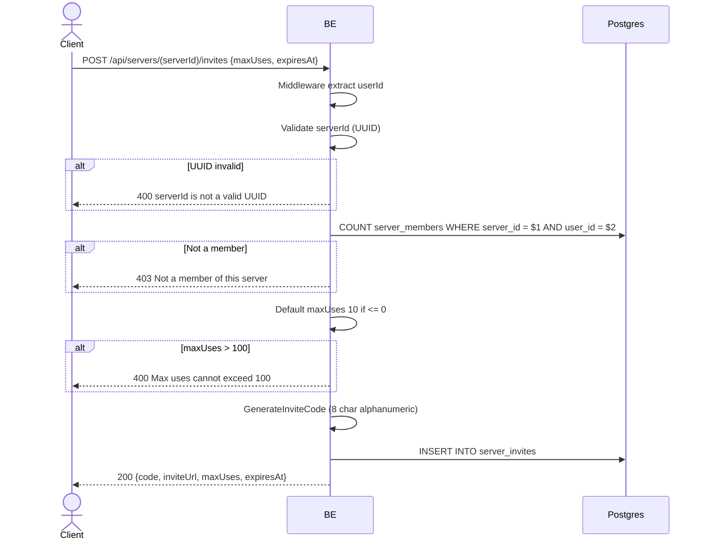

## Overview

This API is used to generate an invite link for a server. Any server member may generate one (not necessarily the owner). The invite code is 8 alphanumeric characters (random). Max uses default 10, cap 100. Expiry optional.

---

## Auth

This is a protected API, so it requires the authorization header `Bearer <accessToken>`.

## Flow



---

## Notes Redis

Does not use Redis.

---

## Notes Postgres/DB

| Table            | Column                                      | Action | Notes                               |
| ---------------- | ------------------------------------------- | ------ | ----------------------------------- |
| `server_members` | (count)                                     | SELECT | Check whether user is a member       |
| `server_invites` | id, server_id, code, max_uses, used_count, expires_at, is_active, created_at, ... | INSERT | New invite row                       |

---

## Prerequisites

User is a member of the server (owner or regular).

---

## Request Validation

Path parameter:

| Field      | Type   | Required | Rules           |
| ---------- | ------ | -------- | --------------- |
| `serverId` | string | yes      | Required, UUID  |

Body JSON:

| Field       | Type              | Required | Rules                                              |
| ----------- | ----------------- | -------- | -------------------------------------------------- |
| `maxUses`   | int               | no       | Default 10 if <= 0, max 100                        |
| `expiresAt` | string (ISO 8601) | no       | Invite expiry timestamp (null = no expiry)         |

---

## Response

### 200 OK

```json
{
  "code": "aB3xZ9pQ",
  "inviteUrl": "https://api.virdan.app/api/servers/invites/aB3xZ9pQ",
  "maxUses": 10,
  "expiresAt": "2026-06-01T10:00:00Z"
}
```

| Field       | Type        | Description                                  |
| ----------- | ----------- | -------------------------------------------- |
| `code`      | string      | 8 alphanumeric characters                     |
| `inviteUrl` | string      | Share URL (built using `APP_BASE_URL`)        |
| `maxUses`   | int         | Usage limit                                    |
| `expiresAt` | string/null | Expiry timestamp                              |

### 400 Bad Request

| `error_message`                  | Cause                  |
| -------------------------------- | ---------------------- |
| `serverId is not a valid UUID`   | UUID invalid            |
| `Max uses cannot exceed 100`     | maxUses > 100           |

### 403 Forbidden

| `error_message`               | Cause              |
| ----------------------------- | ------------------ |
| `Not a member of this server` | User is not a member  |

### 401 Unauthorized

Standard auth errors.

---

## Update

This documentation was last updated on 23 May 2026.
