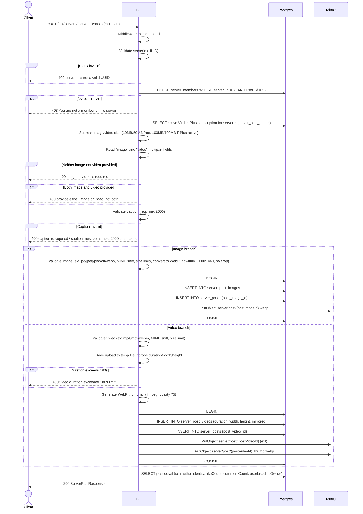

## Overview

This API is used to create a post in a specific server. The request format is multipart; you must provide **either** an `image` **or** a `video` file (not both, not neither). Images are converted to WebP; videos are probed for duration/dimensions and get an auto-generated WebP thumbnail. Only server members may post. The server's active Virdan Plus subscription raises the allowed upload size limits (it does not block non-Plus members from posting).

---

## Auth

This is a protected API, so it requires the authorization header `Bearer <accessToken>`.

## Flow



---

## Notes Redis

Does not use Redis (other than the auth-check middleware).

---

## Notes MinIO

- Bucket: `MINIO_BUCKET_NAME`
- Image object key: `server/post/{postImageId}.webp`, Content-Type `image/webp`
- Video object key: `server/post/{postVideoId}{ext}` (`.mp4`, `.mov`, or `.webm`), Content-Type `video/mp4` / `video/quicktime` / `video/webm`
- Video thumbnail object key: `server/post/{postVideoId}_thumb.webp`, Content-Type `image/webp`
- Action: PutObject

---

## Notes Postgres/DB

| Table                 | Column                                              | Action | Notes                                                       |
| --------------------- | ---------------------------------------------------- | ------ | ------------------------------------------------------------ |
| `server_members`      | (count)                                              | SELECT | Check whether user is a member                                |
| `server_plus_orders`  | plus_expires_at, status                              | SELECT | Check whether the server has an active Virdan Plus subscription (`status = 'PAID' AND plus_expires_at > now`) |
| `server_post_images`  | id, bucket, object_key, mime_type, size, width, height | INSERT | Image row (image branch only)                                 |
| `server_post_videos`  | id, bucket, object_key, mime_type, size, duration, width, height, thumbnail_object_key, mirrored | INSERT | Video row (video branch only)                                 |
| `server_posts`        | id, server_id, author_id, post_image_id/post_video_id, caption | INSERT | Post row                                                       |

---

## Prerequisites

User is a member of the target server. Has exactly one valid media file (image or video, not both).

---

## Request Validation

Path parameter:

| Field      | Type   | Required | Rules           |
| ---------- | ------ | -------- | --------------- |
| `serverId` | string | yes      | Required, UUID  |

Multipart body:

| Field     | Type    | Required | Rules                                                                                  |
| --------- | ------- | -------- | --------------------------------------------------------------------------------------- |
| `image`   | file    | one of image/video | Image (jpg/jpeg/png/gif/webp), max 10MB (free) / 100MB (server has active Virdan Plus) |
| `video`   | file    | one of image/video | Video (mp4/mov/webm), max 50MB (free) / 100MB (server has active Virdan Plus), max duration 180s |
| `mirror`  | string  | no       | `"true"` to flag the video as mirrored; ignored for image posts                          |
| `caption` | string  | yes      | Required, max 2000 characters                                                            |

---

## Response

### 200 OK

Image post:

```json
{
  "id": "post-uuid",
  "serverId": "server-uuid",
  "caption": "Hello world!",
  "imageUrl": "http://.../server/post/imageId.webp",
  "mediaType": "image",
  "mediaWidth": 1080,
  "mediaHeight": 1350,
  "author": {
    "userId": "user-uuid",
    "nickname": "GamerX",
    "username": "gamerx",
    "avatarUrl": "http://.../profile/avatar/uuid.webp",
    "status": "active"
  },
  "likeCount": 0,
  "commentCount": 0,
  "userLiked": false,
  "userSaved": false,
  "isOwner": true,
  "createdAt": "2026-05-23T10:00:00Z",
  "updatedAt": "2026-05-23T10:00:00Z"
}
```

Video post additionally includes `videoUrl`, `thumbnailUrl`, `mediaType: "video"`, and `mirrored` instead of `imageUrl`.

### 400 Bad Request

| `error_message`                              | Cause                          |
| -------------------------------------------- | ------------------------------ |
| `serverId is not a valid UUID`               | UUID invalid                    |
| `image or video is required`                 | Neither file present            |
| `provide either image or video, not both`    | Both files present               |
| `image size exceeded 10MB limit` (or 100MB with active Plus) | Image file too large      |
| `invalid file extension: ...`                | Image extension not allowed      |
| `invalid image type: ...`                    | Image MIME type not allowed      |
| `video size exceeded 50MB limit` (or 100MB with active Plus) | Video file too large      |
| `invalid video extension: ...`               | Video extension not allowed      |
| `invalid video type: ...`                    | Video MIME type not allowed      |
| `video duration exceeded 180s limit`         | Video longer than 180 seconds     |
| `caption is required`                        | Caption empty                   |
| `caption must be at most 2000 characters`    | Caption too long                |

### 403 Forbidden

| `error_message`                          | Cause                   |
| ---------------------------------------- | ----------------------- |
| `You are not a member of this server`    | User is not a server member |

### 401 Unauthorized

Standard auth errors.

---

## Update

This documentation was last updated on 20 July 2026.
