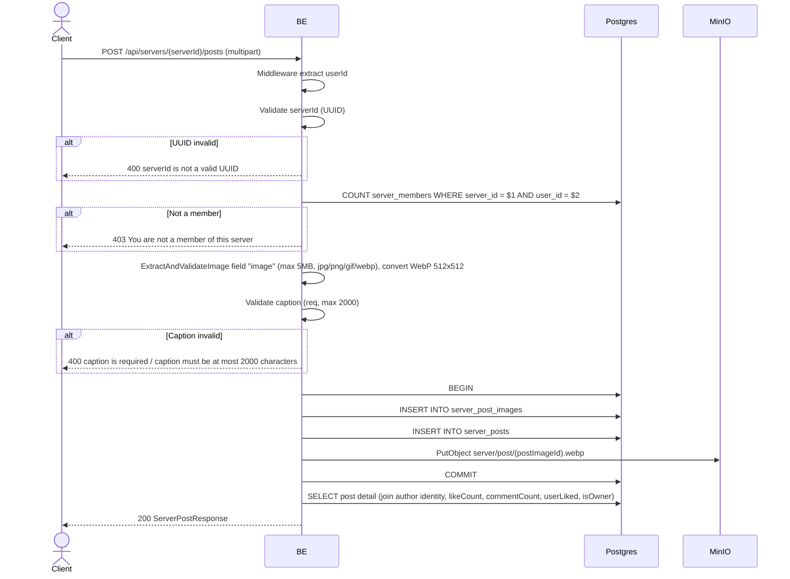

## Overview

This API is used to create a post in a specific server. The request format is multipart, image required (validated + converted to WebP). Only server members may post.

---

## Auth

This is a protected API, so it requires the authorization header `Bearer <accessToken>`.

## Flow



---

## Notes Redis

Does not use Redis (other than the auth-check middleware).

---

## Notes MinIO

- Bucket: `MINIO_BUCKET_NAME` (default `virdan`)
- Object key: `server/post/{postImageId}.webp`
- Content-Type: `image/webp`
- Action: PutObject

---

## Notes Postgres/DB

| Table                | Column                                             | Action | Notes                               |
| -------------------- | -------------------------------------------------- | ------ | ----------------------------------- |
| `server_members`     | (count)                                            | SELECT | Check whether user is a member       |
| `server_post_images` | id, bucket, object_key, mime_type, size, ...       | INSERT | Image row                            |
| `server_posts`       | id, server_id, author_id, post_image_id, caption   | INSERT | Post row                             |

---

## Prerequisites

User is a member of the target server. Has a valid image file.

---

## Request Validation

Path parameter:

| Field      | Type   | Required | Rules           |
| ---------- | ------ | -------- | --------------- |
| `serverId` | string | yes      | Required, UUID  |

Multipart body:

| Field     | Type   | Required | Rules                                           |
| --------- | ------ | -------- | ----------------------------------------------- |
| `image`   | file   | yes      | Image (jpg/jpeg/png/gif/webp), max 5MB           |
| `caption` | string | yes      | Required, max 2000 characters                   |

---

## Response

### 200 OK

```json
{
  "id": "post-uuid",
  "serverId": "server-uuid",
  "caption": "Hello world!",
  "imageUrl": "http://.../server/post/imageId.webp",
  "author": {
    "userId": "user-uuid",
    "nickname": "GamerX",
    "username": "gamerx",
    "avatarUrl": "http://.../profile/avatar/uuid.webp",
    "status": "ACTIVE"
  },
  "likeCount": 0,
  "commentCount": 0,
  "userLiked": false,
  "isOwner": true,
  "createdAt": "2026-05-23T10:00:00Z",
  "updatedAt": "2026-05-23T10:00:00Z"
}
```

### 400 Bad Request

| `error_message`                              | Cause                          |
| -------------------------------------------- | ------------------------------ |
| `serverId is not a valid UUID`               | UUID invalid                    |
| `image is required`                          | Image file not present          |
| `image size exceeded 5MB limit`              | File too large                  |
| `invalid file extension: ...`                | Extension not allowed           |
| `invalid image type: ...`                    | MIME type not allowed           |
| `caption is required`                        | Caption empty                   |
| `caption must be at most 2000 characters`    | Caption too long                |

### 403 Forbidden

| `error_message`                          | Cause                   |
| ---------------------------------------- | ----------------------- |
| `You are not a member of this server`    | User is not a server member |

### 401 Unauthorized

Standard auth errors.

---

## Update

This documentation was last updated on 23 May 2026.
