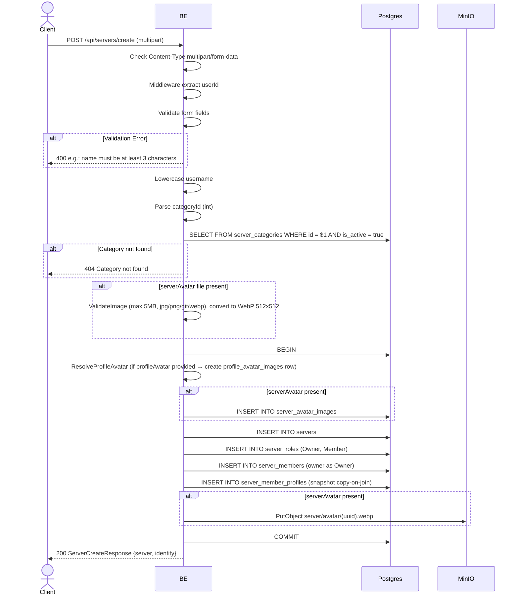

## Overview

This API is used to create a new server. Request format: `multipart/form-data` (because it can upload a server avatar + a per-server profile avatar). The owner is automatically created as a member with the Owner role, and a `server_member_profiles` row is created (multi-identity Option B — copy-on-join).

---

## Auth

This is a protected API, so it requires the authorization header `Bearer <accessToken>`.

## Flow



---

## Notes Redis

Does not use Redis (other than the auth-check middleware).

---

## Notes Postgres/DB

| Table                     | Column                                          | Action | Notes                                               |
| ------------------------- | ----------------------------------------------- | ------ | --------------------------------------------------- |
| `server_categories`       | id, is_active                                   | SELECT | Check category exists & active                       |
| `profile_avatar_images`   | (full)                                          | INSERT | If profileAvatar is uploaded (copy-on-join)          |
| `server_avatar_images`    | (full)                                          | INSERT | If serverAvatar is uploaded                           |
| `servers`                 | id, owner_id, name, short_name, ...             | INSERT | New server                                           |
| `server_roles`            | id, server_id, name, permissions                | INSERT | Owner role (`{"all":true}`) + Member (`{}`)         |
| `server_members`          | id, server_id, user_id, server_role_id, joined_at | INSERT | Owner as a member with the Owner role               |
| `server_member_profiles`  | id, server_id, user_id, nickname, username, bio | INSERT | Per-server profile snapshot (copy-on-join Option B)  |

---

## Prerequisites

User is already logged in with a valid access token.

---

## Request Validation

Request format: `multipart/form-data`.

| Field           | Type          | Required | Rules                                                                 |
| --------------- | ------------- | -------- | ---------------------------------------------------------------------- |
| `name`          | string        | yes      | Required, min 3 characters, max 40 characters                          |
| `shortName`     | string        | yes      | Required, min 2 characters, max 10 characters                          |
| `description`   | string        | no       | Max 500 characters                                                     |
| `categoryId`    | string (int)  | yes      | Required, must be a valid int                                          |
| `isPrivate`     | string (bool) | yes      | Required ("true" or otherwise)                                         |
| `nickname`      | string        | yes      | Required, min 3 characters, max 50 characters                          |
| `username`      | string        | yes      | Required, min 3 characters, max 22 characters, regex `^[a-zA-Z0-9_.]+$`    |
| `bio`           | string        | no       | Max 150 characters                                                     |
| `serverAvatar`  | file          | no       | Image (jpg/jpeg/png/gif/webp), max 5MB, converted to WebP 512x512     |
| `profileAvatar` | file          | no       | The user's profile avatar for this server (same image rules)           |
| `avatarImageId` | string (UUID) | no       | Alternative: reuse existing `profile_avatar_images` UUID owned by the user |

---

## Response

### 200 OK

```json
{
  "server": {
    "id": "550e8400-...",
    "ownerId": "user-uuid",
    "ownerNickname": "OwnerNick",
    "name": "Gaming Squad",
    "shortName": "GS",
    "categoryId": 3,
    "categoryName": null,
    "avatarUrl": "http://.../server/avatar/...webp",
    "bannerUrl": null,
    "description": "Server gaming",
    "settings": null,
    "memberCount": 1,
    "isMember": true,
    "createdAt": "2026-05-23T10:00:00Z",
    "updatedAt": "2026-05-23T10:00:00Z"
  },
  "identity": {
    "profileId": "profile-uuid",
    "serverId": "",
    "nickname": "OwnerNick",
    "username": "ownernick",
    "bio": "Owner bio",
    "avatarImageId": "avatar-uuid",
    "avatarUrl": null,
    "createdAt": "2026-05-23T10:00:00Z",
    "updatedAt": "2026-05-23T10:00:00Z"
  }
}
```

Note: in this create server response, the fields `settings`, `categoryName`, `bannerUrl`, `avatarUrl` (if there is no `serverAvatar` upload) are not set in the response builder, so in JSON they become `null`. Likewise `Identity.ServerId` and `Identity.AvatarUrl` are not set in the builder, so they come out as an empty string / null. To get the full fields (incl. settings + attached avatar URL), the client can hit `GET /api/servers/{id}` after creating.

### 400 Bad Request

| `error_message`                                | Cause                                 |
| ---------------------------------------------- | ------------------------------------- |
| `Invalid Content-Type header. Endpoint requires multipart/form-data.` | Content-Type is not multipart  |
| `name is required` / `name must be at least 3 characters` | Name empty / less than 3 |
| `name must be at most 40 characters`           | Name more than 40                      |
| `shortName is required`                        | ShortName empty                        |
| `shortName must be at least 2 characters`      | ShortName less than 2                  |
| `shortName must be at most 10 characters`      | ShortName more than 10                 |
| `description must be at most 500 characters`   | Description too long                   |
| `categoryId is required`                       | CategoryId not provided                |
| `categoryId must be int`                       | CategoryId is not an integer           |
| `isPrivate is required`                        | IsPrivate not provided                 |
| `nickname is required`                         | Nickname empty                         |
| `nickname must be at least 3 characters`       | Nickname less than 3                    |
| `nickname must be at most 50 characters`       | Nickname more than 50                   |
| `username is required`                         | Username empty                          |
| `username must be at least 3 characters`       | Username less than 3                    |
| `username must be at most 22 characters`       | Username more than 22                   |
| `Username may only contain letters, digits, underscores and dots` | Username failed regex |
| `bio must be at most 150 characters`           | Bio more than 150                       |
| `image size exceeded 5MB limit`                | File more than 5 MB                    |
| `invalid file extension: ...`                  | File extension not allowed             |
| `invalid image type: ...`                      | MIME type sniff not allowed            |

### 404 Not Found

| `error_message`         | Cause                                   |
| ----------------------- | --------------------------------------- |
| `Category not found`    | categoryId not found / inactive         |

### 401 Unauthorized

| `error_message`                       | Cause              |
| ------------------------------------- | ------------------ |
| `Authorization header is missing`     | Header not present  |
| `Authentication token is invalid`    | JWT invalid        |

---

## Update

This documentation was last updated on 23 May 2026.
