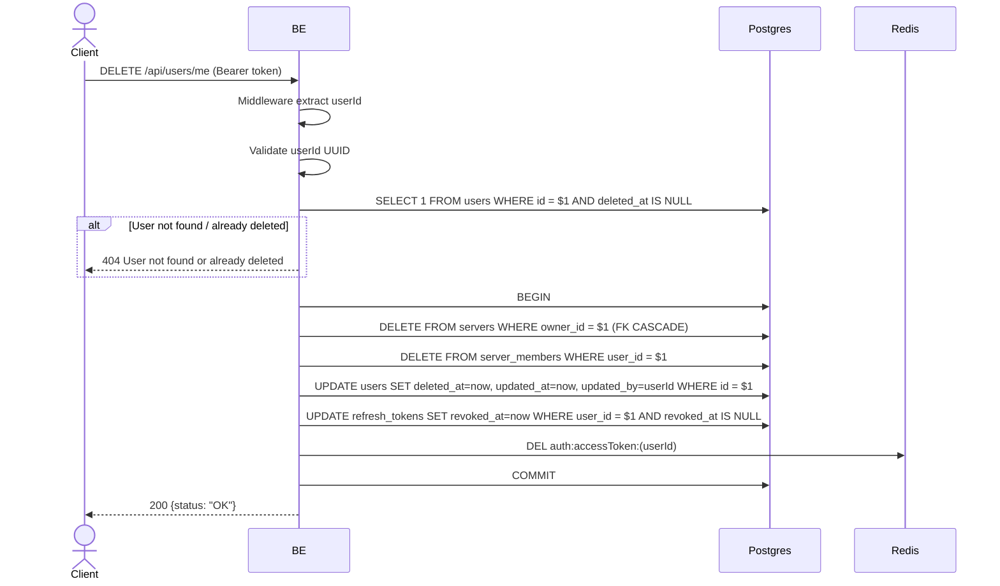

## Overview

This API is used to soft-delete the currently logged-in user's account. The backend will:
1. Hard-delete all servers owned by the user (FK CASCADE cleans up roles/members/profiles/posts/comments/likes/invites in those servers).
2. Hard-delete all of the user's server_members in other servers.
3. Soft-delete the users row (set `deleted_at`).
4. Revoke all of the user's refresh tokens.
5. Clear the access token cache in Redis.

Objects in MinIO are intentionally left orphaned in Phase 1 (cleanup job in Phase 2). Comments/likes in other servers are also retained because the FK to the users row still exists (soft delete).

---

## Auth

This is a protected API, so it requires the authorization header `Bearer <accessToken>`.

## Flow



---

## Notes Redis

1. auth access token:
   key: `auth:accessToken:(userId)`
   action: DEL

---

## Notes Postgres/DB

| Table             | Column       | Action | Notes                                                                       |
| ----------------- | ------------ | ------ | --------------------------------------------------------------------------- |
| `users`           | id           | SELECT | Check active user (`deleted_at IS NULL`)                                    |
| `servers`         | owner_id     | DELETE | Hard-delete all servers owned by the user (FK CASCADE cleans up related tables) |
| `server_members`  | user_id      | DELETE | Hard-delete the user's membership in other servers                          |
| `users`           | deleted_at   | UPDATE | Soft-delete timestamp                                                       |
| `users`           | updated_at   | UPDATE | UTC now                                                                     |
| `users`           | updated_by   | UPDATE | userId (self)                                                               |
| `refresh_tokens`  | revoked_at   | UPDATE | Revoke all refresh tokens                                                   |
| `refresh_tokens`  | updated_at   | UPDATE | UTC now                                                                     |
| `refresh_tokens`  | updated_by   | UPDATE | userId                                                                      |

The `server_member_profiles` table is retained (historical snapshot) because the FK CASCADE from `servers` already handles rows related to the deleted servers, while in other servers the rows remain (no cascade from `users` because of soft-delete).

---

## Prerequisites

User is already logged in and has a valid access token.

---

## Request Validation

The endpoint does not accept a body. Authentication via header.

---

## Response

### 200 OK

```json
{
  "status": "OK"
}
```

### 401 Unauthorized

| `error_message`                       | Cause                   |
| ------------------------------------- | ----------------------- |
| `Authorization header is missing`     | Header not present      |
| `Authentication token is expired`    | JWT expired             |
| `Authentication token is invalid`    | JWT invalid             |

### 404 Not Found

| `error_message`                       | Cause                                   |
| ------------------------------------- | --------------------------------------- |
| `User not found or already deleted`   | User was already soft-deleted previously  |

---

## Update

This documentation was last updated on 23 May 2026.
