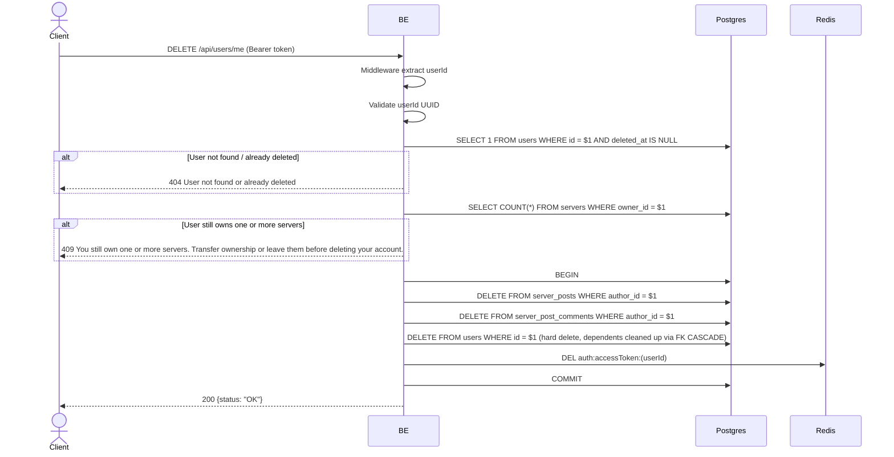

## Overview

This API is used to permanently delete the currently logged-in user's account. The backend will:
1. Check that the user still exists (not previously deleted).
2. Check that the user does not own any servers (`servers.owner_id` has an `ON DELETE RESTRICT` FK to `users`) — if they still own a server, the deletion is rejected with a 409 so the user can transfer ownership or leave first.
3. Hard-delete the user's posts and comments (`server_posts.author_id` / `server_post_comments.author_id` are `ON DELETE RESTRICT`, so these must be removed before the user row itself can be deleted).
4. Hard-delete the `users` row itself. All other rows that reference the user (`refresh_tokens`, `server_members`, `server_member_profiles`, `server_post_likes`, `server_post_saves`, `device_tokens`, `notifications`, `dm_conversations`, etc.) are cleaned up automatically by `ON DELETE CASCADE` FKs.
5. Clear the access token cache in Redis.

Objects in MinIO (avatars, post images/videos) are intentionally left orphaned (cleanup handled separately, not by this endpoint).

---

## Auth

This is a protected API, so it requires the authorization header `Bearer <accessToken>`.

## Flow



---

## Notes Redis

1. auth access token:
   key: `auth:accessToken:(userId)`
   action: DEL

---

## Notes Postgres/DB

| Table                   | Column    | Action | Notes                                                                     |
| ----------------------- | --------- | ------ | -------------------------------------------------------------------------- |
| `users`                 | id        | SELECT | Check active user (`deleted_at IS NULL`)                                  |
| `servers`               | owner_id  | SELECT | Count servers owned by the user (must be 0 to proceed)                   |
| `server_posts`          | author_id | DELETE | Hard-delete the user's posts (required: FK is `ON DELETE RESTRICT`)       |
| `server_post_comments`  | author_id | DELETE | Hard-delete the user's comments (required: FK is `ON DELETE RESTRICT`)   |
| `users`                 | id        | DELETE | Hard-delete the user row itself                                          |

Deleting the `users` row cascades (`ON DELETE CASCADE`) to `refresh_tokens`, `server_members`, `server_member_profiles`, `server_post_likes`, `server_post_saves`, `device_tokens`, `notifications`, and `dm_conversations`/`dm_messages`, among others — these are not deleted with explicit queries by this endpoint.

---

## Prerequisites

User is already logged in and has a valid access token. The user must not currently own any servers.

---

## Request Validation

The endpoint does not accept a body. Authentication via header.

---

## Response

### 200 OK

```json
{
  "status": "OK"
}
```

### 401 Unauthorized

| `error_message`                       | Cause                   |
| ------------------------------------- | ----------------------- |
| `Authorization header is missing`     | Header not present      |
| `Authentication token is expired`    | JWT expired             |
| `Authentication token is invalid`    | JWT invalid             |

### 404 Not Found

| `error_message`                       | Cause                                   |
| ------------------------------------- | --------------------------------------- |
| `User not found or already deleted`   | User was already deleted previously  |

### 409 Conflict

| `error_message`                                                                                      | Cause                                  |
| ------------------------------------------------------------------------------------------------------ | --------------------------------------- |
| `You still own one or more servers. Transfer ownership or leave them before deleting your account.`     | `CountServersOwnedByUser` returns > 0   |

---

## Update

This documentation was last updated on 20 July 2026.
