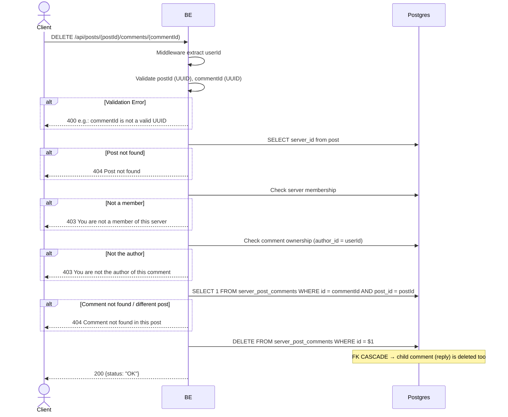

## Overview

This API is used to hard-delete a comment. Only the comment author is allowed. FK CASCADE deletes the reply (child comment) if any.

---

## Auth

This is a protected API, so it requires the authorization header `Bearer <accessToken>`.

## Flow



---

## Notes Redis

Does not use Redis.

---

## Notes Postgres/DB

| Table                  | Column             | Action | Notes                                       |
| ---------------------- | ------------------ | ------ | ------------------------------------------- |
| `server_posts`         | server_id          | SELECT | Fetch server_id for membership check         |
| `server_members`       | (count)            | SELECT | Check membership                              |
| `server_post_comments` | author_id          | SELECT | Check ownership                               |
| `server_post_comments` | id, post_id        | SELECT | Check comment exists & belong to post           |
| `server_post_comments` | id                 | DELETE | Hard-delete (FK CASCADE → reply)               |

---

## Prerequisites

User is a member of the server and the author of the comment.

---

## Request Validation

Path parameter:

| Field       | Type   | Required | Rules           |
| ----------- | ------ | -------- | --------------- |
| `postId`    | string | yes      | Required, UUID  |
| `commentId` | string | yes      | Required, UUID  |

No body.

---

## Response

### 200 OK

```json
{
  "status": "OK"
}
```

### 400 Bad Request

| `error_message`                   | Cause        |
| --------------------------------- | ------------ |
| `postId is not a valid UUID`      | Invalid UUID  |
| `commentId is not a valid UUID`   | Invalid UUID  |

### 403 Forbidden

| `error_message`                              | Cause                   |
| -------------------------------------------- | ----------------------- |
| `You are not a member of this server`        | Not a member             |
| `You are not the author of this comment`     | Not the comment author   |

### 404 Not Found

| `error_message`                          | Cause                                 |
| ---------------------------------------- | ------------------------------------- |
| `Post not found`                         | Post not found                        |
| `Comment not found in this post`         | Comment not found / different post    |

### 401 Unauthorized

Standard auth errors.

---

## Update

This documentation was last updated on 23 May 2026.
