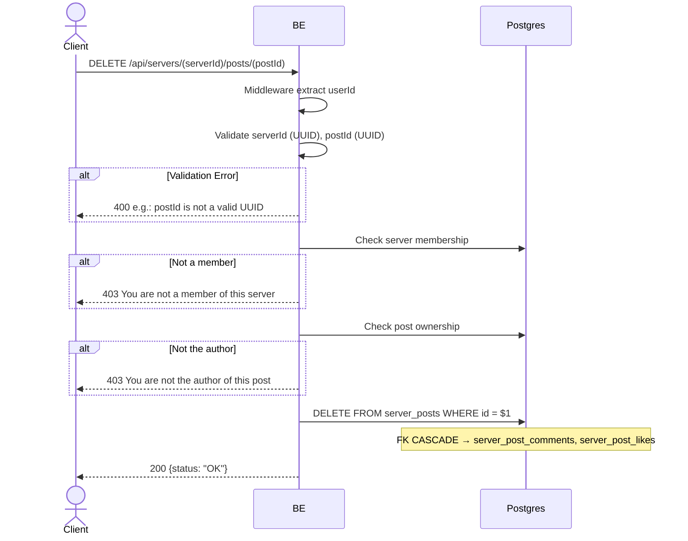

## Overview

This API is used to hard-delete a post. Only the author is allowed. FK CASCADE deletes the related comments + likes. The image in MinIO is intentionally left orphan (cleanup job Phase 2).

---

## Auth

This is a protected API, so it requires the authorization header `Bearer <accessToken>`.

## Flow



---

## Notes Redis

Does not use Redis.

---

## Notes Postgres/DB

| Table            | Column             | Action | Notes                                        |
| ---------------- | ------------------ | ------ | -------------------------------------------- |
| `server_members` | (count)            | SELECT | Check membership                              |
| `server_posts`   | author_id          | SELECT | Check ownership                               |
| `server_posts`   | id                 | DELETE | Hard-delete (FK CASCADE → comments & likes)   |

---

## Prerequisites

User is a member of the server and the author of the post.

---

## Request Validation

Path parameter:

| Field      | Type   | Required | Rules           |
| ---------- | ------ | -------- | --------------- |
| `serverId` | string | yes      | Required, UUID  |
| `postId`   | string | yes      | Required, UUID  |

No body.

---

## Response

### 200 OK

```json
{
  "status": "OK"
}
```

### 400 Bad Request

| `error_message`                | Cause           |
| ------------------------------ | --------------- |
| `serverId is not a valid UUID` | Invalid UUID    |
| `postId is not a valid UUID`   | Invalid UUID    |

### 403 Forbidden

| `error_message`                          | Cause                   |
| ---------------------------------------- | ----------------------- |
| `You are not a member of this server`    | Not a member             |
| `You are not the author of this post`    | Not the author           |

### 401 Unauthorized

Standard auth errors.

---

## Update

This documentation was last updated on 23 May 2026.
