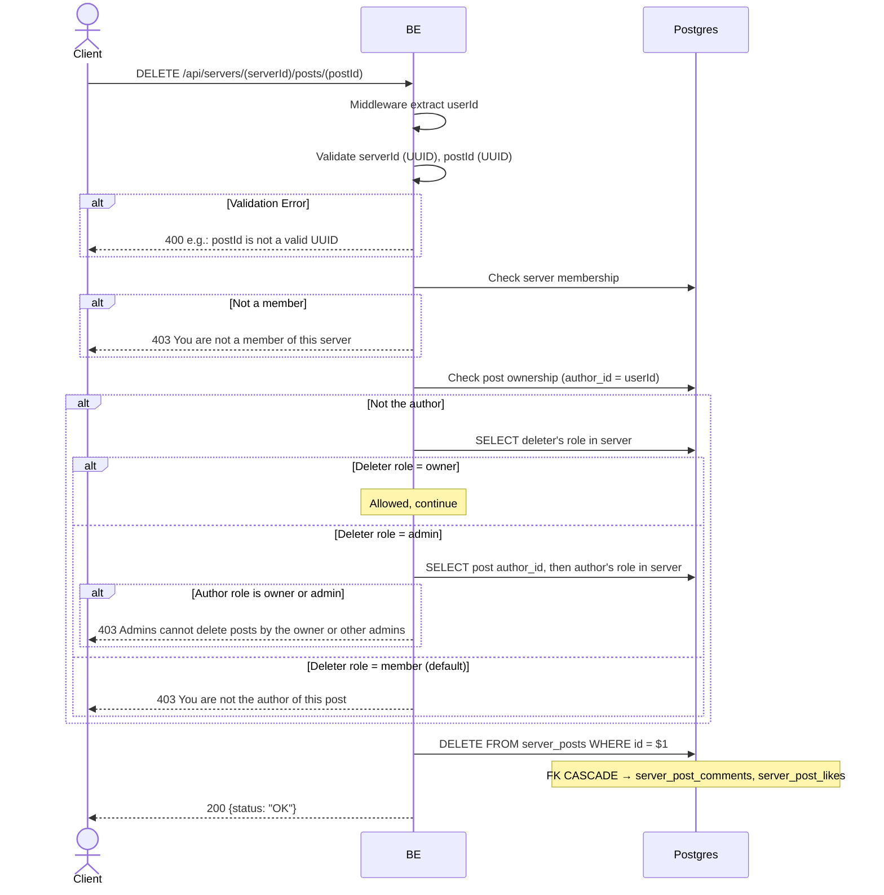

## Overview

This API is used to hard-delete a post. The post's author can always delete it. If the requester is not the author, the server owner may delete any post, and a server admin may delete any post except one authored by the owner or another admin; any other member gets `403 You are not the author of this post`. FK CASCADE deletes the related comments + likes. The image/video in MinIO is intentionally left orphan (cleanup job Phase 2).

---

## Auth

This is a protected API, so it requires the authorization header `Bearer <accessToken>`.

## Flow



---

## Notes Redis

Does not use Redis.

---

## Notes Postgres/DB

| Table            | Column             | Action | Notes                                        |
| ---------------- | ------------------ | ------ | -------------------------------------------- |
| `server_members` | (count)            | SELECT | Check membership                              |
| `server_posts`   | author_id          | SELECT | Check ownership                               |
| `server_members` | role_name          | SELECT | Deleter's role (only if not the author)       |
| `server_posts`   | author_id          | SELECT | Post author (only if deleter is an admin)     |
| `server_members` | role_name          | SELECT | Post author's role (only if deleter is an admin) |
| `server_posts`   | id                 | DELETE | Hard-delete (FK CASCADE → comments & likes)   |

---

## Prerequisites

User is a member of the server. Either the post author, the server owner, or a server admin deleting a post not authored by the owner/another admin.

---

## Request Validation

Path parameter:

| Field      | Type   | Required | Rules           |
| ---------- | ------ | -------- | --------------- |
| `serverId` | string | yes      | Required, UUID  |
| `postId`   | string | yes      | Required, UUID  |

No body.

---

## Response

### 200 OK

```json
{
  "status": "OK"
}
```

### 400 Bad Request

| `error_message`                | Cause           |
| ------------------------------ | --------------- |
| `serverId is not a valid UUID` | Invalid UUID    |
| `postId is not a valid UUID`   | Invalid UUID    |

### 403 Forbidden

| `error_message`                          | Cause                   |
| ---------------------------------------- | ----------------------- |
| `You are not a member of this server`    | Not a member             |
| `You are not the author of this post`    | Not the author, and not the server owner/admin |
| `Admins cannot delete posts by the owner or other admins` | Deleter is an admin but the post's author is the owner or another admin |

### 401 Unauthorized

Standard auth errors.

---

## Update

This documentation was last updated on 20 July 2026.
