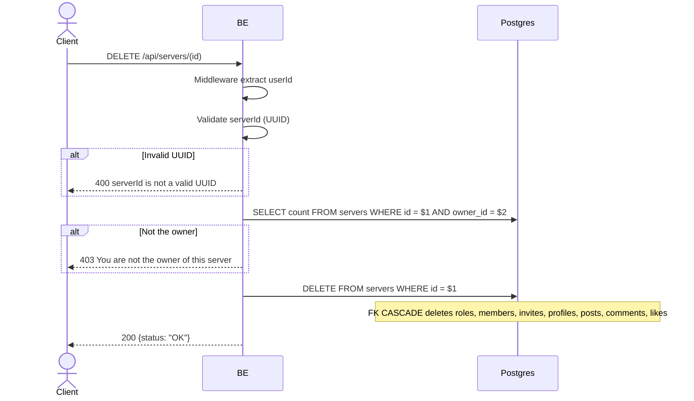

## Overview

This API is used to hard-delete a server. Only the owner is allowed. FK CASCADE cleans up `server_roles`, `server_members`, `server_invites`, `server_member_profiles`, `server_posts`, `server_post_comments`, `server_post_likes`. The MinIO objects are intentionally left orphan in Phase 1 (cleanup job in Phase 2).

---

## Auth

This is a protected API, so it requires the authorization header `Bearer <accessToken>`.

## Flow



---

## Notes Redis

Does not use Redis.

---

## Notes Postgres/DB

| Table     | Column   | Action | Notes                                                 |
| --------- | -------- | ------ | ----------------------------------------------------- |
| `servers` | owner_id | SELECT | Check ownership                                       |
| `servers` | id       | DELETE | Hard delete (FK CASCADE → roles, members, profiles, posts, comments, likes, invites) |

---

## Prerequisites

User is the owner of the server.

---

## Request Validation

Path parameter:

| Field | Type   | Required | Rules           |
| ----- | ------ | -------- | --------------- |
| `id`  | string | yes      | Required, UUID  |

No body.

---

## Response

### 200 OK

```json
{
  "status": "OK"
}
```

### 400 Bad Request

| `error_message`                  | Cause        |
| -------------------------------- | ------------ |
| `serverId is not a valid UUID`   | Invalid UUID  |

### 403 Forbidden

| `error_message`                          | Cause        |
| ---------------------------------------- | ------------ |
| `You are not the owner of this server`   | Not the owner |

### 401 Unauthorized

Standard auth errors.

---

## Update

This documentation was last updated on 23 May 2026.
